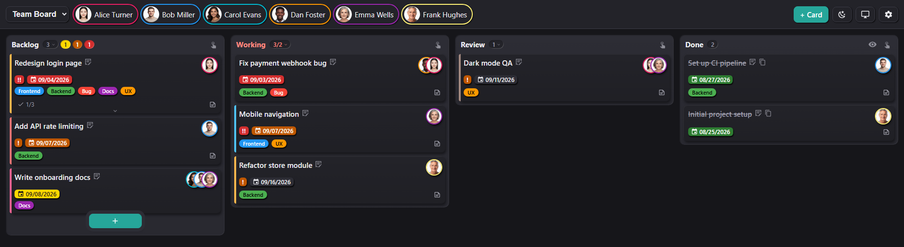

# ioBroker.kanban

[](https://www.npmjs.com/package/iobroker.kanban)
[](https://www.npmjs.com/package/iobroker.kanban)


[](https://github.com/bmueller77/ioBroker.kanban/actions/workflows/test-and-release.yml)
[](LICENSE)

Kanban board adapter for ioBroker with its **own web server**, live sync, webhooks, multi-user support and e-mail notifications (including calendar invites) via the `email` adapter.



**Full documentation:** [English](docs/en/README.md) · [Deutsch](docs/de/README.md)

## Installation

Install the adapter from the ioBroker admin: *Adapters* → filter for `kanban` → install. Then create an instance `kanban.0` and open the web UI at `http://<host>:8095/`.

> The adapter is awaiting inclusion in the official ioBroker repository.

## Features

- **Own web server** (default port 8095), the web UI is served directly by the adapter; no `iobroker upload` needed for UI updates
- **Multiple boards** with freely configurable columns (name, order, display limit, WIP limit, "new"/"done" flags)
- **Cards** with title, Markdown description, assignees, due date (optionally with time), labels, color, priority, checklist, link, location and calendar invite
- **Recurring tasks** (daily/weekly/monthly/yearly, n-th weekday, n-th working day incl. public-holiday calculation)
- **Drag & drop** (mouse + touch), live sync across all open views via WebSocket (polling fallback)
- **Multi-user without login**: user registry in the admin config, assignable members per board; the header chips act as a saved per-board person filter
- **E-mail notifications** via `iobroker.email` on assignment, due date and card events (toggleable per event type and per user)
- **Webhooks inbound** (token-secured) and **outbound** (JSON POST on events)
- **Share view**: dialog to build filtered, embeddable links
- **iframe-friendly** (no frame headers) with `?embed=1` mode for Lovelace & co.
- **Multilingual** (de, en, fr, nl, it, es, pl, pt, ru, uk, zh-cn), configurable **date & time format** per instance (moment/Day.js tokens with localised month/weekday names, 12h/24h), theming (light/dark/auto, accent color, custom CSS)

## Web UI / URL parameters

`http://<host>:8095/` with optional parameters (excerpt, full list in the [docs](docs/en/README.md#sharing-views--url-parameters)):

| Parameter | Effect |
|---|---|
| `board=<id>` | preselect a board |
| `users=<name,name>` | person filter: show only cards assigned to these users (`user=<name>` = single-user short form) |
| `label=<id,id>` | label **blacklist**: hide cards with these labels |
| `columns=<id,id>` | show only these columns |
| `doneLimit=N` | in done columns show only N cards (`0` = none, omit = all) |
| `theme=light\|dark\|auto` | force a theme |
| `embed=1` | borderless view without the header bar (for iframes) |
| `card=<id>` | open a card dialog directly (deep link from e-mails) |
| `lang=<code>` | force a language (de, en, fr, nl, it, es, pl, pt, ru, uk, zh-cn) |

### Lovelace embedding

```yaml
type: iframe
url: http://<host>:8095/?board=family&embed=1&theme=auto&user=user1
aspect_ratio: 75%
```

## REST API

For integrations on the local network (the same API the web UI uses). **Reading** (`GET`) is open; **writing** (`POST`/`PATCH`/`DELETE`) requires a token from 0.1.1 (`X-Kanban-Token`; the web UI sends it automatically), see [Security](docs/en/README.md#security--access-control).

| Method | Route | Purpose |
|---|---|---|
| GET | `/api/boards` | board list |
| POST | `/api/boards` | create a board `{title}` |
| GET | `/api/boards/:id` | board JSON; with `?rev=<n>` → `{unchanged:true}` if current |
| PATCH | `/api/boards/:id` | `{title?, columns?, labels?}` |
| DELETE | `/api/boards/:id` | delete a board |
| POST | `/api/boards/:id/cards` | create a card |
| PATCH | `/api/boards/:id/cards/:cardId` | update a card partially |
| POST | `/api/boards/:id/cards/:cardId/move` | `{columnId, order?}` |
| DELETE | `/api/boards/:id/cards/:cardId` | delete a card |
| PATCH | `/api/users/:name` | set a user colour (applied at runtime, no restart) |

## Webhooks & commands

External systems (scripts, agents) modify boards/cards token-secured via `POST /webhook/<token>/action`. The same command vocabulary applies as for `sendTo` and the `action` state:

```bash
curl -X POST http://<host>:8095/webhook/<token>/action \
  -H 'Content-Type: application/json' \
  -d '{"cmd":"addCard","board":"family","title":"Buy milk","assignees":["user1"],"due":"2026-07-15"}'
```

Commands: `listBoards`, `getBoard`, `addBoard`, `deleteBoard`, `addCard`, `updateCard`, `moveCard`, `doneCard`, `deleteCard`, `reassignUser`. From ioBroker scripts:

```js
sendTo('kanban.0', 'addCard', { board: 'family', title: 'From a script' }, res => log(JSON.stringify(res)));
setState('kanban.0.action', JSON.stringify({ cmd: 'doneCard', board: 'family', cardId: 'c_xyz' }));
```

**Outbound webhooks** send a JSON POST to configured URLs on events (`cardCreated, cardUpdated, cardMoved, cardAssigned, cardDone, cardDeleted, cardDue`). Details in the [docs](docs/en/README.md#webhooks-inbound).

## States (for scripts/visualization)

| State | Content |
|---|---|
| `kanban.0.boards.<id>.data` | full board as JSON (read-only) |
| `kanban.0.boards.<id>.rev` / `.cardCount` / `.overdueCount` | revision & counters |
| `kanban.0.users.<name>.assignedCount` / `.overdueCount` / `.overdueList` | per user |
| `kanban.0.lastEvent` | last event as JSON (can trigger scripts) |
| `kanban.0.info.orphanedAssignees` | assignees that no longer exist as users, after a user ID was renamed |
| `kanban.0.action` | command input (write JSON, cleared after processing) |

## Security

From **0.1.1**: token-secured write API, Markdown preview sanitized with DOMPurify (no stored XSS), a Content Security Policy and safe link schemes only. The web UI works without a login, the token blocks third-party websites/CSRF but is **not** a substitute for network isolation. For hard isolation, bind the port to the LAN only or put an authenticating reverse proxy in front.

Also from **0.3.0**: agent tokens keep their board restriction on the REST API as well, tokens are only read from the header or the request body, the write secret lives in the adapter's file storage instead of a readable state, the token-free `action` state can be switched off, and irreversible commands are logged with their source. Note that `sendTo` and the `action` state are local ioBroker interfaces without a token by design: anyone who can run scripts in ioBroker can use them.

Details: [Security & access control](docs/en/README.md#security--access-control).

## Requirements

- js-controller >= 6.0.11, Node.js >= 22
- For e-mail notifications: a configured `iobroker.email` instance
- Optional: `iobroker.feiertage` for region-accurate public-holiday calculation of the working-day recurrences

## Changelog

<!-- Der Platzhalter bleibt stehen. release-script trägt hier die
     nächste Version ein und ersetzt die Überschrift. -->
### **WORK IN PROGRESS**
* (bmueller77) **Due dates are coloured in three steps now**: red once the moment has passed, orange for due today, yellow within the reminder lead time. Today and tomorrow used to share the same colour, so a card due tomorrow looked like a warning. The yellow window follows the instance setting **Remind X days before due** instead of a hardcoded single day, so the colour says the same thing as the reminder mail. It counts in calendar days, not as a rolling 24 hour window, so tomorrow stays tomorrow all day
* (bmueller77) A card that carries a **time of day** now turns red once that time has passed. Until now the colour only changed at midnight, although 0.3.0 introduced the minute precise `cardDue` event, so the event and the colour contradicted each other. The badges are refreshed in place every minute rather than by re-rendering the board, which leaves the scroll position and a drag in progress untouched
* (bmueller77) Fix: **`boards.<id>.overdueCount` went stale.** The minute tick only refreshed the per-user states; the board counters were written by the persist path, which runs on changes. A card that becomes overdue purely because the date rolled over triggers no change, so on an untouched board the counter kept its old value
* (bmueller77) **A user ID can no longer be renamed once it exists.** Cards, avatar files and the addresses of shared views all hang on that ID, so a rename left every one of them pointing nowhere - and the adapter could not even clean up afterwards, because a rename cannot be told apart from "deleted and newly created". The field is locked as soon as the user has been saved once. The display name stays freely editable, which is what people actually want to change. Cost: the adapter writes a marker into its own instance configuration, which restarts the instance once per newly added user
* (bmueller77) **Cards that point at a user who no longer exists can be repaired in the board settings**, under *Users -> Orphaned assignees*. Each orphaned ID shows how many cards it holds and on which boards; the count expands into the list of cards - title, board, column, due date, done ones struck through - and each card opens in the normal editor, because nobody moves thirteen cards on trust. The gear icon carries a small dot while anything is open. The section is absent when there is nothing to fix, and it never appears in embedded views with `hideSettings=1`
* (bmueller77) The trash is now left out of the repair as well, not just out of the detection. Until now the confirmation named a number that the card list did not contain, and cards on their way to deletion were reassigned to somebody
* (bmueller77) `reassignUser` also moves the **avatar picture** now. The files are named after the user ID, so the picture stayed behind under the old one and the target person was left without. An existing picture of the target is not overwritten. The target also becomes a member of every board it touches - otherwise it would be responsible for cards while missing from that board's person filter
* (bmueller77) **The API validates assignees the way the card editor does.** At least one person is required, and every ID has to exist; unknown ones are answered with `400` and a list of the valid IDs. Until now anything went through, placeholders like `default` included, which produced cards the editor could never have created and which stay invisible behind a `users` filter. An ID already on the card stays allowed when editing, so an orphaned card does not become the one card you cannot touch. **This is a behaviour change:** callers that create cards without an assignee will start failing
* (bmueller77) An unknown **label** coming in through the API is added to the board instead of being rejected, so a script can hand out a new label without creating it first. Without that the card would carry a label the board does not list, which makes it invisible behind an `onlyLabel` filter
* (bmueller77) New commands `reassignUser` and `listOrphanedAssignees`, plus `POST /api/users/<name>/reassign`, `GET /api/users/orphaned` and `GET /api/users/orphaned/<name>` for the card list behind one ID. All of them touch every board, so they stay closed to board-restricted tokens
* (bmueller77) **The column header can show more than the card count.** Clicking the number opens a menu with four checkmarks: total, tomorrow, today, overdue. Each ticked entry gets its own badge next to the others, in the same colours the due-date badges use on the cards and following the same arithmetic, lead time and time of day included. The choice is stored per column and per device, like the sort mode. Done columns and the trash have no menu, since every card there counts as completed
* (bmueller77) The sort menu and the new counts menu can be operated from the keyboard. Both hang off `body`, so a Tab from the button that opened them used to jump past them into the cards; they now take the focus, move with the arrow keys and hand it back on Escape
* (bmueller77) **The card editor is reorganised.** The two required fields come first, title and assignees - the latter used to sit far down and could fall below the fold on a small screen, so the card could not be saved without scrolling for it. Everything optional now sits in collapsible sections: description, labels and card colour, link, location, recurrence, checklist. Each header shows on its right what is inside, so a collapsed section summarises rather than hides. Which sections are open is remembered per device and applies to the next new card as well
* (bmueller77) Labels and card colour share one section header on wide screens; below 600 px each gets its own and collapses separately
* (bmueller77) **The chip groups can be operated from the keyboard.** Assignees, labels, card colours and the new link type bar are `<span>` elements and were invisible to Tab: focus skipped straight past them, and in the colour picker it landed on the last swatch because only the custom-colour wheel carried a `tabIndex`. Each group is now a single tab stop with arrow keys inside, Home and End for the ends, space or Enter to select. The section headers are tab stops too
* (bmueller77) **The link field has a bar of the nine link types above it.** Clicking one puts a matching example into the field as a placeholder, `tel:+49123456789` instead of `https://...`, without touching what is already typed. The bar also highlights which type matches the current address, using the same detection the board uses for the card
* (bmueller77) The link field accepts exactly what the board renders. It was an `<input type="url">`, which demanded a scheme and therefore rejected `example.com` and relative paths although the adapter accepts both - while letting `javascript:` through, because that is a formally valid URL. The same function now decides in both places
* (bmueller77) All dialogs have a close cross in the top right. Card editor and settings share one width and height so nothing jumps when switching between them; the views dialog stays as tall as its content
* (bmueller77) Fix: **a closed dialog stayed on screen.** The rule giving the dialogs their flex layout was not bound to `[open]` and therefore overrode the browser default `dialog:not([open]) { display: none }`. The dialog kept its space and, no longer being in the top layer, the board painted through it
* (bmueller77) Fix: the first label in the editor stretched over all free vertical space and pushed everything below it down, because `flex: 1` on labels is meant to distribute width in a row, not height in a column
* (bmueller77) Fix: the focus ring of the fields was clipped at the left edge of the scrolling area, and section headers did not line up with the other labels
* (bmueller77) The yellow of the lead-time step is `#ffd800`
* (bmueller77) `/api/config` now also carries `reminderDaysBefore`, which the web UI needs for the colour window
* (bmueller77) New CSS variables `--due-upcoming` and `--due-upcoming-text` for the yellow step, defined for both themes and referenced with a fallback so existing custom themes keep working

### 0.3.1 (2026-08-19)
* (bmueller77) Releases are now built and published by CI when a version tag is pushed, signed with provenance through npm trusted publishing. The 0.3.0 package was published by hand and carries no signature, which is what the repository checker flags as E2008 and E3032
* (bmueller77) The workflow follows the ioBroker standard now: separate `check-and-lint` and `adapter-tests` jobs, a trigger for `v*` tags, a concurrency group per branch, and a `deploy` job that also creates the GitHub release. Adapter tests run on Node 22 and 24 across Linux, Windows and macOS instead of Linux alone
* (bmueller77) Type checking for the adapter sources (`tsconfig.json` on `@tsconfig/node22`), with `lib/adapter-config.d.ts` declaring the 29 fields of the instance configuration, so a typo in `adapter.config.<field>` surfaces instead of silently reading `undefined`
* (bmueller77) `npm run lint` is usable again. Prettier flagged every line of every file on a Windows checkout because the repository stores LF and git checks out CRLF; it now accepts the line ending a file arrives with
* (bmueller77) `common.news` lists only the versions that actually exist on npm, so the changelog shown in the admin matches what can be installed
* (bmueller77) Internal: the day difference of the "every X days" recurrence is computed from `getTime()` on both dates rather than subtracting the Date objects. Same result, without the implicit conversion

### 0.3.0 (2026-08-04)
* (bmueller77) **Trash**: deleting a card no longer removes it immediately, it moves to a per-board **Trash** column and can be restored for **30 days**, after which it is deleted permanently. The trash column is hidden by default and can be shown per device (board settings). It has its own fixed grey styling, is sorted by deletion time and shows the remaining days per card
* (bmueller77) Optional **automatic cleanup** of old done cards per board, by **age** (default 90 days) or by **count** (default 100), moving them into the trash daily and on adapter start
* (bmueller77) **Per-column sorting**: a toggle in the column header opens a menu with five modes, drag & drop, drag handles, due date (incl. time, cards without a date last), priority and age in column (most recently added on top, e.g. the last card you completed). For the automatic modes a **direction toggle** sits next to it and reverses the order with one click. Mode and direction are stored per device; returning to the manual modes restores your own order. Requested by @lyc in the [ioBroker forum](https://forum.iobroker.net/topic/85030/neuer-adapter-kanban-board) (post #5), tracked as [#10](https://github.com/bmueller77/ioBroker.kanban/issues/10)
* (bmueller77) Cards can be **moved or copied to another board**: labels are matched by name, assignees are limited to members of the target board, and if none remain you are asked to pick one. Requested by @lyc in the [ioBroker forum](https://forum.iobroker.net/topic/85030/neuer-adapter-kanban-board) (post #5), tracked as [#11](https://github.com/bmueller77/ioBroker.kanban/issues/11)
* (bmueller77) The same dialog can **clone a card in place**: three buttons at the top (clone / copy / move) decide what happens, and a clone duplicates the card with all its content directly below the original
* (bmueller77) **Recurrence by cron expression**: a new recurrence type takes the usual five fields (`0 8 * * 1-5`) with lists, ranges, steps and the English short names for month and weekday. The expression works as a pattern, not as a schedule: the adapter uses it to find the next due date when a card is ticked off. Minute and hour set the time of the card, and the editor shows the rule in plain words plus the next three dates while you type. Simple patterns also become a proper recurring calendar invitation
* (bmueller77) Recurring cards now produce a **series invite** (`RRULE`) instead of one single event per instance, and the invite is sent **once**: follow-up cards attach nothing, an updated invite (same `UID`, higher `SEQUENCE`) only follows a change of due date, time, duration or recurrence rule
* (bmueller77) Calendar invites get an adjustable **duration** (`calendarDuration`, `HH:MM`, default one hour) next to the calendar checkbox
* (bmueller77) Done cards now show a **strikethrough title**, a **completion timestamp** in the configured date/time format, and a **copy button** that opens the editor with the same content
* (bmueller77) The **"Email" tab is now called "Notifications"** and is sorted so that the mail settings come first: adapter instance, sender, reminder time, lead time, the card-precise due trigger, then the per-event defaults. The pointer to other services (Telegram, Pushover and the rest through the lastEvent state or an outbound webhook) sat in the middle of the mail settings and now closes the tab under its own heading, linking straight to the docs section that walks through it. Native messenger support stays open as [#12](https://github.com/bmueller77/ioBroker.kanban/issues/12), raised by @lyc in the [ioBroker forum](https://forum.iobroker.net/topic/85030/neuer-adapter-kanban-board) (posts #5 and #6)
* (bmueller77) New events **cardRestored** and **cardPurged**; `cardDeleted` now means "moved to trash" (automatic cleanup adds `detail.auto`). Per-user e-mail toggles for all three; automatic cleanup runs are bundled into one summary e-mail per user
* (bmueller77) The **created** notification now reaches all members of the board instead of only the assignees of the card, so you also hear about cards someone else is responsible for
* (bmueller77) Every notification event and every card returned by the **REST API** now carries the computed field **`dueAt`**, the due date including time as an ISO timestamp with local offset (no time = 00:00), so automations no longer need to combine `due` + `dueTime` + time zone themselves
* (bmueller77) New instance option **"fire 'card due' at the card's time of day"** (off by default): cards with a time of day trigger `cardDue` exactly then, flagged `detail.exact: true`, next to the unchanged daily reminder, for minute-precise triggers without polling
* (bmueller77) Reworked **board settings**: one Board tab with a board picker (edit any board without switching), a "show this board" button, create/delete board, member selection and the cleanup section
* (bmueller77) Reworked **card editor layout**: calendar-invite checkbox and location moved up below the due date; assignees and labels sit side by side (stacked on narrow screens)
* (bmueller77) All irreversible actions now use an **in-app confirmation dialog** instead of the browser's `confirm()`
* (bmueller77) The card editor now opens **only via the edit icon** placed right after the end of the title, not by clicking anywhere on the card, so no editor opens by accident while scrolling or tapping. Cards stay draggable everywhere
* (bmueller77) Checklist items in the card editor can be **reordered by drag & drop** via a small grip (shown from two items upwards)
* (bmueller77) The **hit area of the checklist chevron** is noticeably wider and taller (the icon itself keeps its size and position), and whether a checklist is **expanded or collapsed is remembered** per device and board, just like the column sort modes
* (bmueller77) Columns always share the **full window width**; the board only scrolls horizontally once less than 280 px per column would be left
* (bmueller77) The landing zones offered while dragging on narrow screens moved from a column at the right edge, up to a full screen width away from the card, to a row along the top in the same order as the columns; with many columns the row wraps instead of running off screen
* (bmueller77) The address bar now carries the **current board** (`?board=<id>`), updated whenever you switch boards, so the URL can be copied and shared as is
* (bmueller77) New URL parameter **`onlyLabel=`** (label whitelist) next to the existing `label=` blacklist, selectable in the share dialog: show only cards carrying one of the given labels
* (bmueller77) Subtle depth for the board, all lit from the top left: cards, avatars, chips, header controls and buttons cast a
    shadow to the bottom right, while columns, the card counter and chips of hidden users look recessed. Cards and
    columns also carry a faint top-to-bottom gradient. Every effect is a CSS variable and can be overridden or
    switched off in your own CSS
* (bmueller77) The UI now ships in **eleven languages**: German, English, French, Dutch, Italian, Spanish, Polish, Portuguese, Russian, Ukrainian and Chinese (simplified)
* (bmueller77) All **log messages are now in English** (they were partly German before), following the usual ioBroker convention. Texts in the web UI and in the admin config stay translated
* (bmueller77) **Security: the write token was readable by any website.** `Access-Control-Allow-Origin: *` sat on every route, including the one that hands the token to the UI in a `<meta>` tag, so any page open in your browser could scan the network for the adapter, read that page cross-origin, take the token and then change or delete boards. CORS is now limited to `/api` and `/webhook` and to origins listed in the new **"Allowed browser origins"** setting (empty by default = same origin only). Only browser access was affected; scripts, Node-RED and curl are unchanged
* (bmueller77) **Security: a board-restricted token could still escape its boards.** It was only checked for board-specific webhook calls and could change any board via `/api`. On the command route the guard accepted any allowed board named anywhere in the body as proof, even for commands that ignore that field: `addBoard` with `"board":"<allowed>"` created boards elsewhere, and the same trick worked on the user and avatar routes. What counts now is the board the call actually touches: the path board for REST plus a transfer's target, and per command the field that command really evaluates. A writing command that names no board is refused for restricted tokens; reading commands (`listBoards`, `getBoard`) stay open
* (bmueller77) **Security: an empty token row opened the API.** A row added in the token table but left blank matched every request that carried no token at all, because a missing token fell back to the empty string. Blank tokens are now rejected outright. In the same vein, an empty **"allowed boards"** field counted as `*`, so clearing it to take rights away in fact granted them for every board. Empty now means no board; enter `*` explicitly for all
* (bmueller77) Tokens are **no longer accepted as a URL parameter** (`?token=...`), only in the `X-Kanban-Token` header or as `_token` in the body, so they stop showing up in logs, browser history and referrers
* (bmueller77) The **SPA write secret moved into the adapter's file storage**; the state `kanban.0.info.apiSecret` stays but is kept empty. An existing value is migrated on first start. Object access no longer implies write access to the API
* (bmueller77) The **`action` state can be switched off** in the instance settings ("Webhooks (in)"). It executes the full command vocabulary without a token, so installations that do not use it can close that door
* (bmueller77) **Irreversible commands** (`deleteBoard`, `emptyTrash`, `purgeCard`) are logged with their source, no matter which route they came in through
* (bmueller77) **Fix: on a tablet, dragging a card into another column was cancelled by the context menu.** Dragging by touch means pressing and holding, which Android also reads as a long press. With the finger on an icon (priority, due date and location are SVGs) or on a link, the WebView opened its context menu, sent `pointercancel` and the card dropped back where it came from. Measured on a Galaxy Tab S5e: context menu after 251 ms, cancel after 749 ms. Grabbing the same card by its title worked, which is why it looked arbitrary: cards without a due date, priority or location have no icon row at all. The context menu is now suppressed on cards, and `touch-action` is applied to their children as well, since it does not inherit and the finger practically never rests on the card itself
* (bmueller77) **Fix: dragging a card landed it somewhere else while a filter was active.** The board reported the position among the *visible* cards, but the server reads it as a position in the *full* column. With a person or label filter, a display limit or a done limit in place, the card therefore jumped after the next reload. The position is now translated to the full column before it is sent
* (bmueller77) **Fix: the "views" dialog kept offering the users of the board you were looking at.** Switching the board inside the dialog reloaded labels and columns but not the users, so the generated `users=` link could name people who belong to no one on the target board, and then silently filtered nothing at all
* (bmueller77) **Fix: a board refresh could pull you back to the board you just left.** A reply that arrived after you had switched boards overwrote the new one, and two overlapping refreshes could write an older revision over a newer one
* (bmueller77) **Fix: a card spawned by a recurrence lost its time of day, location and calendar-invite flag.** They were silently dropped when the follow-up card was built, so `dueAt` of the new card was always 00:00. All three are inherited from the template now
* (bmueller77) **Fix: a board whose member list no longer matched any existing user became unusable.** After renaming user IDs in the admin, the board offered nobody while an assignee is a required field, so no card could be saved. Such a board now offers **all** users. User rows without an ID are dropped instead of showing up as a member called "null", and removing a member who is the only assignee of cards asks first
* (bmueller77) Fix: ticking a checklist item on a card no longer scrolls the board back to the top; column, board and page scroll positions survive the re-render
* (bmueller77) Fix: a shared `users=` link no longer overwrites the personal chip selection permanently
* (bmueller77) Fix: live sync reconnects reliably after an adapter restart (single reconnect chain, watchdog, refresh on tab focus and a minute-by-minute safety net)
* (bmueller77) Fix: native date and time pickers follow the theme (`color-scheme`), so the calendar icon stays visible in dark mode
* (bmueller77) Fix: the port fallback is logged as a warning instead of an error and says what to do
* (bmueller77) **Stricter validation, please check your automations.** The API no longer repairs invalid input silently: an unknown `columnId`, a malformed `due` and a `priority` outside `0/1/2` now return an error instead of being dropped or remapped, and `getBoard` on an unknown board answers `404` instead of `200` with `null`

### 0.2.1 (2026-07-25)
* (bmueller77) Now runs on **Express 5** (updated dependency)
* (bmueller77) Fixed the **user avatar upload** ("image could not be read"): the Content-Security-Policy blocked the `blob:` URL used to read the file; the image is now loaded without a `blob:` URL, so the CSP stays strict
* (bmueller77) Requires **Node.js 20+** (Node.js 18 reached end-of-life) and **admin 7.8.23+**
* (bmueller77) Updated dependencies (`@iobroker/adapter-core`, `ws`)
* (bmueller77) Adapter metadata (type, connection type, keywords) and repository housekeeping for the ioBroker repository (adapter checker)
* (bmueller77) Every notification event now carries a ready-to-use deep **link** to the card; the docs gained copy-paste **Telegram/Pushover** notification-routing examples

### 0.2.0 (2026-07-22)
* (bmueller77) Mobile: columns stack & collapse (accordion); full-screen dialogs with a fixed action bar (equal-width buttons), no sideways scrolling
* (bmueller77) Assignable **users per board**, managed centrally under *Settings → Boards*; each board needs at least one member
* (bmueller77) Header user chips are now a **saved, per-board filter** (multi-select; tap to show only those users' cards; all active by default). The old "my cards" button was removed
* (bmueller77) **User colours** are edited in the web UI (*Settings → Users*), applied instantly **without an adapter restart** (previously in the instance config)
* (bmueller77) **Colour ring** around avatars (cards always, chips when selected), 50% larger avatars, and **automatic black/white text** on labels & avatars (WCAG luminance) for readability
* (bmueller77) Per-board **notification link target**: board view (highlight card), card editor, or a fixed custom URL
* (bmueller77) **Configurable date format** per instance (moment/Day.js tokens incl. localised month/weekday names) plus a 12h/24h **time format**; empty date format = ioBroker system format
* (bmueller77) **At least one assignee is required** per card in the UI, required fields are marked with a red `*`; the validation message follows the board language
* (bmueller77) **Per-column display limit** ("Max"): show only the first N cards, the rest collapse into a `+X more` hint
* (bmueller77) Column settings gained an aligned header row (Title · Max · WIP · New · Done) with explanatory tooltips
* (bmueller77) Material Design icons throughout (toolbar, card badges, link types), no more emoji glyphs
- **0.1.3**, Fix: the column task count now respects the active person/label filter (previously showed the column total)
- **0.1.2**, "Share view": `doneLimit` distinguishes empty=all / 0=none; label filter is now a blacklist (new labels stay visible)
- **0.1.1**, Security: token-protected write API, sanitized Markdown preview, CSP, safe link schemes
- **0.1.0**, Initial release

[Older changelogs can be found here](CHANGELOG_OLD.md)

## Acknowledgements

Built with the support of Anthropic's **Claude**, in particular for the translations of the web UI and this documentation (English, French, Dutch, Italian), as well as testing and documentation review.

## License

The MIT License (MIT)

Copyright (c) 2026 Björn Müller <bjoern@mueller.family>

Permission is hereby granted, free of charge, to any person obtaining a copy
of this software and associated documentation files (the "Software"), to deal
in the Software without restriction, including without limitation the rights
to use, copy, modify, merge, publish, distribute, sublicense, and/or sell
copies of the Software, and to permit persons to whom the Software is
furnished to do so, subject to the following conditions:

The above copyright notice and this permission notice shall be included in all
copies or substantial portions of the Software.

THE SOFTWARE IS PROVIDED "AS IS", WITHOUT WARRANTY OF ANY KIND, EXPRESS OR
IMPLIED, INCLUDING BUT NOT LIMITED TO THE WARRANTIES OF MERCHANTABILITY,
FITNESS FOR A PARTICULAR PURPOSE AND NONINFRINGEMENT. IN NO EVENT SHALL THE
AUTHORS OR COPYRIGHT HOLDERS BE LIABLE FOR ANY CLAIM, DAMAGES OR OTHER
LIABILITY, WHETHER IN AN ACTION OF CONTRACT, TORT OR OTHERWISE, ARISING FROM,
OUT OF OR IN CONNECTION WITH THE SOFTWARE OR THE USE OR OTHER DEALINGS IN THE
SOFTWARE.
