# ioBroker Kanban - Dokumentation (Deutsch)

Ein **Kanban-Board als eigener ioBroker-Adapter**. Er bringt seinen eigenen Webserver mit, liefert eine Single-Page-App ohne Framework aus (reines JavaScript) und hält alle offenen Ansichten per WebSocket live synchron. Karten lassen sich per Drag & Drop verschieben, Boards und Spalten frei konfigurieren, Aufgaben wiederkehrend planen und Benachrichtigungen per E-Mail verschicken, auf Wunsch mit Kalender-Einladung. Nach außen ist alles per REST, Webhook und `sendTo` erreichbar.

> **Für wen?** Für Haushalte, die Aufgaben gemeinsam verwalten wollen - Familie, WG, Wartungsplan fürs Haus - und sie dort haben möchten, wo ohnehin ioBroker läuft. Jedes Ereignis landet in einem State, den Skripte und Node-RED auswerten können, und das Board lässt sich als Webpage-Card in Lovelace einbetten.

> **Version 0.3.2**, Zahlen im Spaltenkopf umschaltbar (Gesamt, Morgen, Heute, Überfällig), aufklappbare Abschnitte im Karteneditor mit Zusammenfassung, Symbolleiste über dem Link-Feld, Benutzer-IDs gesperrt, sobald etwas an ihnen hängt, Reparatur verwaister Zuständiger in der Oberfläche, eine Reihenfolge für Labels an allen Stellen und eine ziehbare Labelliste, Ein-Benutzer-Betrieb ohne Zuständigkeitsfelder, überarbeitete Tastaturbedienung, "Alle X Tage (nach Erledigung des Vorgängers)" als neue Wiederholungsart, Gelb heißt jetzt genau der nächste Kalendertag, keine neuen Karten in Erledigt-Spalten, Kalender-Absage beim Löschen.

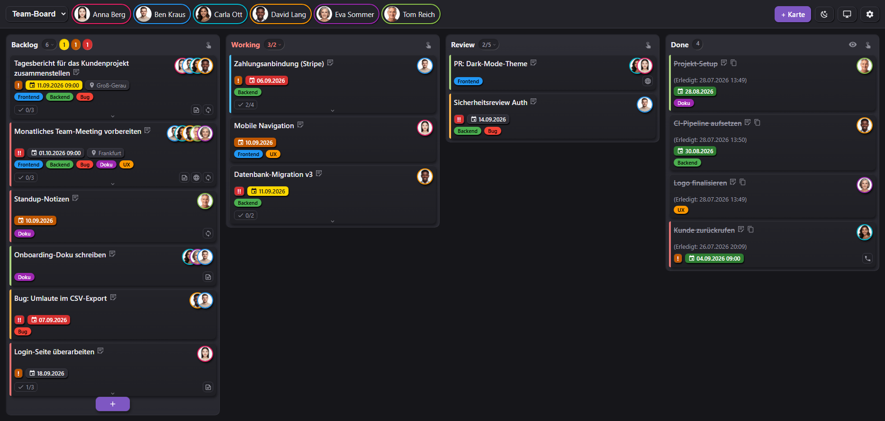

---

## Inhalt

- **[Installation & erste Schritte](#installation--erste-schritte)**
- **[Teil A: Instanzeinstellungen (ioBroker-Admin)](#teil-a-instanzeinstellungen-iobroker-admin)**
  - [Tab "Allgemein"](#tab-allgemein)
  - [Tab "Benutzer"](#tab-benutzer)
  - [Tab "Benachrichtigungen"](#tab-benachrichtigungen)
  - [Tab "Webhooks (eingehend)"](#tab-webhooks-eingehend)
  - [Tab "Webhooks (ausgehend)"](#tab-webhooks-ausgehend)
- **[Teil B: Das Board (Weboberfläche)](#teil-b-das-board-weboberfläche)**
  - [Kopfleiste](#kopfleiste)
  - [Boards, Spalten & Labels](#boards-spalten--labels)
    - [Zahlen im Spaltenkopf](#zahlen-im-spaltenkopf)
    - [Papierkorb](#papierkorb)
    - [Erledigte Karten in den Papierkorb](#erledigte-karten-in-den-papierkorb)
  - [Karten: alle Felder](#karten-alle-felder)
  - [Sortierung & Reihenfolge](#sortierung--reihenfolge)
  - [Wiederholungen](#wiederholungen)
  - [Feiertage](#feiertage)
  - [Benutzer im Board](#benutzer-im-board)
  - [Mobile Ansicht](#mobile-ansicht)
  - [Ansichten teilen / URL-Parameter](#ansichten-teilen--url-parameter)
- **[Teil C: Integration & Automatisierung](#teil-c-integration--automatisierung)**
  - [REST-API](#rest-api)
  - [Webhooks: eingehend](#webhooks-eingehend)
  - [Webhooks: ausgehend](#webhooks-ausgehend)
  - [sendTo & action-State](#sendto--action-state)
  - [Live-Sync & Deep-Links](#live-sync--deep-links)
  - [ioBroker-States & Objekte](#iobroker-states--objekte)
- **[Teil D: Referenz](#teil-d-referenz)**
  - [Sicherheit & Zugriffsschutz](#sicherheit--zugriffsschutz)
  - [Sprache / Mehrsprachigkeit](#sprache--mehrsprachigkeit)
  - [FAQ & Fallstricke](#faq--fallstricke)

---

## Installation & erste Schritte

1. **Adapter installieren.** Im ioBroker-Admin unter *Adapter* nach `kanban` filtern und den Adapter installieren (bei GitHub-Installation siehe [Installation im Haupt-README](../../README.md#installation)).
2. **Instanz anlegen.** Auf der Adapter-Kachel das Menü **⋮** öffnen und **"+"** wählen. ioBroker legt die Instanz an (`kanban.0`) und zeigt dabei ein Konsolenfenster, das nach `Process exited with code 0` geschlossen werden kann. Für jede weitere Instanz (`kanban.1`, `kanban.2`, ...) denselben Weg noch einmal gehen.
3. **Port festlegen.** Unter *Instanzen* das Zahnrad der Instanz öffnen, Tab **Allgemein**: **Port** (Standard `8095`), **IP-Bindung** (Standard `0.0.0.0`) und **Basis-URL** anpassen.
   **Bei mehreren Instanzen:** Jede braucht einen eigenen Port. Ist der eingetragene belegt, startet der Adapter trotzdem und weicht auf den nächsten freien Port aus - die Instanzliste zeigt dann aber weiter den *eingetragenen* Port, und der Link dort führt auf die falsche Instanz. Der tatsächlich benutzte Port steht im Log: `Port 8095 is in use - falling back to free port 8096. The instance list still shows the configured port; enter the free port there to keep both in sync.` Trage ihn danach fest ein.
4. **Benutzer anlegen.** Tab **Benutzer**: Eine frische Instanz bringt **keine** mit. Mindestens eine Person muss eingetragen werden, denn jede Karte braucht eine zuständige. Die Kennung will in Ruhe überlegt sein: Sie lässt sich nach dem ersten Start nicht mehr ändern, der Anzeigename dagegen jederzeit. Warum das so ist, steht im [Tab "Benutzer"](#tab-benutzer).
5. **Web-UI öffnen:** **`http://<host>:<port>/`**
6. Beim ersten Start ist noch kein Board vorhanden. Über das **Zahnrad-Symbol (⚙)** oben rechts ein neues Board anlegen. Jedes neue Board erhält automatisch drei Standardspalten:
   - **Zu erledigen** (`todo`)
   - **In Arbeit** (`doing`)
   - **Erledigt** (`done`, als "Erledigt"-Spalte markiert)
7. Mit **"+ Karte"** die erste Aufgabe anlegen.

**Mehrere Instanzen:** Jede Instanz (`kanban.0`, `kanban.1`, ...) ist ein vollständig eigenständiges System mit eigenem Port, eigener Sprache, eigenen Benutzern und eigenen Boards - **Daten werden nicht geteilt**. Sinnvoll z. B. für getrennte Bereiche (Familie vs. Verein) oder ein Testsystem neben dem Produktivboard.

**Aufbau dieser Dokumentation:** [Teil A](#teil-a-instanzeinstellungen-iobroker-admin) beschreibt alles, was im **ioBroker-Admin** unter *Instanzen → `kanban.0` → Zahnrad* eingestellt wird (Port, Sprache, Benutzerliste, E-Mail, Webhook-Tokens). [Teil B](#teil-b-das-board-weboberfläche) beschreibt die **Weboberfläche** des Boards selbst (Boards, Spalten, Karten, Ansichten). [Teil C](#teil-c-integration--automatisierung) richtet sich an Skripte und Fremdsysteme, [Teil D](#teil-d-referenz) enthält Sicherheit, Sprachen und FAQ.

---

## Teil A: Instanzeinstellungen (ioBroker-Admin)

Diese Einstellungen liegen im **ioBroker-Admin** unter *Instanzen → `kanban.0` → Zahnrad*. Sie gelten für die **gesamte Instanz** und werden erst mit **Speichern** übernommen, der Adapter startet dabei neu. Die folgenden Abschnitte entsprechen den fünf Tabs der Konfigurationsseite.

> In diesem Dokument steht `kanban.0` stellvertretend für die **eigene** Instanz. Bei einer zweiten Instanz lauten alle Pfade und States entsprechend `kanban.1`, `kanban.2`, ...

### Tab "Allgemein"

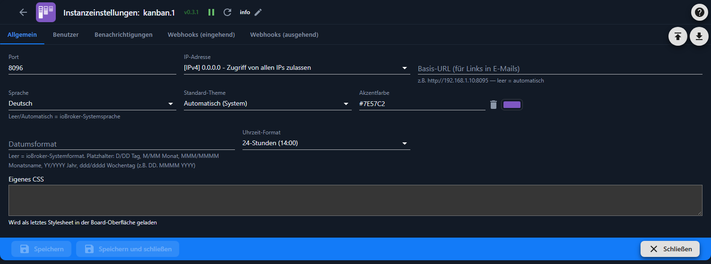

| Einstellung | Bedeutung |
|---|---|
| **Port** | Port des Webservers (Standard `8095`). Ist er belegt, weicht der Adapter auf einen freien aus, die Instanzliste zeigt aber weiter den eingetragenen. Wie sich das erkennen und geradeziehen lässt, steht unter [Installation, Schritt 3](#installation--erste-schritte). |
| **IP-Adresse** | Bind-Adresse (Standard `0.0.0.0` = alle Interfaces). |
| **Basis-URL** | Öffentlich erreichbare URL, die in E-Mail-Links verwendet wird (z. B. hinter einem Reverse-Proxy). Leer = automatische Ermittlung der lokalen IP. |
| **Standard-Theme** | `auto` (System), `light` oder `dark`. |
| **Akzentfarbe** | Farbe der Bedienelemente (Standard `#7E57C2`). |
| **Sprache** | Sprache der Oberfläche. Zur Auswahl stehen elf Sprachen, aufgezählt unter [Sprache / Mehrsprachigkeit](#sprache--mehrsprachigkeit). Leer/automatisch = ioBroker-Systemsprache. Per URL mit `?lang=xx` übersteuerbar. |
| **Datumsformat** | Anzeigeformat des Fälligkeitsdatums. Das Feld ist **leer voreingestellt**, dann gilt das **ioBroker-Systemformat**. Platzhalter siehe Tabelle unten, `DD.MM.` ist eines der möglichen Muster. Beim Start wird geprüft, ob überhaupt ein Tag, Monat oder Jahr darin vorkommt. Ein Vertipper wird verworfen, das Log nennt den Grund, und die Anzeige fällt auf das Systemformat zurück. |
| **Uhrzeit-Format** | `24-Stunden (14:00)` oder `12-Stunden (2:00 PM)`. Betrifft die optionale Uhrzeit auf Karten. |
| **Eigenes CSS** | Wird als `/api/custom.css` eingebunden, für individuelle Anpassungen. |

#### Platzhalter im Datumsformat

Es gilt die verbreitete moment-/Day.js-Schreibweise (Groß-/Kleinschreibung beachten):

| Platzhalter | Bedeutung | Beispiel (20. Juli 2026) |
|---|---|---|
| `D` / `DD` | Tag ohne / mit führender Null | `20` / `20` |
| `M` / `MM` | Monat als Zahl ohne / mit führender Null | `7` / `07` |
| `MMM` / `MMMM` | Monatsname kurz / ausgeschrieben | `Jul` / `Juli` |
| `YY` / `YYYY` | Jahr zwei- / vierstellig | `26` / `2026` |
| `ddd` / `dddd` | Wochentag kurz / ausgeschrieben | `Mo` / `Montag` |

Monats- und Wochentagsnamen erscheinen in der Sprache des Boards. Beispiele: `DD.MM.` → `20.07.` · `DD. MMMM YYYY` → `20. Juli 2026` · `dddd, DD. MMM` → `Montag, 20. Jul` · `MM/DD/YYYY` → `07/20/2026`.

> Hinweis: ioBroker selbst verwendet für Monatsnamen die Platzhalter `OO`/`O`. Diese werden hier **nicht** unterstützt, ein aus dem Systemformat kopierter String mit `OO` muss auf `MMMM` umgeschrieben werden.

### Tab "Benutzer"

Hier wird festgelegt, **welche Personen es gibt**, die Liste gilt für die gesamte Instanz. Im Board erscheinen sie als Chips in der Kopfleiste und lassen sich Karten als Zuständige zuweisen.

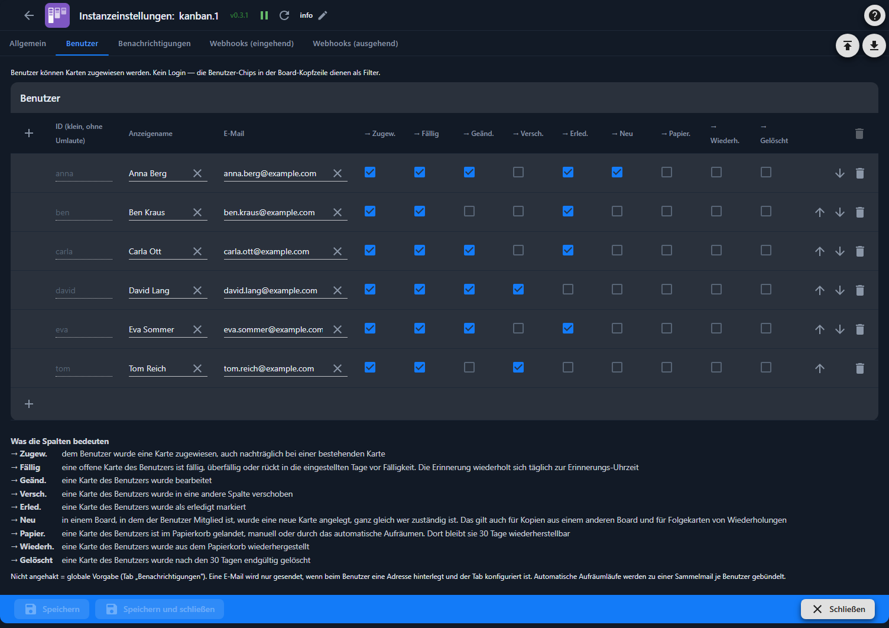

| Feld | Bedeutung |
|---|---|
| **ID** (`name`) | Interne ID, klein geschrieben, ohne Umlaute (z. B. `bjoern`). Wird in URL-Parametern und Zuweisungen verwendet. |
| **Anzeigename** (`displayName`) | Anzeigename (z. B. `Björn`). |
| **E-Mail** (`email`) | Optional. Zieladresse für E-Mail-Benachrichtigungen. |
| **notify...** | Neun Checkboxen je Benutzer für die Benachrichtigungssteuerung, siehe [Tab "Benachrichtigungen"](#tab-benachrichtigungen). |

Eine neue Zeile entsteht über das **"+"** in der Kopfzeile der Tabelle, das Papierkorb-Symbol am Zeilenende entfernt sie wieder (ohne Rückfrage). Die beiden Pfeile daneben schieben eine Zeile nach oben oder unten; die Reihenfolge der Tabelle ist die Reihenfolge, in der die Personen im Board erscheinen. Zeilen ohne ID werden beim Speichern verworfen. Eine frische Instanz bringt **keine** Benutzer mit; bis der erste eingetragen ist, ist der Knopf "+ Karte" im Board gesperrt und sagt das auch.

> **Die ID ist der Schlüssel, und nach dem Anlegen gesperrt.** Über die Spalte *ID* finden Boards und Karten ihre Personen; auch die Avatarbilder und die Adressen geteilter Ansichten hängen daran. Eine nachträgliche Änderung ließe all das ins Leere zeigen, und der Adapter könnte nicht einmal aufräumen: Eine Umbenennung ist technisch nicht von "gelöscht und neu angelegt" zu unterscheiden. Deshalb ist das Feld gesperrt, sobald der Benutzer einmal gespeichert wurde. Der Adapter trägt dafür beim nächsten Start ein Merkmal in die Instanzkonfiguration ein und startet dabei einmal neu. Das passiert einmal je neuem Benutzer, danach nie wieder.
>
> **Wann das Feld überhaupt zuschnappt:** Erst dann, wenn an der Kennung etwas hängt, also sobald ihr eine Karte zugewiesen ist oder sie ein Avatarbild trägt. Bis dahin lässt sie sich frei ändern; eine Kennung, auf die nichts zeigt, kann man gefahrlos umbenennen. Eine frisch eingerichtete Instanz mit Benutzern, aber ohne Karten schreibt ihre Konfiguration deshalb gar nicht zurück und startet nicht von selbst neu.
>
> **Wenn das Feld editierbar bleibt:** Der Adapter schreibt das Merkmal beim Start zurück. Wer die Instanzeinstellungen genau in diesem Moment speichert, überschreibt es mit dem Formular wieder. Der Adapter versucht es dann bis zu dreimal erneut, meldet danach im Log "Could not freeze the user ID(s)" und lässt die Felder editierbar. Erkennbar ist der Zustand daran, dass die Spalte *ID* weiterhin tippbar ist - allerdings **erst nach einem vollständigen Neuladen der Admin-Seite**. Innerhalb der offenen Seite bleibt das Feld auch dann tippbar, wenn der Adapter es längst festgeschrieben hat; ein Wechsel zu einem anderen Menüpunkt und zurück genügt nicht. Wer das nicht weiß, hält einen gelungenen Vorgang für gescheitert. Verlässlicher als das Feld ist das Log: Dort steht entweder "User ID(s) ... are now fixed" oder die Warnung. Abhilfe im echten Fehlerfall: Instanz einmal neu starten und prüfen, ob die Felder gesperrt sind, **bevor** Karten angelegt werden.
>
> Der **Anzeigename** bleibt frei änderbar. Aus "Tom Reich" wird also gefahrlos "Tommy Reich", ohne dass eine Karte etwas davon merkt.
>
> *Empfehlung:* Beim Anlegen kurz überlegen. Kleingeschrieben, ohne Umlaute, und so, dass die Kennung auch in einer geteilten Adresse (`?users=bjoern`) noch lesbar ist.
>
> <a id="benutzer-umbenennen"></a>
> **Wenn Karten doch ins Leere zeigen**, meldet der Adapter das beim Start im Log und im State `info.orphanedAssignees`, und das Zahnrad in der Board-Kopfzeile bekommt einen kleinen Punkt. Dahin kommt es, wenn jemand gelöscht und neu angelegt wurde oder wenn eine Karte über die API mit einer fremden Kennung entstand.
>
> Reparieren lässt sich das unter **⚙ → Benutzer → Verwaiste Zuständige**. Diesen Abschnitt gibt es nur, wenn es etwas zu reparieren gibt - stimmt alles, zeigt der Reiter nur die Benutzer-Avatare. Dort steht je verwaister Kennung eine Zeile mit Umfang und betroffenen Boards; die Kartenzahl klappt die Liste der Karten auf, damit man vor dem Umhängen hineinsehen kann. Daneben ein Auswahlfeld mit den vorhandenen Personen und ein Knopf mit Rückfrage. Der Papierkorb bleibt außen vor: Was auf dem Weg zur Löschung ist, muss niemandem mehr gehören.
>
> Ohne Oberfläche geht dasselbe über die Schnittstelle:
>
> ```bash
> curl -X POST "http://<host>:8095/webhook/<TOKEN>/action" >   -H 'Content-Type: application/json' >   -d '{"cmd":"reassignUser","from":"bjoern_alt","to":"bjoern"}'
> ```
>
> Das zieht die Zuständigen aller Karten, die Mitgliederlisten der Boards **und** das Avatarbild mit. Das Bild allerdings nur, wenn die Zielperson noch keines hat. War die neue ID an einer Karte schon eingetragen, entsteht kein doppelter Eintrag. Die Zielkennung muss in den Instanzeinstellungen existieren, sonst bricht der Aufruf mit `400` ab.

> **Nicht hier:** Benutzerfarbe, Avatarbild und die Zuordnung zu einzelnen Boards werden direkt in der Weboberfläche gepflegt - siehe [Benutzer im Board](#benutzer-im-board).

### Tab "Benachrichtigungen"

Benachrichtigungen werden bei Karten-Ereignissen ausgelöst und per **E-Mail** (über den ioBroker-`email`-Adapter) und/oder **ausgehende Webhooks** verteilt. Zusätzlich wird jedes Ereignis in den State `kanban.0.lastEvent` geschrieben (als Skript-Trigger).

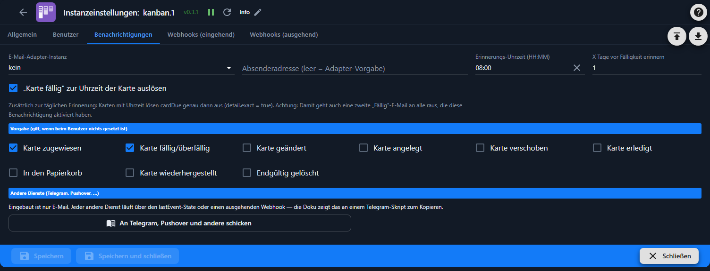

| Einstellung | Bedeutung |
|---|---|
| **email-Adapter-Instanz** | Welche `email.x`-Instanz für den Versand genutzt wird. |
| **Absender** | Optionale Absenderadresse (leer = Standard des email-Adapters). |
| **Erinnerungs-Uhrzeit** | `HH:MM`, wann fällige Karten geprüft werden (Standard `08:00`). |
| **Erinnern X Tage vor Fälligkeit** | Vorlauf für `cardDue`-Erinnerungen (`0`-`30`, Standard `1`). Betrifft **nur** die Erinnerungsmail, nicht die Farben am Board. |
| **"Karte fällig" zur Uhrzeit der Karte auslösen** | Standard **aus**. Zusätzlich zur täglichen Erinnerung feuert `cardDue` bei Karten mit gesetzter **Uhrzeit** genau zu dieser Uhrzeit (`detail.exact = true`). Damit lassen sich Automatisierungen minutengenau auslösen, ohne die API abzufragen. **Achtung:** Das Ereignis läuft durch die normale Benachrichtigung, es geht also auch eine zweite "Fällig"-E-Mail an alle raus, die diese aktiviert haben - wer nur Skripte/Webhooks bedienen will, schaltet die E-Mail "Fällig" beim Benutzer ab. |
| **Standard-Vorgabe** | Globale Fallback-Schalter je Ereignis, greifen, wenn ein Benutzer nichts Eigenes eingestellt hat (siehe unten). |

Ganz unten im Tab steht der Block **"Andere Dienste (Telegram, Pushover, ...)"**. Er enthält keine Einstellung, sondern nur den Hinweis, dass allein E-Mail eingebaut ist, und einen Link auf [Benachrichtigungen an beliebige Dienste](#andere-dienste).

#### Wer wird wann benachrichtigt?

Im Tab **"Benutzer"** hat jeder Benutzer neun Checkboxen. Sie legen fest, bei welchen Ereignissen er eine E-Mail erhält:

| Häkchen | Wann genau es feuert | Empfänger |
|---|---|---|
| **Zugew.** (`notifyAssigned`) | Sobald jemand als Zuständiger **hinzukommt**, beim Anlegen der Karte für jeden Ersteintrag und beim späteren Hinzufügen. Feuert **einmal je Person**. | **Nur die betroffene Person** |
| **Fällig** (`notifyDue`) | Täglich zur Erinnerungszeit (Standard `08:00`) für Karten, die heute fällig sind oder innerhalb der Vorlauftage liegen. Ein durch Adapterstart verpasster Lauf wird nachgeholt. | Alle Zuständigen der Karte |
| **Geänd.** (`notifyUpdated`) | Bei jeder Bearbeitung einer Karte (Titel, Datum, Labels, Checkliste ...). | Alle Zuständigen der Karte |
| **Versch.** (`notifyMoved`) | Beim Verschieben in eine **andere** Spalte. | Alle Zuständigen der Karte |
| **Erled.** (`notifyDone`) | **Zusätzlich** zu "Versch.", wenn die Zielspalte als *Erledigt* markiert ist. | Alle Zuständigen der Karte |
| **Neu** (`notifyCreated`) | **Einmal** beim Anlegen einer Karte; ebenso beim Kopieren aus einem anderen Board und wenn eine Wiederholung die nächste Karte erzeugt. | **Alle Mitglieder des Boards**, unabhängig von der Zuständigkeit |
| **Papier.** (`notifyDeleted`) | Wenn eine Karte in den **Papierkorb** wandert, egal ob von Hand gelöscht oder durch das automatische Aufräumen. Standard: aus. | Alle Zuständigen der Karte |
| **Wiederh.** (`notifyRestored`) | Wenn eine Karte aus dem Papierkorb **wiederhergestellt** wird. Standard: aus. | Alle Zuständigen der Karte |
| **Gelöscht** (`notifyPurged`) | Wenn eine Karte **endgültig** entfernt wird, also nach 30 Tagen im Papierkorb oder von Hand. Standard: aus. | Alle Zuständigen der Karte |

Der Kern-Unterschied zwischen **Zugew.** und **Neu**: "Zugew." ist die **persönliche** Nachricht an die zuständige Person und geht nur an sie. "Neu" ist die **Bestandsmeldung** an das ganze Team, also an alle Mitglieder des Boards, auch wenn die Karte jemand anderem gehört.

**Achtung, Ereignisse überlagern sich.** Manche Aktionen lösen mehrere Ereignisse gleichzeitig aus. Wer beide Häkchen gesetzt hat, bekommt dann auch **mehrere E-Mails**, eine Zusammenfassung findet nicht statt:

| Aktion | Ausgelöste Ereignisse |
|---|---|
| Karte **mit** Zuständigen anlegen | **Neu** + **Zugew.** |
| Karte bearbeiten und dabei jemanden hinzufügen | **Geänd.** + **Zugew.** |
| Karte in die Erledigt-Spalte ziehen | **Versch.** + **Erled.** |
| Spalte im Karteneditor auf eine Erledigt-Spalte umstellen | **Geänd.** + **Versch.** + **Erled.** |
| Spalte im Karteneditor auf eine offene Spalte umstellen | **Geänd.** + **Versch.** |

Für die meisten Setups genügt daher **"Zugew." allein**. "Neu" lohnt sich, wenn man auch über Karten informiert werden will, die *andere* anlegen und bei denen man mitzuständig ist.

**Fallback:** Hat ein Benutzer bei einem Ereignis nichts eingestellt, greift die **globale Vorgabe** (Tab "Benachrichtigungen", Abschnitt "Standard-Vorgabe"). So bekommen bestehende Benutzer weiterhin Benachrichtigungen, ohne dass für jeden alles einzeln gesetzt werden muss.

**Kein Selbst-Spam:** Wer eine Änderung auslöst, wird über genau diese Änderung nicht selbst benachrichtigt.

**Voraussetzung:** Nur Benutzer **mit hinterlegter E-Mail-Adresse** erhalten Mails; alle anderen werden übersprungen.

> **Der Weg zählt mit.** Eine Karte per Ziehen zu verschieben löst die Ereignisse des Verschiebens aus. Wird dieselbe Spalte im **Karteneditor** umgestellt, ist das für den Adapter zusätzlich eine Änderung an der Karte, es kommt also **Geänd.** dazu. Wer alle Haken gesetzt hat, bekommt für einen Handgriff drei Nachrichten.

> **Papierkorb-Ereignisse:** Für "in den Papierkorb", "wiederhergestellt" und "endgültig gelöscht" gibt es eigene Häkchen, die standardmäßig **aus** sind. Ein **automatischer Aufräumlauf** verschickt keine Einzelmails, sondern **eine Sammelmail je Benutzer** mit allen betroffenen Karten. Wird eine einzelne Karte von Hand gelöscht, kommt wie gewohnt eine Einzelmail. Der **Besen** dagegen leert den ganzen Papierkorb auf einmal und verschickt deshalb ebenfalls eine Sammelmail, nicht eine Nachricht je Karte.

#### Kalender-Einladung (.ics)

Ist an einer Karte **"Kalender-Einladung"** aktiviert und ein Datum gesetzt, hängt der Adapter der Benachrichtigungs-E-Mail eine `termin.ics` an:

- **Ohne Uhrzeit** → Ganztagestermin am Fälligkeitstag.
- **Mit Uhrzeit** → Termin mit Start und der an der Karte eingestellten **Dauer** (`calendarDuration`, Standard eine Stunde).
- **Mit Wiederholung** → **Serientermin** statt Einzeltermin: Der Termin trägt eine `RRULE`, der Kalender legt also die ganze Serie an. Abgebildet werden täglich, alle X Tage, wöchentlich (mit Wochentagen), monatlich (Tag im Monat), monatlich (n-ter/letzter Wochentag) und jährlich. **Ausnahme:** "Arbeitstag im Monat" hängt an Feiertagen, die der Kalenderstandard nicht kennt - solche Karten bleiben Einzeltermine.
- **Die Einladung kommt nur einmal.** Sie liegt der Mail bei, wenn die Karte **angelegt** oder jemandem **neu zugewiesen** wird. Die Folgekarten einer Wiederholung verschicken **keine** weitere Einladung (die Serie liegt im Kalender bereits), und Erinnerungs- oder Verschiebe-Mails hängen ebenfalls nichts an. Eine **aktualisierte** Einladung geht nur raus, wenn sich **Fälligkeit, Uhrzeit, Dauer oder Wiederholungsregel** ändern - dann mit derselben `UID` und höherer `SEQUENCE`, sodass der Kalender den vorhandenen Termin ersetzt statt einen zweiten anzulegen. Andere Änderungen (z. B. am Titel) lösen bewusst keine neue Einladung aus.
- **Beim Löschen kommt eine Absage.** Wandert eine Karte mit Einladung in den Papierkorb oder wird sie endgültig entfernt, geht eine `.ics` mit `METHOD:CANCEL`, derselben `UID` und der nächsten `SEQUENCE` raus. Der Kalender räumt den Termin damit ab, statt ihn stehen zu lassen.
- Übernommen werden Titel (`SUMMARY`), Beschreibung, **Ort** (`LOCATION`) und Link (`URL`).
- **Zeitzone:** Uhrzeit-Termine werden eindeutig in UTC ausgegeben; die zugrunde liegende Zeitzone wird aus dem System ermittelt (bzw. `system.config`), Sommer-/Winterzeit inklusive. Ganztägige Termine sind bewusst zeitzonenlos.

Der Anhang wird bei **jeder** Benachrichtigung zur Karte mitgeschickt. Wird die Einladung z. B. erst nachträglich aktiviert, kommt sie mit der nächsten "Karte geändert"-Mail.

### Tab "Webhooks (eingehend)"

Andere Systeme (oder ioBroker selbst) können Karten und Boards per HTTP verändern. Diese Zugriffe sind über **Tokens** abgesichert, die hier verwaltet werden. Die zugehörigen Endpunkte und Kommandos stehen in [Teil C](#webhooks-eingehend).

| Feld | Bedeutung |
|---|---|
| **name** | Bezeichnung (erscheint in Logs als Quelle). |
| **token** | Geheimes Token, Teil der URL. |
| **allowedBoards** | `*` = alle Boards, oder eine Liste erlaubter Board-IDs (getrennt durch Leerzeichen, Komma oder Semikolon). **Leer = kein Board**: Der Token darf dann nichts mehr schreiben. Wer alle Boards meint, trägt ausdrücklich `*` ein. |
| **enabled** | Token aktiv/inaktiv. |

Mit dem Button **"Neuen Token generieren"** (über der Tabelle) wird automatisch eine neue Zeile mit einem sicheren Zufallstoken (32 Hex-Zeichen) und dem Namen `agent`/`agent1`/... angelegt. Danach den Namen anpassen, ggf. `allowedBoards` einschränken und **Speichern**. Alternativ das Token-Feld von Hand ausfüllen (z. B. `openssl rand -hex 16`). **Empfehlung:** für jede Integration (jeder Agent, jedes Skript) einen eigenen Token, so lässt sich jeder einzeln per `enabled`-Häkchen sperren oder ersetzen.

Ungültiges Token → HTTP `401`. Board nicht erlaubt → HTTP `403`.

**Schnelltest:** Ob ein frisch angelegter Token funktioniert, klärt ein einzelner Aufruf - der Standardfall braucht keinen Ausflug in [Teil C](#webhooks-eingehend):

```bash
curl -X POST "http://<host>:8095/webhook/<DEIN_TOKEN>/action" \
  -H 'Content-Type: application/json' -d '{"cmd":"listBoards"}'
```

Kommt eine **Board-Liste** zurück, ist der Token gültig. Alle weiteren Kommandos sowie die vollständige Liste der Antworten und Fehlercodes stehen in [Teil C](#webhooks-eingehend).

Unter der Tabelle stehen zwei weitere Schalter: **"Kommandos über den action-State annehmen"** (siehe [sendTo & action-State](#sendto--action-state)) und **"Erlaubte Browser-Herkünfte (CORS)"**. Letzteres bleibt normalerweise leer und wird nur gebraucht, wenn eine Webseite unter anderer Adresse die API aus dem Browser aufruft - Einzelheiten unter [Sicherheit & Zugriffsschutz](#sicherheit--zugriffsschutz).

### Tab "Webhooks (ausgehend)"

Der Adapter kann bei jedem Ereignis einen **HTTP-POST** an beliebige URLs senden, z. B. an Node-RED, IFTTT, einen Chat-Dienst oder eigene Skripte.

| Feld | Bedeutung |
|---|---|
| **name** | Bezeichnung. |
| **url** | Ziel-URL (empfängt `POST` mit JSON-Body). |
| **events** | `*` = alle Ereignisse, oder eine Liste von Ereignistypen (durch Komma/Semikolon/Leerzeichen getrennt). |
| **enabled** | Aktiv/inaktiv. |

**Ereignistypen:** `cardCreated`, `cardUpdated`, `cardMoved`, `cardAssigned`, `cardDone`, `cardDeleted`, `cardRestored`, `cardPurged`, `cardDue`.

Aufbau des gesendeten JSON-Payloads und Details zur Zustellung: [Teil C](#webhooks-ausgehend).

---

## Teil B: Das Board (Weboberfläche)

Die Weboberfläche unter **`http://<host>:8095/`** ist der eigentliche Arbeitsbereich. Alles in diesem Teil wird **direkt im Browser** eingestellt und wirkt sofort, ohne Adapter-Neustart. Dank Live-Sync sind Änderungen auf allen offenen Geräten unmittelbar sichtbar.

### Kopfleiste

Die **Kopfleiste** enthält von links nach rechts: die **Board-Auswahl**, die **Benutzer-Chips** (zugleich Personen-Filter, siehe [Benutzer im Board](#benutzer-im-board)), den Button **"+ Karte"**, den **Theme-Umschalter** (Sonne/Mond), die **"Ansichten"** (Monitor-Symbol, siehe [Ansichten teilen](#ansichten-teilen--url-parameter)) und die **Einstellungen** (Zahnrad).

Das Zahnrad öffnet den **Board-Manager**, der die folgenden Abschnitte abdeckt. Im Einbettmodus (`embed=1`) wird die Kopfleiste komplett ausgeblendet.

### Boards, Spalten & Labels

Das **Zahnrad (⚙)** öffnet den Board-Manager. Er hat zwei Tabs: **Board** und **Benutzer** (Farben und Avatare, siehe [Benutzer im Board](#benutzer-im-board)). Änderungen werden erst mit **Speichern** übernommen.

Ganz oben im Board-Tab steht eine Zeile mit drei Elementen. Der vierte Eintrag der Tabelle, "Board löschen", sitzt am unteren Ende des Tabs:

| Element | Wirkung |
|---|---|
| **Board-Auswahl** | Legt fest, welches Board gerade **bearbeitet** wird. Das aktive Board im Hintergrund wechselt dadurch nicht. Bei ungespeicherten Änderungen fragt der Dialog vorher nach (Speichern, Verwerfen, Abbrechen). |
| **Pfeil-Button** | Wechselt das **angezeigte** Board auf das gerade bearbeitete. Der Dialog bleibt dabei offen. Ist bereits das aktive Board gewählt, ist der Button ausgegraut. |
| **Namensfeld + "Anlegen"** | Legt ein neues Board an. Es wird sofort zum bearbeiteten Board und bekommt automatisch alle bekannten Benutzer als Mitglieder sowie einen Papierkorb. |
| **"Board löschen"** (ganz unten) | Löscht das bearbeitete Board nach Rückfrage. Das letzte verbleibende Board lässt sich **in der Weboberfläche** nicht löschen. Über API und Webhook (`deleteBoard`) greift diese Sperre **nicht**: Dort lässt sich auch das letzte Board entfernen, die Instanz zeigt danach wieder "Kein Board vorhanden". |

Darunter folgen Board-Titel, die Mitgliederauswahl (siehe [Benutzer im Board](#benutzer-im-board)), Spalten, Labels, das Link-Ziel für Benachrichtigungen sowie der Abschnitt [Erledigte Karten in den Papierkorb](#papierkorb).

#### Spalten

Spalten lassen sich anlegen, per Drag & Drop sortieren, umbenennen und löschen. **Beim Löschen einer Spalte gehen keine Karten verloren**, sie werden automatisch in die erste Spalte des Boards verschoben. Der [Papierkorb](#papierkorb) ist eine Systemspalte und taucht in dieser Liste nicht auf.

> Alle Aktionen, die sich nicht rückgängig machen lassen (Karte oder Board löschen, Papierkorb leeren, endgültig löschen), fragen über einen Dialog **innerhalb der Oberfläche** nach, passend zum Design und in der eingestellten Sprache.

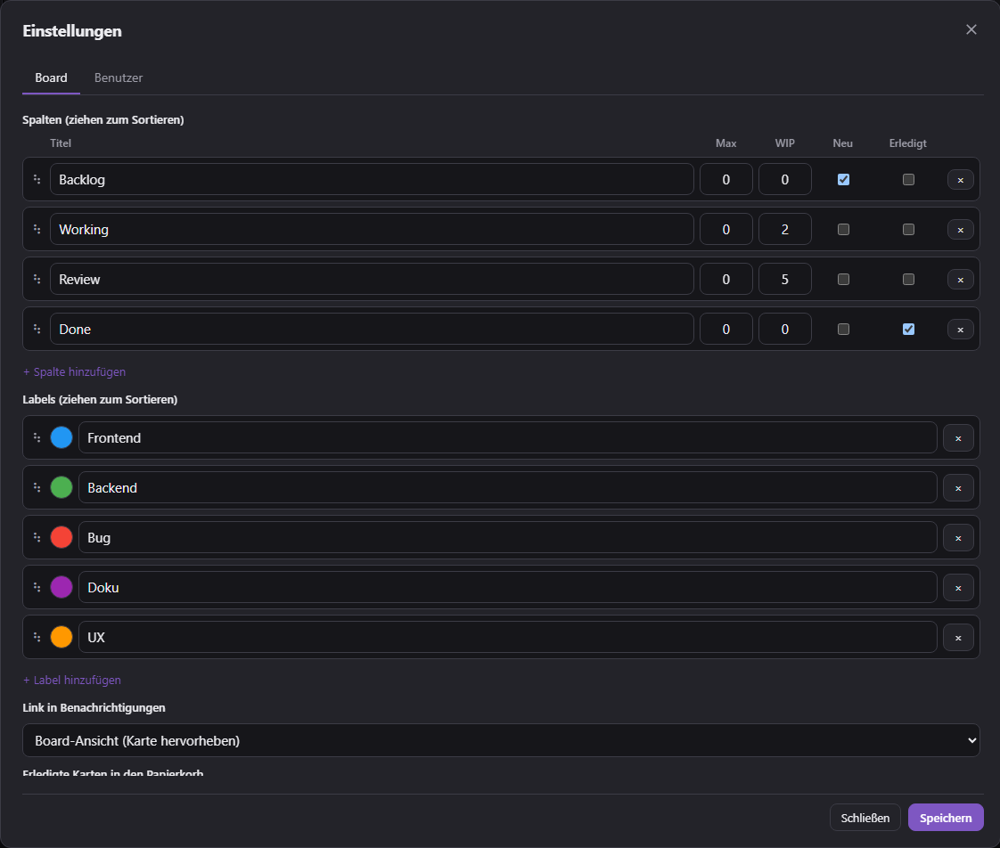

Über der Spaltenliste steht eine Kopfzeile mit den Feldbezeichnungen (**Titel · Max · WIP · Neu · Erledigt**). Jede Überschrift hat einen Tooltip mit der ausführlichen Erklärung.

- **Spalten-ID:** Neben dem sichtbaren Titel trägt jede Spalte eine **unveränderliche ID**. Die drei Standardspalten heißen `todo`, `doing` und `done`, neu angelegte Spalten bekommen eine erzeugte ID der Form `col_msd0mu8tkck68`. Beim **Umbenennen bleibt die ID erhalten** - geteilte `columns=`-Links und `moveCard`-Aufrufe funktionieren also unverändert weiter. Nachschlagen lassen sich die IDs über `GET /api/boards/<id>` (siehe [REST-API](#rest-api)). IDs müssen **eindeutig** sein: Schickt ein `PATCH` dieselbe ID zweimal oder die ID der Papierkorb-Spalte, bekommt die betroffene Spalte eine neue erzeugte ID.
- **Spaltenbreite:** Die Spalten teilen sich immer die **volle Fensterbreite** - zwei Spalten nehmen also je die Hälfte ein. Erst wenn rechnerisch weniger als 280 px je Spalte übrig bleiben, wird das Board waagerecht scrollbar.
- **Anzeige-Limit (Max):** Zahl > 0 zeigt in dieser Spalte nur die ersten N Karten; direkt unter der letzten erscheint `+X weitere`, darunter erst der Knopf zum Anlegen. `0` = alle anzeigen. Praktisch, damit lange Rückstände das Board nicht sprengen. Der Zähler in der Spaltenkopfzeile zählt weiterhin **alle** Karten der Spalte. `+X weitere` ist ein **Knopf**: Ein Klick zeigt die übrigen Karten, die Zeile heißt dann `- X wieder ausblenden`, ein zweiter Klick klappt sie zu. Das Limit am Board bleibt dabei unangetastet, die Abweichung merkt sich nur der eigene Browser, wie der Sortiermodus und das Augen-Symbol.
- **WIP-Limit** (Work-in-Progress): Zahl > 0 begrenzt die empfohlene Kartenanzahl. Wird sie überschritten, warnt die Spalte optisch (Zähler & Kopf werden hervorgehoben). `0` = kein Limit. Das Limit ist eine **Warnung**, keine harte Sperre. Sie bezieht sich immer auf die **Gesamtzahl** der Spalte, auch wenn der Personen-/Label-Filter gerade weniger Karten anzeigt. Ist es überschritten, steht auch bei aktivem Filter die Zahl der **Spalte** vor dem Schrägstrich, etwa "7/5" — also genau die Zahl, aus der die Warnfarbe kommt. Der Tooltip nennt beide: wie viele Karten wirklich in der Spalte liegen und wie viele der Filter davon zeigt. Solange das Limit eingehalten wird, zeigt die Zahl bei aktivem Filter schlicht die Treffer, ohne Schrägstrich; ein Verhältnis aus gefilterten Karten und Limit wäre eine Zahl aus zwei verschiedenen Mengen.
- **"Neu"** (`allowAdd`): legt fest, in welchen Spalten am Spaltenfuß der Knopf zum Anlegen erscheint - ein "+" auf farbigem Grund. Beschriftet ist er nur im Tooltip, dort steht "+ Karte hinzufügen".
- **"Erledigt"-Spalte** (`isDone`): Karten, die hierher verschoben werden, gelten als erledigt (`doneAt` wird gesetzt, Wiederholungen werden ausgelöst). Ihr Titel wird **durchgestrichen** dargestellt, darunter steht der Zeitpunkt des Erledigens in Klammern, zum Beispiel `(Erledigt: 26.07.2026 20:09)`, im Datums- und Zeitformat der Instanz. Die Zeile setzt einen gesetzten `doneAt` voraus; Karten, die nie durch eine Erledigt-Spalte gegangen sind, zeigen sie nicht.
- **Erledigt ein-/ausblenden (Augen-Symbol):** Jede Erledigt-Spalte hat oben rechts einen Augen-Umschalter, der die erledigten Karten ein- oder ausblendet (pro Gerät gespeichert).
- **Limit sichtbarer erledigter Karten:** Per URL-Parameter `doneLimit=N` (siehe [Ansichten teilen / URL-Parameter](#ansichten-teilen--url-parameter)) lassen sich nur die N zuletzt erledigten Karten anzeigen - praktisch für kompakte, geteilte Ansichten.
- **Erledigte Karte kopieren:** Neben dem Titel einer erledigten Karte sitzt ein kleines Kopier-Symbol. Es öffnet den Editor mit denselben Inhalten als **neue** Karte. Sie landet beim Speichern in der ersten Spalte mit "Neu"-Häkchen, Checklisten-Punkte starten unerledigt, und als Fälligkeit wird das **heutige Datum** vorgeschlagen, sofern das Original überhaupt eines hatte (eine gesetzte Uhrzeit bleibt erhalten). Gedacht für wiederkehrende Aufgaben, die keine feste Wiederholung haben.

<a id="zahlen-im-spaltenkopf"></a>
#### Zahlen im Spaltenkopf (ab 0.3.2)

Neben dem Spaltentitel steht nicht nur die Kartenanzahl, sondern auf Wunsch auch, **wie dringend** der Inhalt der Spalte ist.

Ein Klick auf eine der Zahlen öffnet ein kleines Menü mit vier Haken. Jeder gesetzte Haken steht anschließend als eigenes Abzeichen daneben.

| Eintrag | Zeigt |
|---|---|
| **Gesamt** | die gewohnte Zahl: alle Karten der Spalte, bei WIP-Limit als `7/5`. Bei aktivem Filter die Treffer, sobald das Limit überschritten ist aber weiterhin die Zahl der Spalte |
| **Morgen** | Karten im Vorwarnfenster, gelb |
| **Heute** | heute fällige Karten, orange |
| **Überfällig** | Karten, deren Datum oder Uhrzeit vorbei ist, rot |

Die drei Fälligkeitszahlen tragen **dieselben Farben wie die Abzeichen auf den Karten** und folgen derselben Rechnung, samt Uhrzeit. "Morgen" heisst dabei genau der nächste Kalendertag, unabhängig davon, was in den Instanzeinstellungen als Vorlauf für die Erinnerungsmail steht. Steht eine Zahl auf `0`, bleibt das Abzeichen stehen und verliert nur die Warnfarbe; so springt die Kopfzeile nicht bei jeder Änderung, und das Menü bleibt in Reichweite.

Mindestens eine Zahl bleibt stehen: Der letzte gesetzte Haken lässt sich nicht entfernen, sonst gäbe es kein Ziel mehr, über das sich das Menü wieder aufrufen lässt. Er ist deshalb abgeblendet dargestellt.

Die Auswahl gilt **je Spalte** und wird **pro Gerät** gespeichert, wie der Sortiermodus und das Augen-Symbol. Ein Personen- oder Label-Filter wirkt auf alle vier Zahlen gleich. In der Erledigt-Spalte und im Papierkorb fehlt das Menü: Dort gilt jede Karte als erledigt, es gäbe nichts einzufärben.

Bedienen lässt sich das auch mit der Tastatur. Tab erreicht die Zahlen, Enter öffnet das Menü, die Pfeiltasten wandern darin, Enter setzt oder löscht einen Haken, Escape schließt und gibt den Fokus zurück. Dasselbe gilt für das Sortiermenü.

<a id="papierkorb"></a>
#### Papierkorb (ab 0.3.0)

Jedes Board hat eine **Systemspalte "Papierkorb"**. Gelöschte Karten verschwinden nicht sofort, sondern liegen dort **30 Tage** und lassen sich jederzeit zurückholen. Erst danach werden sie endgültig entfernt.

- **Sichtbarkeit:** Der Papierkorb ist **standardmäßig ausgeblendet**. Einblenden lässt er sich unten in den Board-Einstellungen über **"Papierkorb einblenden"**. Diese Einstellung gilt **nur für das jeweilige Gerät**, andere Nutzer sehen ihr Board unverändert.
- **Was dort landet:** alles, was über den **Löschen**-Button im Karten-Editor entfernt wird, Karten, die **per Drag & Drop** in den Papierkorb gezogen werden, sowie die Karten aus dem [automatischen Aufräumen](#erledigte-karten-in-den-papierkorb).
- **Zurückholen:** Karte aus dem Papierkorb herausziehen oder das **Wiederherstellen**-Symbol auf der Karte antippen. Sie landet dann in der ersten offenen Spalte.
- **Sofort endgültig löschen:** Das zweite Symbol auf der Karte entfernt sie unwiderruflich. Am Spaltenkopf leert der Besen-Button den **kompletten** Papierkorb. Beides fragt vorher nach. Auch über API und Webhook greift `purgeCard` **nur auf Karten im Papierkorb** - bei einer aktiven Karte kommt `400` mit "Karte '...' liegt nicht im Papierkorb". Der Weg an der Aufbewahrungsfrist vorbei führt also immer erst durch den Papierkorb.
- **Rückfragen richtig lesen:** Der Bestätigungsdialog beim Löschen einer Karte sagt selbst, was passiert: "Karte in den Papierkorb verschieben? Von dort ist sie 30 Tage lang wiederherstellbar." Wirklich unwiderruflich sind nur das zweite Symbol auf einer Karte **im** Papierkorb und der Besen-Button am Spaltenkopf; deren Dialoge sagen das ausdrücklich.
- **Restlaufzeit:** Jede Karte zeigt an, wie lange sie noch aufbewahrt wird, zum Beispiel "noch 30 Tage".
- **Eigene Optik:** Die Spalte ist bewusst neutral grau gehalten, unabhängig von Theme und Akzentfarbe, damit sie sich von den Arbeitsspalten abhebt.
- **Sonderstellung:** Der Papierkorb steht immer ganz rechts, lässt sich nicht umbenennen, verschieben oder löschen und taucht in der Spalten-Konfiguration nicht auf. Er kennt kein WIP-Limit und keinen "Neu"-Button und trägt zum Zähler anderer Spalten nicht bei. Den **Sortier-Umschalter** hat er seit 0.3.2 wie jede andere Spalte; er sitzt rechts im Spaltenkopf, der Besen links daneben. Voreingestellt bleibt die Reihenfolge nach Löschzeitpunkt, älteste zuerst - oben steht also, was der endgültigen Löschung am nächsten ist.
- **Bestehende Boards:** Beim ersten Start von 0.3.0 bekommt jedes vorhandene Board automatisch einen Papierkorb. An bestehenden Karten ändert sich dabei nichts.

<a id="erledigte-karten-in-den-papierkorb"></a>
#### Erledigte Karten in den Papierkorb (ab 0.3.0)

Damit sich die Erledigt-Spalte nicht endlos füllt, kann jedes Board alte erledigte Karten selbsttätig in den Papierkorb räumen. Die Einstellung steht unten im Board-Tab und ist **standardmäßig aus**.

| Modus | Wirkung |
|---|---|
| **Aus** | Nichts wird automatisch verschoben (Standard). |
| **Nach Alter** | Karten, deren Erledigung länger als *X* Tage zurückliegt, wandern in den Papierkorb. Voreinstellung: 90 Tage. |
| **Nach Anzahl** | In jeder Erledigt-Spalte bleiben nur die *X* zuletzt erledigten Karten stehen, der Rest wandert in den Papierkorb. Voreinstellung: 100 Karten. |

Der Lauf startet **einmal täglich** sowie **beim Adapterstart**. Grundlage ist der Erledigt-Zeitpunkt (`doneAt`); Karten ohne diesen Zeitstempel bleiben unangetastet. Er überlebt den Papierkorb: Wer eine erledigte Karte löscht und zurückholt, findet ihren ursprünglichen Erledigt-Zeitpunkt wieder vor. Weil die Karten nur in den Papierkorb wandern, bleiben weitere 30 Tage Zeit, etwas zurückzuholen.

#### Labels

Labels sind farbige Schlagworte und werden **pro Board** im Tab *Board* verwaltet (anlegen, umbenennen, umfärben, löschen). Auf der Karte erscheinen sie als farbiges Badge mit automatisch kontrastierender Schrift; im [Ansichten-Dialog](#ansichten-teilen--url-parameter) lassen sie sich als Blacklist zum Ausblenden nutzen.

Neue Labels bekommen ihre Farbe reihum aus einer Palette von acht, damit nacheinander angelegte Labels sich schon an der Farbe unterscheiden.

Die **Reihenfolge** der Labels lässt sich wie die der Spalten am Anfasser ziehen, und sie gilt überall: auf den Karten, in der Auswahl im Karteneditor und in der Zusammenfassung der Abschnittszeile. Zwei Karten mit denselben Labels sehen damit gleich aus. Wer es alphabetisch will, zieht die Liste einmal in diese Reihenfolge.

#### Link in Benachrichtigungen (ab 0.2.0)

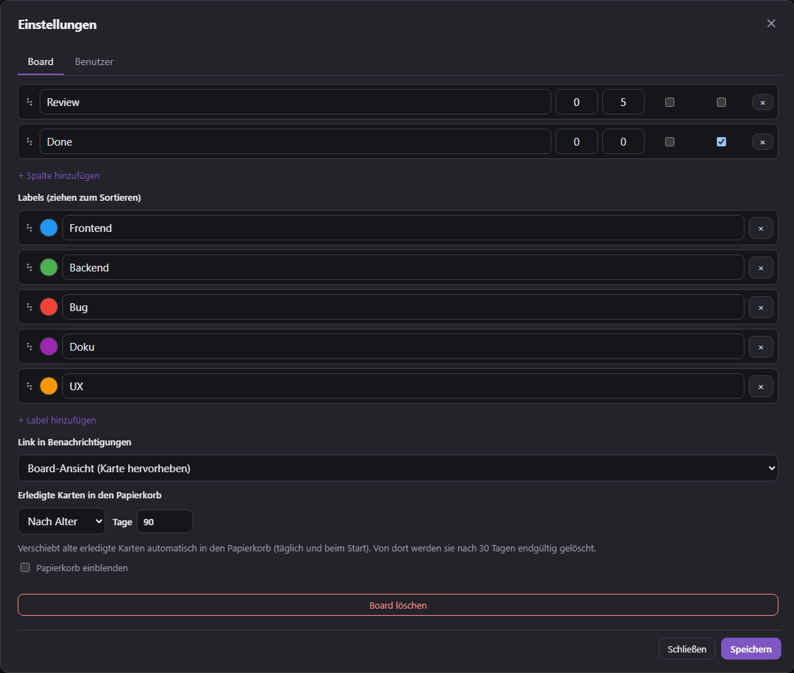

Je Board lässt sich festlegen, wohin der "Karte öffnen"-Link in den Benachrichtigungs-E-Mails führt: **Board-Ansicht** (Standard, öffnet das Board und hebt die Karte kurz hervor), **Karten-Editor** (öffnet direkt den Bearbeiten-Dialog) oder **eigene URL** (eine feste Adresse, z. B. das eigene Lovelace-Dashboard, in das das Board eingebettet ist).

### Karten: alle Felder

**Aufbau einer Karte:** Die **Zuständigen** stehen als Avatarstapel oben rechts, der Titeltext umfließt sie. Ein Zeigen mit der Maus oder ein Tipp auf den Stapel fächert die Gesichter nach links auf, ohne den Zeilenumbruch zu verändern. Lange Titel werden nach **zwei Zeilen** mit "..." abgeschnitten, der vollständige Titel steht im Tooltip. Trägt die Karte eine **Checkliste**, bekommt sie einen Kartenfuß: links der Fortschritt, mittig der Chevron zum Auf- und Zuklappen und rechts die Symbole für **Beschreibung, Link und Wiederholung** in dieser Reihenfolge. Ohne Checkliste gibt es keinen Fuß, dieselben Symbole stehen dann am rechten Ende der Label- oder Abzeichenzeile. Ein Klick auf das Beschreibungssymbol öffnet die Beschreibung in einem **Lesefenster** mit gerendertem Markdown; Links darin öffnen immer in einem neuen Tab. Die Klickfläche des Chevrons ist bewusst größer als das Symbol selbst, damit sie auch per Touch gut zu treffen ist: gemessen 119 x 26 px gegenüber einem Symbol von 14 x 14 px. Sie liegt als unsichtbare Fläche darüber, der Knopf selbst misst deshalb nur 90 x 11 px. Ob eine Checkliste auf- oder zugeklappt ist, wird **pro Gerät und Board gemerkt** - genau wie die Sortierung der Spalten - und bleibt nach einem Neuladen erhalten.

**Die Symbole auf einer Karte** in der Reihenfolge, in der sie auftauchen:

| Symbol | Wo | Bedeutung |
|---|---|---|
| Blatt mit Stift | rechts neben dem Titel | Karteneditor öffnen. Der einzige Weg dorthin. |
| Zwei versetzte Blätter | rechts neben dem Titel, nur auf erledigten Karten | Inhalt als **neue** Karte übernehmen, siehe [Erledigte Karte kopieren](#boards-spalten--labels) |
| Pfeil im Kreis | im Papierkorb, in einer eigenen Zeile unten auf der Karte | Karte wiederherstellen. Darüber steht die verbleibende Aufbewahrungsfrist. |
| Papierkorb | daneben | endgültig löschen, mit Rückfrage |
| `!` orange, `!!` rot | unter dem Titel | Priorität Hoch beziehungsweise Dringend. Bei Normal steht dort nichts. |
| Kalenderblatt mit Datum | unter dem Titel | Fälligkeit, eingefärbt nach [Farben der Fälligkeit](#farben-der-fälligkeit) |
| Ortsmarke | unter dem Titel | Ort, gekürzt. Der vollständige Text steht im Tooltip. |
| Notizblatt | rechts in der Label- oder Abzeichenzeile, bei vorhandener Checkliste im Kartenfuß | Die Karte hat eine Beschreibung. Ein Klick öffnet sie als Lesefenster mit gerendertem Markdown. |
| wechselndes Linksymbol | daneben | Die Karte hat einen Link. Welches Symbol erscheint, hängt an der Adresse, siehe [Link-Typen](#link-typen). |
| Kreispfeil | daneben | Wiederkehrende Aufgabe |
| Haken mit `3/12` | im Kartenfuß links | Stand der Checkliste. Das Dreieck daneben klappt sie auf. |

Der Editor öffnet sich **ausschließlich über das Stift-Symbol direkt rechts neben dem Titel**; ein Klick irgendwo auf die Karte öffnet ihn nicht. Das verhindert, dass der Editor beim Scrollen oder Antippen versehentlich aufgeht. Karten lassen sich überall anfassen und ziehen.

Oben stehen die beiden Pflichtfelder: **Titel**, direkt darunter **Zuständig**. Es folgt die Zeile mit Fälligkeit, Uhrzeit, Priorität und Spalte, darunter die Kalender-Einladung. Alles Weitere steckt in **aufklappbaren Abschnitten**: Beschreibung, Labels und Kartenfarbe, Link, Ort, Wiederholung, Checkliste.

Rechts in jeder Abschnittszeile steht, was darin steckt: ein Auszug der Beschreibung, die gewählten Labels samt Farbtupfer, der Ort, das Wiederholungsmuster, der Stand der Checkliste. Ein zugeklappter Abschnitt verbirgt also nichts, er fasst zusammen. Welche Abschnitte offen sind, **merkt sich das Gerät** und gilt auch für die nächste neue Karte; frisch installiert ist nur die Beschreibung offen. Labels und Kartenfarbe teilen sich auf breiten Bildschirmen eine Kopfzeile, unter 600 px trägt jedes seine eigene und lässt sich einzeln klappen.

In der Fußzeile stehen **Löschen**, **Verwalten** (übertragen/klonen), **Abbrechen** und **Speichern**. Oben rechts schließt ein **×** den Dialog, wie in allen Dialogen des Boards.

**Ungespeicherte Änderungen** gehen nicht verloren. Escape, das Schließkreuz und die **Zurück-Taste des Browsers** fragen nach, sobald am Inhalt etwas geändert wurde. Auf dem Tablet ist die Zurück-Taste die wichtigste der drei, denn dort ist die Zurück-Geste der übliche Weg aus einem Dialog heraus. Die Rückfrage hat drei Knöpfe: **Speichern**, **Verwerfen** und **Abbrechen**. "Abbrechen" ist der wichtigste - er lässt den Editor offen und alles Getippte stehen, man kann also einfach weiterarbeiten.

Der Knopf **Abbrechen** in der Fußzeile des Editors ist etwas anderes: Er schließt ohne Rückfrage, denn wer ihn drückt, meint ihn auch.

**Mit der Tastatur** lässt sich der Editor vollständig bedienen. Tab springt von Feld zu Feld und dabei auch auf die Abschnittsköpfe; Enter oder Leertaste klappt einen Abschnitt auf. Die Chip-Gruppen (Zuständige, Labels, Kartenfarbe, Linktypen) sind je ein einziger Tab-Halt: darin bewegen die Pfeiltasten, Pos1 und Ende springen an die Ränder, Leertaste oder Enter wählt aus. In der Checkliste legt Enter den nächsten Punkt an, gespeichert wird von dort aus mit Strg und Enter.

**Gehört eine Karte jemandem, den es nicht mehr gibt**, steht die alte Kennung als eigener Chip im Feld *Zuständig*, gestrichelt und mit dem Zusatz "(gelöscht)". Abwählen lässt sie sich hier, umhängen unter [⚙ → Benutzer](#benutzer-umbenennen).

Eine Karte hat folgende inhaltliche Felder (per API unter denselben Namen setzbar):

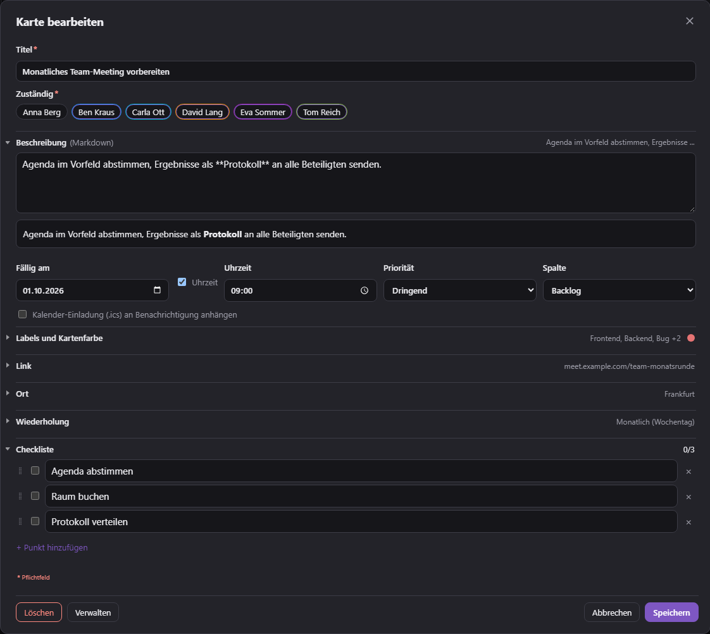

| Feld | Typ | Beschreibung |
|---|---|---|
| **title** | Text | Titel der Aufgabe (Pflichtfeld). |
| **description** | Markdown | Beschreibung; wird als Markdown gerendert (Links, Bilder, Listen ...). Der Editor blendet **unter dem Eingabefeld eine Live-Vorschau** des gerenderten Markdowns ein, sobald etwas im Feld steht - das Ergebnis ist also schon beim Tippen zu sehen. Eingebettetes HTML wird vor der Anzeige bereinigt (XSS-Schutz). |
| **due** | `YYYY-MM-DD` | Fälligkeitsdatum. Das Badge färbt sich je nach Zustand, siehe [Farben der Fälligkeit](#farben-der-fälligkeit). |
| **dueTime** | `HH:MM` | Optionale Uhrzeit. Wird über eine Checkbox aktiviert und erscheint auf der Karte hinter dem Datum. Nur wirksam zusammen mit `due`. |
| **priority** | `0`/`1`/`2` | Normal / Hoch / Dringend. Auf der Karte zeigt sich das als Badge unter dem Titel (vor Fälligkeit und Ort): bei **Normal** erscheint nichts, bei **Hoch** ein oranges `!`, bei **Dringend** ein rotes `!!`. Andere Werte werden abgelehnt, per API mit einem Fehler - siehe [Antworten & Fehler](#antworten--fehler). |
| **assignees** | Liste von Benutzer-IDs | Zuständige. Steuern, wer Benachrichtigungen erhält. **Pflichtfeld, auch über die API:** Mindestens eine Person muss angegeben sein, und jede angegebene ID muss in den Instanzeinstellungen existieren - sonst antwortet die Schnittstelle mit `400` und nennt die vorhandenen Kennungen. **Ausnahme:** Gibt es genau einen Benutzer, wird die Angabe automatisch ergänzt statt abgewiesen. Eine ID, die **bereits auf der Karte steht**, bleibt beim Bearbeiten erlaubt, auch wenn es den Benutzer nicht mehr gibt - sonst wäre ausgerechnet die verwaiste Karte gesperrt. Zeigt die **Mitgliederliste eines Boards ins Leere**, sind **alle** Benutzer zuweisbar. |
| **labels** | Liste von Label-IDs | Farbige Schlagworte. Labels werden pro Board verwaltet (anlegen, umbenennen, umfärben, löschen). Kommt über die API ein Label an, das das Board nicht kennt, wird es **angelegt** statt abgelehnt (Titel = Kennung, Farbe reihum aus derselben Palette wie in der Oberfläche; beides danach änderbar). Andernfalls trüge die Karte ein Label, das das Board nicht führt - hinter einem `onlyLabel`-Filter bliebe sie damit unsichtbar. |
| **color** | Hex-Farbe | Farbiger Balken links an der Karte. Wählbar über einen eingebetteten Colorpicker (Farbfeld + Farbton-Regler + Hex-Eingabe) oder Presets. |
| **link** | URL | Verknüpfung. Auf der Karte erscheint ein **typabhängiges Icon** - siehe [Link-Typen](#link-typen). |
| **location** | Text | Ort. Erscheint als Orts-Badge (Pin-Symbol) auf der Karte und wird als `LOCATION` in die Kalender-Einladung übernommen. |
| **checklist** | Liste | Unterpunkte mit Häkchen; ab zwei Punkten lassen sie sich im Editor am kleinen **Anfasser** links per Drag & Drop umsortieren. Auf der Karte als Fortschritt `✓ 2/5` unten links. Über den **Chevron (▾/▴)** in der Mitte des Kartenfußes lassen sich die Punkte direkt auf der Karte auf-/zuklappen und **abhaken** (wird sofort gespeichert). |
| **calendarInvite** | Ja/Nein | Wenn aktiviert **und** ein Fälligkeitsdatum gesetzt ist, wird jeder Benachrichtigungs-E-Mail zu dieser Karte eine **`.ics`-Kalender-Einladung** angehängt. |
| **calendarDuration** | `HH:MM` | Termindauer in der Kalender-Einladung, Standard **`01:00`** (eine Stunde). Das Feld erscheint im Editor rechts neben der Kalender-Checkbox, sobald diese aktiv ist. Wirkt nur bei Terminen **mit Uhrzeit**; ohne Uhrzeit bleibt es ein Ganztagestermin. |
| **recurrence** | Objekt | Wiederholungsregel - siehe [Wiederholungen](#wiederholungen). |

Zusätzlich verwaltet der Adapter automatisch: `id`, `columnId`, `order`, `createdAt`, `createdBy`, `movedAt`, `doneAt`, `trashedAt` sowie intern `lastReminderAt`, `lastExactAt` (Merker, damit dieselbe Erinnerung bzw. dasselbe Uhrzeit-Ereignis nicht mehrfach am Tag feuert) und `icsUid`/`icsFingerprint`/`icsSeq` (Kalender-Serie: gleiche UID über die ganze Wiederholungskette, Erkennung geänderter Termindaten).

Jedes Kartenobjekt der **REST-API** enthält ab 0.3.0 außerdem das berechnete Feld **`dueAt`** - die Fälligkeit inklusive Uhrzeit als ISO-Zeitstempel mit lokalem Offset (z. B. `2026-08-01T13:30:00+02:00`; ohne Uhrzeit `00:00`, ohne Datum `null`). Es ist identisch mit dem `dueAt` der Ereignisse, wird **nicht gespeichert** und beim Schreiben ignoriert - Automatisierungen müssen also nicht selbst aus `due` + `dueTime` + Zeitzone rechnen.

`movedAt` hält fest, **seit wann eine Karte in ihrer aktuellen Spalte liegt**, und ist damit die Grundlage für den Sortiermodus "Alter in Spalte". Der Zeitstempel wird nur bei einem echten Spaltenwechsel neu gesetzt; das Umsortieren innerhalb derselben Spalte lässt ihn unverändert. `trashedAt` markiert den Zeitpunkt, zu dem eine Karte in den Papierkorb gewandert ist, und steuert die 30-Tage-Frist.

#### Karte übertragen oder klonen (ab 0.3.0)

In der Fußzeile des Karten-Editors sitzt rechts neben **Löschen** der Button **Verwalten**. Er öffnet den gleichnamigen Dialog, der oben drei Schaltflächen anbietet: **Klonen**, **Kopieren** und **Verschieben**. Die Auswahlfelder darunter richten sich nach der gewählten Schaltfläche.

- **Klonen** dupliziert die Karte **im selben Board**. Es erscheint nur die **Ziel-Spalte**, vorbelegt mit der Spalte, in der die Karte gerade liegt. Der Klon übernimmt alle Inhalte inklusive Checkliste, Labels, Zuständigen und Wiederholung. Bleibt die vorbelegte Spalte stehen, landet er direkt **unter dem Original**; bei einer anderen Spalte hängt er dort **unten** an. Praktisch für wiederkehrende Aufgaben, die man als Vorlage benutzt.
- **Kopieren** und **Verschieben** blenden zusätzlich das **Ziel-Board** ein; vorbelegt ist dessen erste Spalte mit "Neu"-Häkchen. Verschieben nimmt die Karte mit (sie verlässt das aktuelle Board), Kopieren legt am Ziel eine neue Karte an und lässt das Original unangetastet. Existiert kein weiteres Board, sind beide Schaltflächen deaktiviert.
- **Labels** werden über den **Namen** abgeglichen. Gibt es im Ziel-Board ein gleichnamiges Label, wird es übernommen; Labels ohne Entsprechung fallen weg. Das Ziel-Board wird also nicht ungefragt um neue Labels ergänzt.
- **Zuständige** bleiben nur erhalten, wenn sie im Ziel-Board **Mitglied** sind. Der Dialog zeigt vorher an, was wegfällt.
- Bliebe **niemand** übrig, blendet der Dialog eine Auswahl der Ziel-Board-Mitglieder ein und lässt das Übertragen erst zu, wenn mindestens eine Person gewählt ist. So kann keine Karte ohne Zuständigen entstehen.
- Beim Verschieben feuert `cardMoved` (mit Kennzeichnung des Board-Wechsels), beim Kopieren und Klonen `cardCreated` mit neuer Karten-ID (beim Klon zusätzlich `detail.clone = true`).

#### Link-Typen

Aus der eingetragenen Adresse leitet das Board automatisch ein passendes Icon ab (Material Design Icons). Geprüft wird von oben nach unten, die **erste zutreffende Regel gewinnt**.

| Icon | Erkennung | Beispiel |
|:--:|---|---|
|  | `mailto:` | `mailto:hausmeister@example.com` |
|  | `tel:` | `tel:+491701234567` |
|  | `youtube.com` / `youtu.be` | `https://youtu.be/xxxxxxxxxxx` |
|  | Adresse endet auf `.pdf` | `https://example.com/anleitung.pdf` |
|  | `.jpg` `.jpeg` `.png` `.gif` `.webp` `.svg` | `https://example.com/grundriss.png` |
|  | Route: `waze.com`, `/maps/dir/`, `daddr=` | `https://www.waze.com/ul?ll=52.52,13.405` |
|  | Ort: Google/Apple Maps, OpenStreetMap, `geo:` | `geo:52.52,13.405` |
|  | interne Adresse: private Bereiche (`10.`, `172.16.`-`172.31.`, `192.168.`), `127.`, `169.254.`, `localhost` sowie Hostnamen auf `.local` `.lan` `.home` `.internal` `.fritz.box` | `http://192.168.1.10:8123/` |
|  | alles Übrige | `https://example.com` |

Über dem Link-Feld steht eine **Leiste mit diesen neun Symbolen**, in der Reihenfolge Weblink, interne Adresse, E-Mail, Telefon, YouTube, PDF, Bild, Route, Ort. Ein Klick darauf setzt ein passendes Beispiel als Platzhalter ins Feld, etwa `tel:+49123456789` statt `https://...`. Der eingetippte Wert bleibt dabei unangetastet. Umgekehrt hebt die Leiste hervor, welche Art zu einer bereits eingetragenen Adresse passt, und läuft beim Tippen mit.

Anklickbar sind nur die sicheren Schemata `http(s)`, `mailto:`, `tel:` und `geo:` - siehe [Sicherheit & Zugriffsschutz](#sicherheit--zugriffsschutz). **Das Feld nimmt genau das an, was das Board später auch darstellt:** zusätzlich zu den Schemata also relative Pfade und Adressen ohne Schema wie `example.com`, die um `https://` ergänzt werden. Alles Übrige, etwa `javascript:` oder `data:`, wird schon beim Speichern abgewiesen.

### Sortierung & Reihenfolge

Standardmäßig bestimmt man die Reihenfolge selbst: Karte anklicken, gedrückt halten und nach oben oder unten ziehen (funktioniert auch per Touch am Smartphone). Genauso wandert eine Karte per Drag & Drop in eine andere Spalte, um ihren Status zu ändern. Die gewählte Reihenfolge bleibt erhalten und wird live auf alle offenen Ansichten synchronisiert.

Das gilt auch, wenn gerade **nicht alle Karten sichtbar sind** - etwa bei gesetztem Personen- oder Label-Filter oder bei einem Anzeige-Limit. Die Karte landet dann genau dort, wo sie zwischen den sichtbaren Nachbarn abgelegt wurde; die ausgeblendeten Karten behalten ihre Reihenfolge drumherum.

Stattdessen kann **jede Spalte einzeln** automatisch sortiert werden. Ein Klick auf das Sortier-Symbol im Spaltenkopf öffnet ein kleines Menü mit fünf Modi:

| Modus | Verhalten |
|---|---|
| **Drag & Drop** | Die eigene Reihenfolge. Karten werden direkt angefasst und gezogen (Standard). |
| **Anfasser** | Ebenfalls die eigene Reihenfolge, aber jede Karte bekommt links einen Anfasser. Gezogen wird nur darüber, was das Umsortieren auf dem Touchscreen erleichtert. |
| **Fälligkeit** | Frühestes Datum zuerst, eine gesetzte Uhrzeit wird mitberücksichtigt. Karten ohne Datum stehen unten. |
| **Priorität** | Höchste Priorität zuerst, bei gleicher Priorität entscheidet die Fälligkeit. |
| **Alter in Spalte** | Die zuletzt in diese Spalte gekommene Karte steht oben. In der Erledigt-Spalte ist das also die zuletzt abgehakte Aufgabe. |

Bei den drei automatischen Modi erscheint links daneben ein **Richtungsumschalter**. Ein Klick kehrt die Reihenfolge um, das Pfeil-Symbol zeigt die aktuelle Richtung dauerhaft an. In "Alter in Spalte" steht damit wahlweise das zuletzt Erledigte oben oder das, was am längsten liegt.

Ein paar Feinheiten, damit das Umkehren berechenbar bleibt: Umgedreht wird immer nur das Hauptkriterium. Karten ohne Datum oder Zeitstempel bleiben unten, bei Gleichstand entscheidet der Titel, und innerhalb gleicher Priorität sortiert weiterhin die Fälligkeit aufsteigend.

Das Menü lässt sich auch mit der Tastatur bedienen: Tab erreicht den Knopf, Enter öffnet, die Pfeiltasten wandern im Menü, Escape schließt und gibt den Fokus zurück.

Auch der **Papierkorb** hat dieses Menü. Dort bedeuten "Drag & Drop" und "Anfasser" allerdings nicht die eigene Reihenfolge - von Hand ziehen lässt sich im Papierkorb ohnehin nichts -, sondern die Reihenfolge nach Löschzeitpunkt, älteste zuerst. Das ist die Voreinstellung und zeigt oben, was der endgültigen Löschung am nächsten ist. Der Richtungsumschalter dreht auch sie um. Die übrigen drei Modi wirken wie in jeder anderen Spalte.

**Sortiermodus und Richtung werden pro Gerät gespeichert** (wie das Augen-Symbol), sie gelten also nur für den, der sie eingestellt hat. In den automatischen Modi ist das eigene Umsortieren innerhalb der Spalte deaktiviert, weil es wirkungslos wäre; das Verschieben in eine andere Spalte funktioniert weiterhin. Zurück auf "Drag & Drop" oder "Anfasser" geschaltet, erscheint die gespeicherte eigene Reihenfolge unverändert.

Unabhängig davon färbt sich das Fälligkeits-Badge, sodass Dringendes auffällt, egal an welcher Position es steht.

<a id="farben-der-fälligkeit"></a>
#### Farben der Fälligkeit

| Farbe | Zustand |
|---|---|
| **rot** | vorbei: Datum in der Vergangenheit, oder die Uhrzeit der Karte ist verstrichen |
| **orange** | heute fällig, Uhrzeit noch nicht erreicht |
| **gelb** | morgen fällig, also am nächsten Kalendertag |
| neutral | später fällig |
| **grün** | erledigt |

Dahinter stehen zwei verschieden gerechnete Fragen. Das **Vorwarnfenster** (gelb) ist Planung und zählt in **Kalendertagen**: Gelb ist genau der nächste Kalendertag. Kein rollendes 24-Stunden-Fenster, "morgen" bleibt den ganzen Tag morgen.

> Die Einstellung [**Erinnern X Tage vor Fälligkeit**](#tab-benachrichtigungen) steuert allein, wie früh die **Erinnerungsmail** rausgeht. Auf die Farben am Board wirkt sie nicht.

Die Grenze zu **rot** ist dagegen eine Tatsache. Trägt die Karte eine **Uhrzeit**, zählt sie: Um 17:01 ist 17:00 vorbei, und genau dann feuert auch das Ereignis `cardDue` mit `detail.exact`. Ohne Uhrzeit wechselt die Farbe um Mitternacht. Die Zustände [`overdueCount` und `overdueList`](#iobroker-states--objekte) rechnen nach derselben Regel: Farbe und Datenpunkt springen zur selben Minute.

Was eine Farbe bedeutet, steht im Tooltip des Abzeichens: überfällig, heute fällig, morgen fällig, später fällig, erledigt. In einer zweiten Zeile steht die Einteilung dazu, damit man sie nicht raten muss. Eine Legende in der Oberfläche gibt es nicht, und eine Farbe allein sagt nicht, ob sie schlimmer ist als die daneben.

Die Farben lassen sich über [eigenes CSS](#faq--fallstricke) ändern: `--danger` für rot, `--warn` für orange und `--due-upcoming` samt `--due-upcoming-text` für gelb. Dieselbe Einteilung steckt hinter den [Zahlen im Spaltenkopf](#zahlen-im-spaltenkopf).

### Wiederholungen

Wiederkehrende Aufgaben funktionieren **beim Erledigen** (Kanban-typisch): Sobald eine wiederkehrende Karte in die "Erledigt"-Spalte wandert, wird automatisch eine **frische Karte** mit dem nächsten passenden Fälligkeitsdatum in der ersten Nicht-Erledigt-Spalte angelegt (Checklisten-Haken zurückgesetzt). Übernommen werden dabei alle inhaltlichen Felder der Vorlage: Titel, Beschreibung, Zuständige, Labels, Kartenfarbe, Priorität, Link, **Uhrzeit**, **Ort** und das **Kalender-Einladung**-Häkchen. Karten mit Wiederholung tragen ein Wiederholungs-Badge (Kreispfeil-Symbol). Die **erledigte** Karte behält die Regel nicht: Sie wandert vollständig zur Folgekarte, das Badge verschwindet dort also.

Wird eine wiederkehrende Karte **ohne** manuelles Datum angelegt, setzt der Adapter automatisch das nächste passende Datum.

| Typ (`recurrence.type`) | Bedeutung | Zusätzliche Felder |
|---|---|---|
| `daily` | Täglich | - |
| `weekly` | An bestimmten Wochentagen | `dayOfWeek`: Liste `[1..7]` (1 = Montag ... 7 = Sonntag) |
| `monthly` | Fester Tag im Monat | `dayOfMonth`: `1..31` (der 31. wird in kurzen Monaten auf den letzten Tag begrenzt) |
| `monthly_weekday` | N-ter/letzter Wochentag im Monat, z. B. **2. Dienstag** | `ordinal`: `1..4` oder `-1` (letzter), `dayOfWeek`: `[iso]` |
| `workday` | Erster/letzter/n-ter **Arbeitstag** im Monat | `workdayPos`: `first` / `last` / `nth` / `nth_last`, `n`: bei `nth`/`nth_last` |
| `yearly` | Jährlich | `month`: `1..12`, `dayOfMonth`: `1..31` |
| `every_n_days` | Alle X Tage ab Startdatum | `interval`: N, `startDate`: `YYYY-MM-DD` |
| `every_n_days_done` | Alle X Tage **ab dem Erledigen** | `interval`: N |
| `cron` | Cron-Ausdruck als Muster | `cron`: `"0 8 * * 1-5"` |

Die beiden Arten mit **X Tagen** sehen sich ähnlich und rechnen doch verschieden. "Alle X Tage" hält ein festes Raster ab dem Startdatum ein: Wird eine Karte, die alle 30 Tage fällig ist, zehn Tage zu spät erledigt, liegt der nächste Termin auf dem nächsten Rasterpunkt, also schon in 20 Tagen. "Alle X Tage (nach Erledigung des Vorgängers)" zählt dagegen ab dem Haken, hier wären es volle 30 Tage. Gedacht ist das für Wartungen, bei denen die Standzeit ab dem Handgriff zählt, etwa ein Filterwechsel.

Bei allen kalendergebundenen Arten gilt: Der nächste Termin liegt immer **in der Zukunft**. Bleibt eine tägliche Karte zwei Wochen liegen und wird dann abgehakt, bekommt die Folgekarte den morgigen Tag, nicht einen Tag aus der vergangenen Woche. Wird **früher** als geplant erledigt, bleibt dagegen der Kalender der Bezugspunkt - sonst würde sich der Termin bei jedem vorzeitigen Haken nach vorn schieben.

Für diese Art lässt sich **keine Kalenderserie** erzeugen: Wann der nächste Termin fällt, entscheidet erst das Erledigen. Eine [Kalender-Einladung](#karten-alle-felder) enthält deshalb nur den einzelnen Termin, so wie bei "Arbeitstag im Monat" auch.

**Arbeitstag** heißt: kein Wochenende **und** kein gesetzlicher Feiertag (siehe unten). Beispiel: "erster Arbeitstag im Mai" landet auf dem 4.5., wenn der 1.5. auf einen Feiertag/Wochenende fällt.

#### Cron-Ausdruck

Für Muster, die sich mit den festen Typen nicht ausdrücken lassen, gibt es den Typ **Cron-Ausdruck**. Er nimmt die üblichen fünf Felder:

```
Minute  Stunde  Tag  Monat  Wochentag
   0      8      *     *      1-5      -> Montag bis Freitag um 08:00
```

Je Feld verstanden werden `*`, einzelne Zahlen, Listen (`1,15`), Bereiche (`1-5`), Schrittweiten (`*/3`, `1-7/2`) sowie die englischen Kurznamen für Monat (`jan`...`dec`) und Wochentag (`mon`...`sun`). Sonntag ist `0` **und** `7`. Der Ausdruck darf höchstens 120 Zeichen lang sein - auch das längste sinnvolle Muster bleibt weit darunter.

Drei Dinge unterscheiden sich von einem echten Cron-Dienst:

- **Der Ausdruck ist ein Muster, kein Zeitplan.** Der Adapter führt nichts zu diesen Zeitpunkten aus - er sucht damit das nächste Fälligkeitsdatum, wenn die Karte erledigt wird. Wie bei allen Wiederholungen entsteht die Folgekarte beim Abhaken, nicht von selbst.
- **Minute und Stunde setzen die Uhrzeit der Karte.** `0 8 * * 1-5` erzeugt Karten mit Uhrzeit `08:00`; das Feld *Uhrzeit* im Editor wird dabei aus dem Muster befüllt und gesperrt. Nennt das Muster mehrere Zeiten (`15,45 8-10 * * *`), gilt die früheste.
- **`L`, `W`, `#` und `?` gibt es nicht.** Für "letzter Werktag im Monat" oder "zweiter Dienstag" gibt es die Typen *Arbeitstag im Monat* bzw. *Monatlich (Wochentag)* - die kennen zusätzlich die Feiertagslogik, die kein Cron abbilden kann.

Sind **Tag** und **Wochentag** gleichzeitig eingeschränkt, gilt wie im Original **oder**: `0 8 1 * mon` trifft jeden Monatsersten *und* jeden Montag.

Unter dem Eingabefeld zeigt der Editor die Regel im Klartext und die nächsten drei Termine. Ist der Ausdruck fehlerhaft, steht dort die Ursache statt einer Vorschau; die Karte lässt sich dann nicht speichern.

**Kalender-Einladung:** Einfache Muster werden in eine Serienregel übersetzt (täglich, feste Wochentage, feste Monatstage, jährlich). Verschachtelte Muster - etwa Tag und Wochentag gleichzeitig oder Schrittweiten über mehrere Felder - lassen sich im Kalenderstandard nicht ausdrücken; solche Karten verschicken einen Einzeltermin je Wiederholung.

### Feiertage

Für die **Arbeitstag-Wiederholungen** ermittelt der Adapter die gesetzlichen Feiertage selbst (Osterformel + feste Tage + Buß- und Bettag), damit auch weit in der Zukunft liegende Termine korrekt berechnet werden.

- Ist der ioBroker-Adapter **`feiertage`** installiert, übernimmt der Kanban-Adapter dessen **Bundesland-Konfiguration** (welche Feiertage gelten). Es zählen nur die tatsächlich gesetzlich arbeitsfreien Tage, reine Dekotage (z. B. Valentinstag) werden ignoriert.
- Ohne `feiertage`-Adapter greift ein **Fallback** mit den bundesweit einheitlichen gesetzlichen Feiertagen.

> Änderungen am `feiertage`-Adapter werden beim nächsten Start von `kanban.0` übernommen.

### Benutzer im Board

Welche Personen es überhaupt gibt, kommt aus den Instanzeinstellungen ([Tab "Benutzer"](#tab-benutzer)). Aussehen und Board-Zuordnung werden dagegen direkt in der Weboberfläche gepflegt - ohne Adapter-Neustart.

**Gibt es nur eine Person**, verschwindet die ganze Zuständigkeit aus der Oberfläche: keine Chips in der Kopfzeile, keine Avatare auf den Karten, kein Feld *Zuständig* im Karteneditor und keine Benutzerauswahl im Ansichten-Dialog. Es gäbe dort nichts zu wählen und nichts zu filtern. Neue Karten bekommen diese Person automatisch, auch über die Schnittstelle: Ein `POST` ohne `assignees` wird dann nicht mehr mit `400` abgewiesen, sondern still ergänzt. Eine angegebene Kennung wird weiterhin geprüft.

**Gibt es gar keine Person**, lässt sich keine Karte anlegen: Die Zuständigkeit ist ein Pflichtfeld, und niemand ist nicht dasselbe wie irgendjemand. Der Knopf "+ Karte" ist deshalb gesperrt und sagt beim Anklicken, dass zuerst ein Benutzer in den Instanzeinstellungen fehlt, ebenso das "+" am Fuß der Spalten. Dieser Zustand ist ohne Warnung erreichbar, indem man dort alle Zeilen löscht.

Dasselbe gilt für ein **Board ohne Spalten**: Ohne Spalte gibt es keinen Ort für die Karte, der Knopf sagt es und der Editor geht gar nicht erst auf.

> **In einer Erledigt-Spalte entstehen keine Karten.** Sie wandern dorthin, sie werden dort nicht angelegt: Der Karteneditor bietet Erledigt-Spalten beim Anlegen und Kopieren nicht an, am Fuß einer solchen Spalte steht kein "+", und über die Schnittstelle wird der Versuch abgewiesen. Der Grund ist der Erledigt-Zeitpunkt. Eine dort angelegte Karte hätte keinen, fiele damit aus der Sortierung [Alter in Spalte](#sortierung--reihenfolge), aus dem [Anzeige-Limit](#spalten) für Erledigte und aus dem [automatischen Aufräumen](#erledigte-karten-in-den-papierkorb) heraus und bliebe für immer liegen. Beim **Verschieben** und beim Bearbeiten einer bestehenden Karte bleibt die Erledigt-Spalte wählbar, das ist der übliche Weg zum Abschließen.

Sobald ein zweiter Benutzer in den Instanzeinstellungen steht, ist alles wieder da. Karten, die in der Zwischenzeit entstanden sind, tragen die eine Person und zeigen sie ab dann auch an. Trägt eine Karte eine Kennung, die es nicht mehr gibt, bleibt die stehen und wird nicht stillschweigend umgehängt; dafür gibt es die [Reparatur verwaister Zuständiger](#benutzer-umbenennen).

**Kopf-Chips als Filter:** Die Benutzer-Chips in der Kopfzeile sind zugleich ein **Mehrfach-Filter**, Antippen wählt Personen an oder ab. Bei einer Teilauswahl zeigt das Board nur Karten der gewählten Personen; sind **alle oder keine** Chips aktiv, werden alle Karten angezeigt. Die Auswahl wird **je Board im Browser gespeichert** und beim nächsten Aufruf wiederhergestellt.

**Benutzerfarbe:** Die Farbe von Avatar-Ring und Chip wird **in der Board-Oberfläche** gepflegt (⚙ → Benutzer) und greift sofort, ohne Neustart der Instanz.

**Avatar-Bild (optional):** Standardmäßig zeigt der Avatar die Initialen (auf der Benutzerfarbe). In der Board-Oberfläche unter **⚙ → "Benutzer-Avatare"** kann man je Benutzer ein **PNG/JPG hochladen**, das dann rund als Avatar erscheint (mit Vorschau; das Bild wird automatisch quadratisch zugeschnitten, auf 128 px verkleinert und im ioBroker-Dateispeicher abgelegt, kein Config-Ballast). "Avatar entfernen" schaltet zurück auf die Initialen.

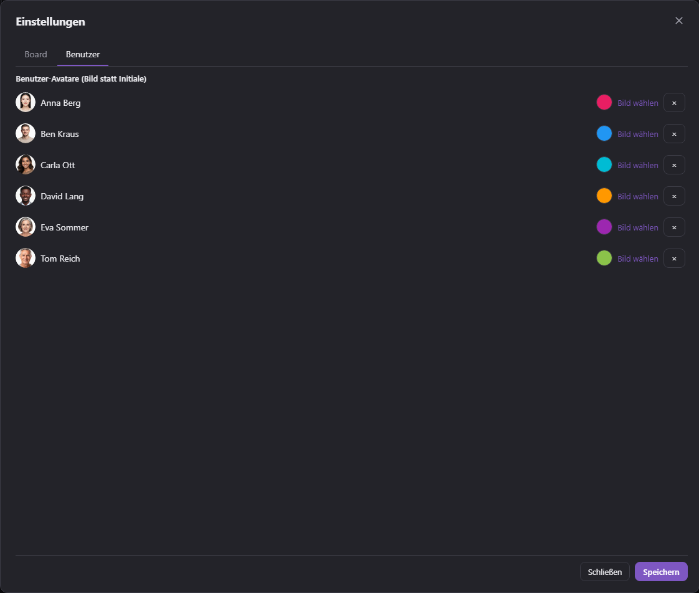

**Mitglieder je Board:** Im Board-Tab der Einstellungen (**⚙ → Board**) wird direkt unter dem Board-Titel festgelegt, welche Benutzer dort zuweisbar sind (Karten-Dialog, Kopf-Chips und Ansichten-Dialog zeigen nur Mitglieder). Jedes Board braucht **mindestens ein Mitglied**; neue Boards starten mit allen Benutzern. Wird jemand herausgenommen, dessen Karten sonst niemanden mehr als zuständig hätten, fragt der Dialog nach und nennt die Zahl: Diese Karten behalten ihre Zuordnung, tauchen aber nicht mehr im Personenfilter des Boards auf. Über die Board-Auswahl ganz oben lassen sich auch die Mitglieder anderer Boards bearbeiten, ohne dorthin zu wechseln.

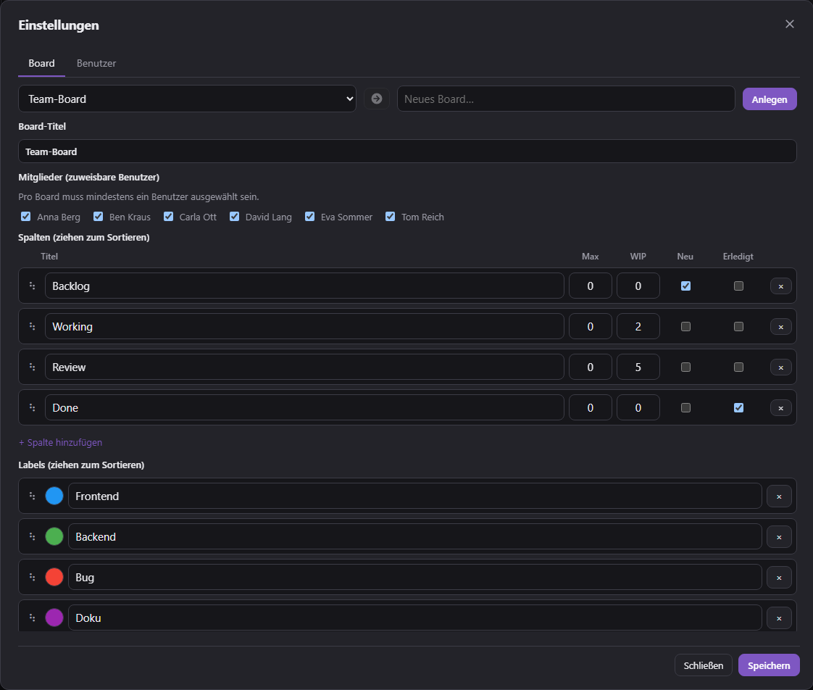

### Mobile Ansicht

Auf schmalen Bildschirmen stapelt das Board die Spalten untereinander; jede Spalte lässt sich als Akkordeon ein-/ausklappen (Zustand wird je Gerät gemerkt). Karten-, Board- und Ansichten-Dialog öffnen im Vollbild mit fester Aktionsleiste unten. Zum Verschieben eine Karte kurz gedrückt halten, beim Ziehen erscheint ein Schnellmenü mit den Zielspalten.

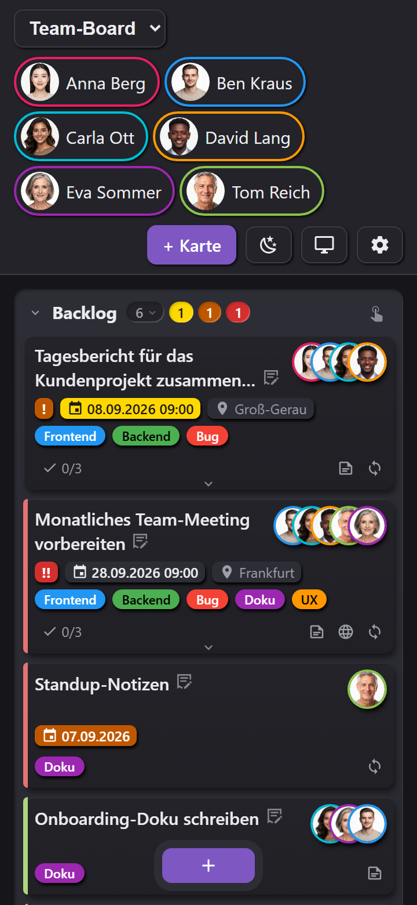 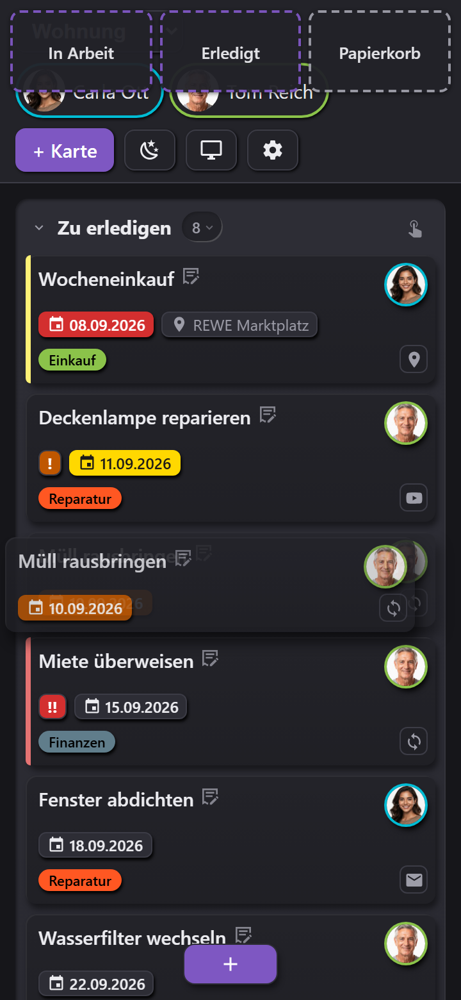

*Links das Team-Board: gestapelte Spalten als Akkordeon, die erste zugeklappt. Rechts ein anderes Board, das Haushaltsbrett, und darauf das Schnellmenü, das beim Ziehen einer Karte über den Zielspalten erscheint.*

### Ansichten teilen / URL-Parameter

Über das **Monitor-Symbol** in der Kopfzeile öffnet sich der Dialog **"Ansichten"**. Dort lässt sich eine gefilterte Ansicht zusammenklicken; darunter steht eine **fertige URL zum Kopieren**. Ideal zum Einbetten in Lovelace (Webpage-Card) oder zum Weitergeben.

Der Dialog deckt die **gebräuchlichsten** Filter ab: Board, Benutzer (mehrfach), Labels (mehrfach) samt Umschaltung zwischen **"Diese Labels ausblenden"** (Blacklist) und **"Nur diese Labels zeigen"** (Whitelist), sichtbare Spalten, Limit für erledigte Karten (`doneLimit`) sowie das Ausblenden von Bedienelementen (`hideSettings`, `embed`). **Nicht** im Dialog, sondern **nur als URL-Parameter** gibt es `theme`, `accent`, `lang`, `card` und `focus` - die kommen bei Bedarf von Hand an die erzeugte Adresse.

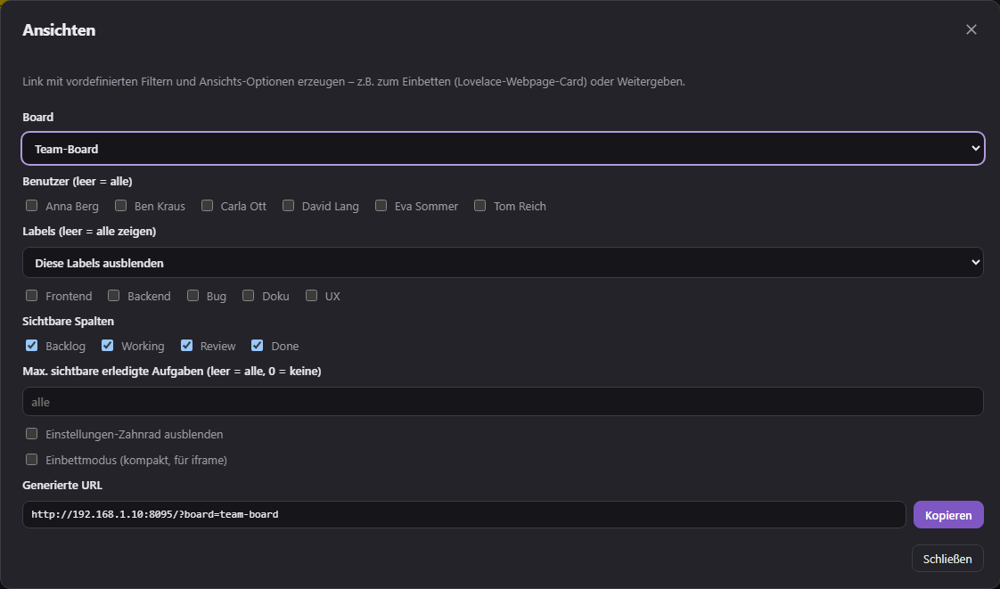

Alle Parameter lassen sich auch direkt an die URL hängen:

| Parameter | Wirkung |
|---|---|
| `board=<id>` | Öffnet dieses Board. Die Adresszeile trägt das aktuelle Board automatisch nach: Beim Wechsel über die Board-Auswahl wird `?board=<id>` gesetzt (ohne neuen History-Eintrag, alle übrigen Parameter bleiben stehen), sodass die Adresse direkt kopier- und teilbar ist. |
| `users=<name,name>` | **Personen-Filter**: zeigt nur Karten, die mindestens einem dieser Benutzer zugewiesen sind (setzt die Kopf-Chips entsprechend). `user=<name>` ist die Kurzform für einen einzelnen Benutzer. Der Parameter gilt **nur für diesen Aufruf**: Die eigene Chip-Auswahl bleibt gespeichert und steht beim nächsten Aufruf ohne Parameter wieder da. Ein geteilter Link überschreibt also nicht, was jemand am eigenen Gerät eingestellt hat. |
| `label=<id,id>` | **Label-Blacklist** (mehrere möglich): blendet Karten mit einem dieser Labels aus, neue Labels bleiben automatisch sichtbar. |
| `onlyLabel=<id,id>` | **Label-Whitelist**: zeigt **nur** Karten, die mindestens eines dieser Labels tragen - Karten ohne Label fallen weg. Lässt sich mit `label=` kombinieren (erst Whitelist, dann Blacklist). |
| `columns=<id,id>` | Zeigt nur diese Spalten. Nicht genannte Spalten werden ausgeblendet. |
| `doneLimit=N` | In Erledigt-Spalten nur die N zuletzt erledigten Karten anzeigen (`0` = keine, weglassen = alle). |
| `hideSettings=1` | Blendet das Einstellungen-Zahnrad aus. |
| `embed=1` | **Einbettmodus**: blendet die komplette Kopfleiste aus (für iframe/Lovelace). |
| `theme=auto\|light\|dark` | Erzwingt ein Theme. |
| `accent=%23RRGGBB` | Akzentfarbe (Hex, `#` als `%23` kodieren). |
| `card=<id>` | Öffnet direkt eine Karte (Deep-Link, z. B. aus E-Mails). |
| `focus=<id>` | Öffnet **nicht** den Editor, sondern hebt die Karte im Board kurz hervor (pulsierender Rahmen). Wird von Benachrichtigungen mit Link-Ziel "Board-Ansicht" erzeugt. |
| `lang=<code>` | Überschreibt die Oberflächensprache der Instanz für diese Ansicht (de, en, fr, nl, it, es, pl, pt, ru, uk, zh-cn). |

**Beispiele**

```
# Kompakte Einbettung: nur Board "familie", ohne Kopfleiste
http://192.168.1.10:8095/?board=familie&embed=1&theme=auto

# Nur "In Arbeit"-Spalte + letzte 3 erledigte, gefiltert auf zwei Personen
http://192.168.1.10:8095/?board=familie&columns=doing,done&doneLimit=3&users=bjoern,heike

# Alles außer Karten mit Label "privat", Einstellungen ausgeblendet
http://192.168.1.10:8095/?board=familie&label=privat&hideSettings=1

# Umgekehrt: ausschließlich Karten mit Label "pflege-heike"
http://192.168.1.10:8095/?board=familie&onlyLabel=pflege-heike&hideSettings=1&embed=1
```

> **Lovelace/iframe:** Der Adapter setzt **keine** Frame-Header (`X-Frame-Options`/`frame-ancestors`). Die ab 0.1.1 gesetzte CSP steht als `<meta>` und schränkt die Einbettung **nicht** ein, die UI lässt sich also weiterhin direkt in eine Lovelace-Webpage-Card oder ein `<iframe>` einbetten.

---

## Teil C: Integration & Automatisierung

Boards und Karten lassen sich vollständig von außen steuern, aus ioBroker-Skripten, Node-RED, Shell-Skripten oder LLM-Agenten.

### REST-API

Für Integrationen im gleichen Netz steht eine REST-API bereit (dieselbe, die die Web-UI nutzt). **Lesen** (`GET`) ist offen, **Schreiben** (`POST`/`PATCH`/`DELETE`) erfordert ab 0.1.1 einen Token - siehe [Sicherheit & Zugriffsschutz](#sicherheit--zugriffsschutz).

| Methode & Pfad | Zweck |
|---|---|
| `GET /api/config` | UI-Konfiguration (Benutzer, Theme, Akzentfarbe). |
| `GET /api/users` | Benutzerliste. |
| `GET /api/custom.css` | Das in den Einstellungen hinterlegte eigene CSS. |
| `GET /avatars/<name>` | Avatar-Bild eines Benutzers (PNG). |
| `POST /api/users/<name>/avatar` | Avatar setzen (`{ image: "data:image/png;base64,..." }`, max. 512 KB; Token nötig). |
| `DELETE /api/users/<name>/avatar` | Avatar entfernen (Token nötig). |
| `GET /api/boards` | Alle Boards (Kurzform). |
| `POST /api/boards` | Board anlegen (`{ id?, title }`). |
| `GET /api/boards/<id>` | Board mit allen Karten. Mit `?rev=<n>` liefert es `{unchanged:true}`, falls unverändert (Polling). |
| `PATCH /api/boards/<id>` | Board ändern (Titel, Spalten, Labels, Mitglieder, Aufräum-Einstellung `cleanup: { mode, days, count }`). |
| `PATCH /api/users/<name>` | Benutzerfarbe setzen (`{ color: "#RRGGBB" }`). Wird von der Benutzer-Verwaltung im Board genutzt. |
| `DELETE /api/boards/<id>` | Board löschen. |
| `POST /api/boards/<id>/cards` | Karte anlegen. |
| `PATCH /api/boards/<id>/cards/<cardId>` | Karte ändern. |
| `POST /api/boards/<id>/cards/<cardId>/move` | Karte verschieben (`{ columnId, order }`). |
| `DELETE /api/boards/<id>/cards/<cardId>` | Karte **in den Papierkorb** verschieben, kein endgültiges Löschen. |
| `POST /api/boards/<id>/cards/<cardId>/restore` | Karte aus dem Papierkorb zurückholen (`{ columnId? }`, sonst erste offene Spalte). |
| `POST /api/boards/<id>/cards/<cardId>/purge` | Karte **endgültig** entfernen. |
| `POST /api/boards/<id>/trash/empty` | Papierkorb des Boards komplett leeren. |
| `GET /api/users/orphaned/<name>` | Die Karten hinter einer verwaisten Kennung: Titel, Board, Spalte, Fälligkeit, erledigt ja/nein. `?limit=<n>` kürzt die Liste, die Gesamtzahl steht trotzdem in `total`. Der Papierkorb bleibt außen vor. |
| `POST /api/boards/<id>/cards/<cardId>/transfer` | Karte auf ein anderes Board übertragen (`{ toBoard, toColumn?, mode: "move"\|"copy", assignees? }`). Mit `toBoard` = eigenes Board und `mode: "copy"` wird die Karte im selben Board geklont. |

> **Schreibzugriffe** auf `/api` brauchen ab 0.1.1 einen Token (`X-Kanban-Token`; die Web-UI schickt ihn automatisch mit), **Lesen** bleibt im LAN offen. Details und Grenzen: [Sicherheit & Zugriffsschutz](#sicherheit--zugriffsschutz). Für Zugriffe von außen die tokenbasierten [Webhooks](#webhooks-eingehend) verwenden.

#### Aufbau eines Spaltenobjekts

So liefert `GET /api/boards/<id>` jede Spalte, und genau so erwartet `PATCH /api/boards/<id>` sie zurück:

```json
{ "id": "todo", "title": "Zu erledigen", "maxVisible": 0, "wipLimit": 0, "isDone": false, "allowAdd": true }
```

| Feld | Bedeutung |
|---|---|
| `id` | Unveränderliche [Spalten-ID](#spalten) (`todo`, `doing`, `done` oder eine erzeugte wie `col_msd0mu8tkck68`). Sie bleibt beim Umbenennen erhalten. |
| `title` | Angezeigter Titel der Spalte, frei änderbar. |
| `maxVisible` | Anzeige-Limit ("Max"): Zahl > 0 zeigt nur die ersten N Karten, `0` = alle. |
| `wipLimit` | WIP-Warnschwelle, `0` = kein Limit. |
| `isDone` | `true` = "Erledigt"-Spalte (setzt `doneAt` und löst Wiederholungen aus). |
| `allowAdd` | `true` = die Spalte zeigt am Fuß den Knopf zum Anlegen. |

Der **Papierkorb** erscheint zusätzlich als Spalte mit `isTrash: true`. Er wird vom Adapter selbst verwaltet und darf beim Schreiben **nicht mitgeschickt** werden.

> **`PATCH` ersetzt die Spaltenliste vollständig.** Einzelne Spalten lassen sich nicht ändern: erst per `GET /api/boards/<id>` die aktuelle Liste lesen, sie dort ändern oder ergänzen und die **komplette** Liste zurückschicken. Was fehlt, gilt als gelöscht - die Karten der Spalte wandern dann in die erste Spalte des Boards.

### Webhooks: eingehend

Die verwendeten **Tokens** werden in den Instanzeinstellungen verwaltet ([Tab "Webhooks (eingehend)"](#tab-webhooks-eingehend)).

#### Generischer Endpunkt (empfohlen)

```
POST /webhook/<token>/action
Content-Type: application/json
```

Der Body enthält `cmd` plus die passenden Felder. Es gilt dasselbe **Kommando-Vokabular** wie bei `sendTo` und dem `action`-State:

| `cmd` | Pflichtfelder | Weitere Felder |
|---|---|---|
| `addBoard` | `title` | `id` (optional, sonst aus Titel erzeugt) |
| `deleteBoard` | `board` | - |
| `addCard` | `board`, `title` | alle Kartenfelder (`due`, `assignees`, `labels`, `priority`, `location`, `recurrence`, ...), `columnId` |
| `updateCard` (Alias `editCard`) | `board`, `cardId`\|`id` | zu ändernde Kartenfelder |
| `moveCard` | `board`, `cardId`\|`id`, `column`\|`columnId` | `order` |
| `doneCard` | `board`, `cardId`\|`id` |, (verschiebt in die Erledigt-Spalte) |
| `deleteCard` | `board`, `cardId`\|`id` |, (verschiebt in den Papierkorb) |
| `restoreCard` | `board`, `cardId`\|`id` | `column`\|`columnId` (Zielspalte; sonst erste offene Spalte) |
| `purgeCard` | `board`, `cardId`\|`id` |, (entfernt endgültig) |
| `emptyTrash` | `board` |, (leert den Papierkorb) |
| `transferCard` | `board`, `cardId`\|`id`, `toBoard` | `toColumn`, `mode` (`move` oder `copy`, Standard `move`), `assignees` - `toBoard` darf mit `mode: "copy"` auch das eigene Board sein (Klon) |
| `listOrphanedAssignees` | - | - |
| `reassignUser` | `from`, `to` | hängt alle Zuständigkeiten von `from` auf `to` um, siehe [Benutzer umbenennen](#benutzer-umbenennen) |
| `listBoards` / `getBoards` | - | - |
| `getBoard` | `board` | - |

> **Feldnamen-Fallstricke (wichtig!)**
> - Die Karten-ID heißt **`cardId` ODER `id`** - **nicht** `card`.
> - Die Zielspalte bei `moveCard` heißt **`column` ODER `columnId`**.
> - Das Board wird über **`board` ODER `boardId`** angegeben.

**Beispiele**

```bash
TOKEN=dein_token
BASE=http://192.168.1.10:8095

# Karte anlegen
curl -X POST "$BASE/webhook/$TOKEN/action" -H 'Content-Type: application/json' -d '{
  "cmd": "addCard",
  "board": "familie",
  "columnId": "todo",
  "title": "Mülltonne rausstellen",
  "due": "2026-07-20",
  "assignees": ["bjoern"],
  "labels": ["haushalt"],
  "priority": 1
}'

# Karte in eine andere Spalte verschieben
curl -X POST "$BASE/webhook/$TOKEN/action" -H 'Content-Type: application/json' -d '{
  "cmd": "moveCard", "board": "familie", "cardId": "c_abc123", "column": "doing"
}'

# Karte als erledigt markieren
curl -X POST "$BASE/webhook/$TOKEN/action" -H 'Content-Type: application/json' -d '{
  "cmd": "doneCard", "board": "familie", "id": "c_abc123"
}'

# Karte ändern (z. B. Kalender-Einladung nachträglich aktivieren)
curl -X POST "$BASE/webhook/$TOKEN/action" -H 'Content-Type: application/json' -d '{
  "cmd": "updateCard", "board": "familie", "id": "c_abc123",
  "calendarInvite": true, "location": "Rathaus Musterstadt"
}'

# Karte in den Papierkorb verschieben (30 Tage wiederherstellbar)
curl -X POST "$BASE/webhook/$TOKEN/action" -H 'Content-Type: application/json' -d '{
  "cmd": "deleteCard", "board": "familie", "id": "c_abc123"
}'

# Karte aus dem Papierkorb zurückholen
curl -X POST "$BASE/webhook/$TOKEN/action" -H 'Content-Type: application/json' -d '{
  "cmd": "restoreCard", "board": "familie", "id": "c_abc123"
}'

# Karte auf ein anderes Board kopieren
curl -X POST "$BASE/webhook/$TOKEN/action" -H 'Content-Type: application/json' -d '{
  "cmd": "transferCard", "board": "familie", "id": "c_abc123",
  "toBoard": "wohnung", "mode": "copy"
}'
```

#### Ressourcen-Endpunkte (Alternative)

Dieselben Aktionen gibt es auch als REST-artige Webhook-Routen (Token in der URL):

```
POST   /webhook/<token>/boards/<id>/cards
PATCH  /webhook/<token>/boards/<id>/cards/<cardId>
POST   /webhook/<token>/boards/<id>/cards/<cardId>
POST   /webhook/<token>/boards/<id>/cards/<cardId>/move
```

#### Antworten & Fehler

Alle Aufrufe - Webhook wie REST - antworten mit JSON. Bei Erfolg kommt HTTP `200` mit dem betroffenen Objekt (Karte bzw. Board); Kommandos ohne eigenes Ergebnis, etwa `emptyTrash`, melden `{"ok":true}`. Im Fehlerfall steht der Grund im Feld `error`:

| Situation | Code | Antwort |
|---|---|---|
| Erfolg | `200` | betroffenes Objekt bzw. `{"ok":true}` |
| Token fehlt oder ist ungültig | `401` | `{"error":"invalid token"}` |
| Board ist für diesen Token gesperrt | `403` | `{"error":"Token darf Board '...' nicht ändern"}` |
| Schreibendes Kommando ohne Board-Angabe bei board-begrenztem Token | `403` | `{"error":"token is limited to specific boards"}` |
| Board existiert nicht | `404` | `{"error":"Board '...' existiert nicht"}` |
| Karte existiert nicht | `404` | `{"error":"Karte '...' existiert nicht"}` |
| Spalte existiert nicht | `404` | `{"error":"Spalte '...' existiert nicht in Board '...'"}` |
| Pflichtfeld fehlt | `400` | `{"error":"title fehlt"}` |
| Ungültiges Datum | `400` | `{"error":"due muss im Format YYYY-MM-DD vorliegen, nicht '...'"}` |
| Ungültige Priorität | `400` | `{"error":"priority kennt nur 0, 1 oder 2, nicht '...'"}` |

> **Fehlerhafte Angaben werden abgewiesen, nicht zurechtgebogen.** Eine unbekannte `columnId`, ein ungültiges `due` und `getBoard` auf ein unbekanntes Board liefern jeweils einen **Fehler**. So bleibt nichts unbemerkt an der falschen Stelle liegen.

### Webhooks: ausgehend

Ziel-URLs und Ereignisfilter werden in den Instanzeinstellungen gepflegt ([Tab "Webhooks (ausgehend)"](#tab-webhooks-ausgehend)).

**Zustellung:** HTTP-POST mit `Content-Type: application/json`, 5 Sekunden Timeout, **ein** automatischer Wiederholungsversuch nach 2 Sekunden.

**Beispiel-Payload** (Body des ausgehenden POST):

```json
{
  "event": "cardMoved",
  "ts": "2026-07-12T14:05:46.415Z",
  "board": { "id": "familie", "title": "Familie" },
  "card": {
    "id": "c_abc123",
    "title": "Mülltonne rausstellen",
    "columnId": "doing",
    "due": "2026-07-20",
    "assignees": ["bjoern"],
    "labels": ["haushalt"],
    "priority": 1
  },
  "detail": { "fromColumn": "todo", "toColumn": "doing", "by": "bjoern" }
}
```

Jedes Event hat die Struktur `{ event, ts, board:{id,title}, card:{...}, detail:{...}, link, dueAt }`. Das Feld `detail` variiert je Ereignistyp (z. B. `assignee` bei `cardAssigned`, `fromColumn`/`toColumn` bei `cardMoved`, `auto`/`reason` bei Massenaktionen, `clone`/`crossBoardCopy` beim Klonen bzw. Kopieren auf ein anderes Board, `crossBoard` beim Verschieben dorthin, `exact` beim kartengenauen `cardDue`). `dueAt` gibt es seit 0.3.0 und enthält die Fälligkeit inklusive Uhrzeit als ISO-Zeitstempel mit lokalem Offset.

<a id="andere-dienste"></a>
### Benachrichtigungen an beliebige Dienste (Telegram, Pushover, ...)

Neben der eingebauten E-Mail-Benachrichtigung lässt sich **jeder** Dienst anbinden, ohne dass er fest im Adapter integriert sein muss. Bei jedem Ereignis schreibt der Adapter den State `kanban.0.lastEvent` und sendet - falls konfiguriert - einen [ausgehenden Webhook](#webhooks-ausgehend). Ein kurzes Skript (JavaScript-Adapter) oder ein Node-RED-Flow greift das ab und leitet es an Telegram, Pushover, Signal, Pushbullet o. Ä. weiter.

**Aufbau eines Ereignisses** (Inhalt von `lastEvent` bzw. Webhook-Body):

```json
{
  "event": "cardAssigned",
  "ts": "2026-07-25T09:00:00.000Z",
  "board": { "id": "familie", "title": "Familie" },
  "card": { "id": "c_abc", "title": "Mülltonne rausstellen", "due": "2026-07-27", "dueTime": "18:00", "assignees": ["user1"], "priority": 1, "labels": ["haushalt"] },
  "detail": { "assignee": "user1", "by": "user2" },
  "link": "http://<host>:8095/?board=familie&card=c_abc",
  "dueAt": "2026-07-27T18:00:00+02:00"
}
```

- `event` - Ereignistyp: `cardCreated`, `cardAssigned`, `cardUpdated`, `cardMoved`, `cardDone`, `cardDeleted`, `cardRestored`, `cardPurged`, `cardDue`.
- `card.assignees` - die Zuständigen (Benutzer-**IDs**, nicht Anzeigenamen); an sie richtet sich die Benachrichtigung.
- `link` - fertiger Deep-Link zur Karte, nutzt die Basis-URL aus den Instanzeinstellungen.
- `dueAt` - ab 0.3.0: Fälligkeit als ISO-Zeitstempel mit lokalem Offset, z. B. `2026-08-01T09:00:00+02:00`. Ohne gesetzte Uhrzeit wird `00:00` übermittelt; ohne Fälligkeitsdatum ist der Wert `null`. Das gleiche Feld liefert auch jedes Kartenobjekt der REST-API.
- **`cardDue` feuert in zwei Varianten:** die **tägliche** Erinnerung zur eingestellten Erinnerungs-Uhrzeit (tagesbasiert, inklusive Vorlauf und überfälliger Karten, `detail.overdue` kann `true` sein) und - wenn die Instanz-Option "'Karte fällig' zur Uhrzeit der Karte auslösen" aktiv ist - ein **kartengenaues** Ereignis zur Uhrzeit der Karte mit `detail.exact: true` und `detail.dueTime`. Letzteres kommt einmal pro Karte und Tag; fällt der Zeitpunkt in eine Ausfallzeit, wird es beim nächsten Start desselben Tages nachgeholt. Skripte, die nur exakte Termine wollen, filtern auf `ev.detail && ev.detail.exact`.

**Papierkorb-Ereignisse:** `cardDeleted` bedeutet jetzt "in den Papierkorb verschoben" - die Karte ist 30 Tage lang wiederherstellbar. `cardRestored` feuert beim Zurückholen, `cardPurged` beim endgültigen Entfernen. Bei Massenaktionen enthält `detail` zusätzlich `auto: true` und `reason`: `cleanup` (aus Erledigt in den Papierkorb), `retention` (30-Tage-Frist abgelaufen) oder `emptyTrash` (Papierkorb von Hand geleert). E-Mails werden in allen drei Fällen als **eine Sammelmail je Benutzer** verschickt statt einzeln pro Karte; die ausgehenden Webhooks feuern weiterhin je Karte.

**Wiederholungen:** Wird eine wiederkehrende Karte erledigt, legt der Adapter sofort die nächste Instanz an. Dabei feuern `cardCreated` und je Zuständigem ein `cardAssigned`, beide mit `detail.recurrence: true`. Ohne Filter meldet ein Skript direkt nach dem Abhaken also die neue Karte als frisch zugewiesen. Wer das nicht möchte, blendet solche Ereignisse mit einer Zeile aus:

```javascript
if (ev.detail && ev.detail.recurrence) return;   // Folgekarte einer Wiederholung
```

- `detail.by` - **wer die Änderung ausgelöst hat.** Wichtig: Das Board arbeitet **ohne Login**, die Weboberfläche kennt den Verursacher nicht und lässt `by` leer bzw. `api`. Gefüllt ist es nur bei Änderungen über API, Webhook oder Skript, die ein `by` mitgeben (z. B. eigene Agenten). Ein "nicht den Auslöser benachrichtigen"-Filter greift daher nur bei solchen Quellen.

> **Voraussetzung je Dienst:** Der Empfänger muss dem Dienst bekannt sein. Bei **Telegram** z. B. muss die Person dem Bot einmalig `/start` (ggf. + Passwort) senden; danach steht sie mit ihrer numerischen **chatId** im State `telegram.0.communicate.users`. Diese chatId kommt unten in `USERS` als Wert - der **Schlüssel** ist die Kanban-Benutzer-ID (z. B. `user1`), nicht der Anzeigename.

**Beispiel: Telegram** (im JavaScript-Adapter als Skript anlegen). Oben `USERS` (Kanban-ID -> Telegram-**chatId**) und ggf. `BASE_URL` anpassen. Für einen anderen Dienst nur die `sendTo`-Zeile tauschen (siehe darunter):

```javascript
// ============================================================
//  Kanban  ->  messenger notifications (Telegram example)
//  Runs in the ioBroker JavaScript adapter.
//  Reacts to kanban.0.lastEvent and sends the assigned users a
//  message. The same pattern works with Pushover, Signal,
//  Pushbullet, WhatsApp ... - just swap the sendTo line.
// ============================================================

// ---- Configuration -----------------------------------------
const KANBAN    = 'kanban.0';                 // Kanban instance
const MESSENGER = 'telegram.0';               // messenger instance (Telegram here)
const BASE_URL  = 'http://192.168.1.10:8095'; // board base URL (fallback if the event has no link)

// Mapping: Kanban user id  ->  messenger chat id
// Key   = the Kanban user id (lowercase "name" as in card.assignees, e.g. "user1"), NOT the display name.
// Value = the recipient id (Telegram: the numeric "ID" column of telegram.0.communicate.users).
const USERS = {
    user1: '123456789',
    // user2: '234567890',
};

// Which events should trigger a message?
// Available: cardCreated, cardAssigned, cardUpdated, cardMoved, cardDone,
//            cardDeleted (= in den Papierkorb), cardRestored, cardPurged, cardDue
// Tip: 'cardAssigned' + 'cardDue' is enough for most setups. Adding 'cardCreated'
//      sends an extra message when a card is created.
const EVENTS = ['cardAssigned', 'cardDue'];

// Skip the person who triggered the change? Uses ev.detail.by (the actor).
// Note: the board has NO login, so the web UI does not identify the actor -
// "by" is only filled for changes made via API / webhooks / scripts that pass
// a "by" field (e.g. your own agents). For plain clicks in the board UI this
// option therefore has no effect.
const SKIP_SELF = true;

// If a person has no messenger mapping: send to everyone? (false = skip)
const BROADCAST_IF_UNMAPPED = false;
// ------------------------------------------------------------

const HEADER = {
    cardAssigned: 'Assigned to you',
    cardDue:      'Due',
    cardCreated:  'New card',
    cardMoved:    'Moved',
    cardDone:     'Done',
    cardUpdated:  'Updated',
};
const PRIO = ['', 'Priority: High', 'Priority: Urgent'];

function buildText(ev) {
    const c = ev.card || {};
    const b = ev.board || {};
    const lines = ['[Kanban] ' + (HEADER[ev.event] || ev.event), ''];
    lines.push(c.title || '(no title)');
    lines.push('Board: ' + (b.title || b.id || '?'));
    if (c.due)      lines.push('Due: ' + c.due + (c.dueTime ? ' ' + c.dueTime : ''));
    if (c.priority) lines.push(PRIO[c.priority]);
    // The adapter adds a ready-to-use deep link as ev.link; fall back to building one
    const link = ev.link || (c.id && b.id
        ? BASE_URL + '/?board=' + encodeURIComponent(b.id) + '&card=' + encodeURIComponent(c.id)
        : '');
    if (link) { lines.push(''); lines.push(link); }
    return lines.join('\n');
}

on({ id: KANBAN + '.lastEvent', change: 'any' }, (obj) => {
    let ev;
    try { ev = JSON.parse(obj.state.val); } catch (e) { return; }
    if (!ev || !EVENTS.includes(ev.event)) return;

    // Determine recipients
    let recipients;
    if (ev.event === 'cardAssigned' && ev.detail && ev.detail.assignee) {
        recipients = [ev.detail.assignee];                 // only the newly assigned person
    } else {
        recipients = (ev.card && ev.card.assignees) || []; // all assignees
    }

    // Optionally drop the person who triggered the change (no self-notification)
    const by = ev.detail && ev.detail.by;
    if (SKIP_SELF && by) recipients = recipients.filter(u => u !== by);
    if (!recipients.length) return;

    const text = buildText(ev);

    const already = new Set();
    for (const uid of recipients) {
        const chatId = USERS[uid];
        if (chatId) {
            if (already.has(chatId)) continue;
            already.add(chatId);
            sendTo(MESSENGER, { chatId: chatId, text: text }); // adjust to your messenger's sendTo parameters if needed
        } else if (BROADCAST_IF_UNMAPPED) {
            sendTo(MESSENGER, { text: text }); // adjust to your messenger's broadcast parameters if needed
        }
        // otherwise: no mapping -> skipped
    }
});
```

**Andere Dienste** - nur die Sende-Zeile tauschen:

```javascript
// Pushover  (message ist Pflicht; title/sound/priority/device optional)
sendTo('pushover.0', { title: 'Kanban', message: text });

// Pushbullet
sendTo('pushbullet.0', { type: 'note', title: 'Kanban', message: text });

// WhatsApp (whatsapp-cmb) - phone optional = Standardnummer
sendTo('whatsapp-cmb.0', 'send', { text: text, phone: '+49170...' });
```

### sendTo & action-State

Dasselbe Kommando-Vokabular (`addCard`, `moveCard`, ...) ist auf mehreren Wegen erreichbar:

**`sendTo` (aus ioBroker-Skripten):**

```javascript
sendTo('kanban.0', 'addCard', {
    board: 'familie',
    title: 'Aus dem Skript erstellt',
    due: '2026-07-20',
    assignees: ['bjoern']
}, (res) => log(JSON.stringify(res)));
```

**`action`-State:** Ein JSON-Kommando in den State `kanban.0.action` schreiben (ohne `ack`):

```javascript
setState('kanban.0.action', JSON.stringify({
    cmd: 'moveCard', board: 'familie', cardId: 'c_abc123', column: 'done'
}));
```

Der Adapter führt das Kommando aus und leert den State wieder.

> **Zugriff:** Beide Wege kennen **keinen Token** - wer in ioBroker Skripte ausführen oder States schreiben darf, darf damit alles, auch `deleteBoard` und `emptyTrash`. Das ist so gewollt, weil beides lokale ioBroker-Schnittstellen sind. Ab 0.3.0 lässt sich der `action`-State unter "Webhooks (eingehend)" abschalten, wenn kein Skript darauf schreibt, und unumkehrbare Kommandos landen mit ihrer Quelle im Log. Für Zugriffe von außen ist der Webhook-Weg mit eigenem Token und Board-Begrenzung gedacht.

### Live-Sync & Deep-Links

- **WebSocket `/ws`:** Bei jeder Änderung sendet der Server eine `dirty`-Nachricht an alle offenen Ansichten; diese laden das betroffene Board neu. So sehen alle Geräte Änderungen praktisch sofort.
- **Polling-Fallback:** Ist der WebSocket nicht verfügbar, fragt die UI periodisch mit `?rev=` nach Änderungen.
- **Deep-Link:** `.../?board=<id>&card=<id>` öffnet direkt die betreffende Karte, so verlinken auch die Benachrichtigungs-E-Mails ("Karte im Board öffnen").
- **Gleichzeitiges Bearbeiten:** Der Karten-Editor arbeitet **ohne Sperre**, meldet sich aber. Hat jemand die Karte geändert, während sie hier offen lag, kommt beim Speichern die Rückfrage "Karte wurde inzwischen geändert" mit den Knöpfen *Trotzdem speichern* und *Abbrechen*. Wer trotzdem speichert, setzt seinen Stand durch - nur eben wissentlich. Verglichen wird der **Inhalt** der Karte; dass sie inzwischen in einer anderen Spalte liegt oder abgehakt wurde, löst die Rückfrage nicht aus.
- **Nach einem Adapter-Neustart:** Eine offene Seite verbindet sich **selbsttätig neu** - das gilt auch nach jedem Speichern der Instanzeinstellungen, denn dabei startet der Adapter. Zusätzlich gleicht sich die Ansicht ab, sobald der Tab wieder in den Vordergrund kommt, und im Minutentakt. Sollte eine Ansicht doch einmal veraltet wirken, hilft ein Neuladen.

### ioBroker-States & Objekte

Neben der Oberfläche legt der Adapter States an, die sich in Skripten, VIS/Lovelace oder Node-RED auswerten lassen:

| State | Typ | Bedeutung |
|---|---|---|
| `kanban.0.info.connection` | bool | Webserver läuft. |
| `kanban.0.lastEvent` | json | Zuletzt ausgelöstes Ereignis (`{event, ts, board, card, detail, link, dueAt}`), ideal als Skript-Trigger. |
| `kanban.0.action` | json (beschreibbar) | Kommando-Eingang, siehe [sendTo & action-State](#sendto--action-state). |
| `kanban.0.info.orphanedAssignees` | json | Zuständige, die es als Benutzer nicht mehr gibt, je Eintrag mit Anzahl Karten und Boards. Leer, solange alles zusammenpasst. Siehe [Benutzer umbenennen](#benutzer-umbenennen). |
| `kanban.0.info.apiSecret` | string | Der interne Schreib-Token liegt im Dateispeicher des Adapters, nicht in diesem State. Bei neu angelegten Instanzen wird der State gar nicht erst erzeugt; bei aktualisierten Instanzen bleibt er bestehen und ist **leer**. Für Skripte sind die Tokens aus "Webhooks (eingehend)" der richtige Weg. |
| `kanban.0.info.freezeRetries` | number | Wie oft der Adapter versucht hat, das Merkmal für die gesperrten Benutzer-IDs zurückzuschreiben. `0` heißt: Es hat beim ersten Versuch gehalten. Siehe [Benutzer](#tab-benutzer). |
| `kanban.0.boards.<id>.data` | json | Vollständiges Board (Karten, Spalten, Labels). |
| `kanban.0.boards.<id>.rev` | number | Revision (steigt bei jeder Änderung, für Polling). |
| `kanban.0.boards.<id>.cardCount` | number | Anzahl Karten im Board. |
| `kanban.0.boards.<id>.overdueCount` | number | Überfällige Karten im Board, nach derselben Regel wie die rote Einfärbung: eine gesetzte Uhrzeit zählt mit, ohne Uhrzeit wechselt der Wert um Mitternacht. Erledigte Spalten und der Papierkorb bleiben außen vor. |
| `kanban.0.users.<name>.assignedCount` | number | Offene, dieser Person zugewiesene Karten. |
| `kanban.0.users.<name>.overdueCount` | number | Davon überfällig. |
| `kanban.0.users.<name>.overdueList` | json | Liste der überfälligen Karten (Titel + Board/Spalte). |

Die `boards.*`- und `users.*`-Spiegel-States eignen sich gut für Dashboards ("Björn: 3 offen, 1 überfällig") oder Automatisierungen, ohne die REST-API abfragen zu müssen. Wird ein Benutzer in den Instanzeinstellungen gelöscht, verschwindet sein Zweig unter `users.*` mit; bis 0.3.2 blieb er samt seinen letzten Zahlen stehen und ein Dashboard zählte dauerhaft eine Person zu viel.

---

## Teil D: Referenz

### Sicherheit & Zugriffsschutz

> **Neu in 0.1.1**, ergänzt nach einem Sicherheits-Review.

**Schreibschutz der REST-API (Token).** Lesende Zugriffe (`GET`) auf `/api` bleiben im LAN offen (Web-UI und einfache Dashboards brauchen keinen Token). **Schreibende** Zugriffe (`POST`/`PATCH`/`DELETE`) verlangen einen Token im Header `X-Kanban-Token` oder als Feld `_token` im Body. Gültig sind:

- das automatisch erzeugte **SPA-Secret**, das der Server der eigenen Oberfläche als `<meta name="kanban-token">` mitgibt, die Web-UI schickt es transparent mit, einzustellen ist nichts;
- jeder aktive **inboundToken** (Tab "Webhooks (eingehend)"), damit auch Skripte/Agenten `/api` schreibend nutzen können.

Ohne gültigen Token → HTTP `401`. Über die native Einstellung `apiWriteProtection: false` lässt sich der Schutz abschalten (dann verhält sich `/api` wie in 0.1.0).

> **Ebenfalls neu in 0.3.0:**
> - Die **Board-Begrenzung eines Tokens** ("Erlaubte Boards") gilt auf **beiden** Wegen: REST (`/api/boards/<id>/...`) und Webhook-Kommandos (`addCard`, `moveCard`, `deleteBoard`, `transferCard`, ...). Maßgeblich ist, welches Board der Aufruf **tatsächlich anfasst**: bei REST das Board im Pfad, beim Übertragen zusätzlich das Zielboard, bei Kommandos das Feld, das genau dieses Kommando auswertet. Ein fremdes Board ergibt `403`. Nennt ein **schreibendes** Kommando gar kein Board (etwa `addBoard` oder das Ändern von Benutzern und Avataren), ist es für einen begrenzten Token ebenfalls gesperrt, und zwar unabhängig davon, was sonst im Body steht. Rein **lesende** Kommandos (`listBoards`, `getBoard`) bleiben erlaubt, Lesen ist am Adapter ohnehin nicht token-pflichtig.
> - Tokens werden **nicht als URL-Parameter** (`?token=...`) angenommen, da sie dort in Logs, Browser-Verlauf und Referrern landen. Header oder Body-Feld verwenden.
> - Das **SPA-Secret liegt im Dateispeicher** des Adapters statt im lesbaren State `kanban.0.info.apiSecret`; der State bleibt leer bestehen. Ein vorhandener Wert wird beim ersten Start übernommen und gelöscht.
> - **Unumkehrbare Kommandos** (`deleteBoard`, `emptyTrash`, `purgeCard`) werden mit ihrer Quelle im Log protokolliert.

**Fremde Webseiten kommen nicht an die API (CORS).** Der Adapter verschickt CORS-Freigaben nur auf `/api` und `/webhook` und nur für Herkünfte, die unter *Webhooks (eingehend)* → **Erlaubte Browser-Herkünfte** eingetragen sind. Die Vorgabe ist leer, also nur gleiche Herkunft. Die Prüfung betrifft ausschließlich den Zugriff **aus einem Browser** - Skripte, Node-RED und `curl` kennen keine Herkunftsprüfung und funktionieren mit und ohne Eintrag.

Ein Eintrag ist nur nötig, wenn eine Webseite unter **anderer** Adresse die API **aus dem Browser** aufruft, etwa ein eigenes Dashboard unter `https://dashboard.local:8123`. Mehrere Herkünfte per Komma trennen. Ein `*` ist möglich, gibt aber jeder Webseite Lesezugriff auf alle Boards - dann besser die konkreten Adressen eintragen.

> **Grenze dieses Schutzes (ehrlich):** Da die Oberfläche **ohne Login** arbeitet, kann ein Gerät im selben Netz, das die Seite lädt, das SPA-Secret mitlesen. Der Token wehrt damit zuverlässig **fremde Webseiten/CSRF** und naive Scanner ab, ist aber **kein** Ersatz für Netzisolation. Für harte Abschottung den Port nur ans LAN/`127.0.0.1` binden und einen Reverse-Proxy mit Authentifizierung davorsetzen.

**Sichere Beschreibungs-Vorschau.** Die Markdown-Beschreibung wird vor der Anzeige mit einem HTML-Sanitizer (DOMPurify) bereinigt, eingebettetes `<script>`, `onerror` u. Ä. wird entfernt (Schutz vor gespeichertem XSS).

**Nur sichere Link-Schemata.** Das Link-Badge einer Karte ist nur bei `http(s)`, `mailto:`, `tel:` und `geo:` anklickbar; andere Schemata (z. B. `javascript:`) werden nicht als Link ausgeführt.

**Content-Security-Policy.** Die Oberfläche setzt eine CSP (als `<meta>`), die Fremd-/Inline-Skripte unterbindet. Sie enthält **bewusst kein** `frame-ancestors`, damit die iframe-/Lovelace-Einbettung frei bleibt.

### Sprache / Mehrsprachigkeit

Die Oberfläche ist **mehrsprachig**. Die Standardsprache richtet sich nach der **in ioBroker eingestellten Systemsprache**; in den Instanzeinstellungen lässt sich die Sprache optional fest wählen.

Die Übersetzungen liegen als **eine Datei pro Sprache** unter `www/i18n/` (z. B. `de.json`, `en.json`). Aktuell sind **elf Sprachen** enthalten: **Deutsch, Englisch, Französisch, Niederländisch, Italienisch, Spanisch, Polnisch, Portugiesisch, Russisch, Ukrainisch und Chinesisch (vereinfacht)** - alle im Instanz-Dropdown "Sprache" wählbar, zusätzlich zu "Automatisch". Weitere Sprachen lassen sich einfach ergänzen, indem eine weitere JSON-Datei mit denselben Schlüsseln hinzugefügt wird. Ist für die gewünschte Sprache keine Datei vorhanden, wird auf Englisch zurückgegriffen.

### FAQ & Fallstricke

- **Es kommen keine E-Mails an.** Der Versand hängt vollständig vom konfigurierten `email`-Adapter ab. Prüfe dort die Zugangsdaten (moderne Postfächer benötigen häufig OAuth2 statt Passwort). Der Kanban-Adapter übergibt die Nachricht nur.
- **Die `.ics` wird nicht angehängt.** Der Anhang entsteht nur, wenn an der Karte **"Kalender-Einladung"** aktiv **und** ein **Fälligkeitsdatum** gesetzt ist.
- **Uhrzeit ohne Datum verschwindet.** Eine Uhrzeit ist immer an ein Fälligkeitsdatum gekoppelt, ohne Datum wird sie verworfen.
- **Farbauswahl.** Der Adapter nutzt bewusst einen **eingebetteten** Colorpicker (nicht den nativen Systemdialog), damit auf allen Geräten, auch mobil, der volle Farbraum inklusive Hex-Eingabe verfügbar ist.
- **Eigenes Design (Theming).** Über **Instanzeinstellungen → Allgemein → "Eigenes CSS"** lässt sich die Oberfläche anpassen. Sie basiert auf CSS-Variablen, die man überschreiben kann, z. B. für ein schwarz-oranges Design (angelehnt an Lovelace):

  ```css
  :root, html[data-theme="dark"] {
    --bg: #000000;                  /* Seitenhintergrund */
    --surface: #161616;             /* Karten & Dialoge */
    --surface2: rgba(10,10,10,.55); /* Spalten-Hintergrund */
    --text: #f5f5f5;
    --border: rgba(255,152,0,.3);   /* Ränder (überall) */
    --accent: #ff9800 !important;   /* Akzentfarbe */
  }
  .column { border: 1px solid var(--border); }
  ```

  Wichtige Variablen: `--bg`, `--surface`, `--surface2`, `--text`, `--muted`, `--border`, `--accent`, `--danger`, `--warn`, `--radius`. Das `!important` bei `--accent` ist nötig, weil die Akzentfarbe zusätzlich über das Config-Feld gesetzt wird.
- **"Schließen" im Einstellungen-Dialog verwirft Änderungen.** Der Board-Manager übernimmt Änderungen erst mit **Speichern**; "Schließen" verwirft sie kommentarlos.
- **Das Datum im Bearbeiten-Dialog sieht anders aus als auf der Karte.** Das Eingabefeld ist das native Datumsfeld des Browsers und folgt dessen Sprache; die Anzeige auf den Karten folgt dem konfigurierten **Datumsformat** der Instanz. Beides meint dasselbe Datum.
- **Ein Webhook-Kommando schlägt fehl mit "Karte 'undefined' existiert nicht".** Fast immer das falsche ID-Feld: Es heißt `cardId` oder `id`, **nicht** `card`.
- **"Spalte '...' existiert nicht in Board '...'" beim Anlegen einer Karte.** Eine unbekannte `columnId` liefert einen `404`. Die gültigen [Spalten-IDs](#spalten) stehen in `GET /api/boards/<id>` - Achtung: Der Titel einer Spalte ist **nicht** ihre ID.
- **"due muss im Format YYYY-MM-DD vorliegen".** Das Fälligkeitsdatum wird ausschließlich als `YYYY-MM-DD` angenommen (z. B. `2026-07-20`), nicht als `20.07.2026` oder Zeitstempel. Ein ungültiges Datum bricht den Aufruf mit `400` ab.
- **"priority kennt nur 0, 1 oder 2".** Die Priorität kennt genau drei Werte: `0` = Normal, `1` = Hoch, `2` = Dringend. Texte wie `"hoch"` oder Zahlen darüber werden mit `400` abgelehnt.
- **Neue Spalten fehlen in einer geteilten URL.** Der `columns=`-Filter ist statisch. Kommt später eine Spalte dazu, muss die Ansicht neu geteilt werden. Im "Ansichten"-Dialog selbst werden Spalten dagegen live erkannt.
