# ioBroker Kanban: documentation (English)

A **Kanban board as a dedicated ioBroker adapter**. It ships its own web server, serves a single-page app with no framework (plain JavaScript) and keeps every open view in sync over a WebSocket. Cards move by drag & drop, boards and columns are freely configurable, tasks can recur, and notifications go out by e-mail, with a calendar invite if you want one. Everything is reachable from outside over REST, webhooks and `sendTo`.

> **Who is it for?** Households that manage tasks together, whether that is a family, a flat-share or the maintenance plan for a house, and want those tasks where ioBroker already runs. Every event lands in a state that scripts and Node-RED can read, and the board embeds into Lovelace as a webpage card.

> **Version 0.3.0**, Per-board trash (restorable for 30 days), automatic cleanup of old done cards, per-column sorting with five modes and a direction toggle, done cards with strikethrough title, completion timestamp and copy button, moving or copying cards between boards, new events `cardRestored`/`cardPurged` and `dueAt` (due date incl. time) in every event, reworked board settings and card editor, confirmation dialogs inside the UI.
>
> **Version 0.2.1**: Express 5, fixed avatar upload (CSP blocked `blob:` URLs), Node.js 20+ and admin 7.8.23+, ready-to-use deep link in the event, notification routing via script (Telegram/Pushover, see below), updated dependencies and repository compliance.

> **Version 0.2.0**: mobile (accordion columns, full-screen dialogs with a fixed action bar), assignable users per board, header chips as a saved per-board filter, user colours in the web UI (no restart), automatic text contrast colour on labels/avatars, per-board notification link target, per-instance date and time format (moment/Day.js tokens incl. localised month and weekday names), at least one assignee required per card, per-column display limit, Material Design icons throughout.

> **Version 0.1.3**: the column task count now respects the active person/label filter (previously showed the column total).

> **Version 0.1.2**: "Share view": labels now act as a **blacklist** (selection hides them, new labels stay visible); `doneLimit` distinguishes **empty = all** from **`0` = none**.

> **Version 0.1.1**, a security update: write protection for the REST API via token (`X-Kanban-Token`), XSS-sanitized Markdown preview, safe link schemes only, and a Content Security Policy. See [Security & access control](#security--access-control).


---

## Contents

- **[Installation & first steps](#installation--first-steps)**
- **[Part A: Instance settings (ioBroker admin)](#part-a-instance-settings-iobroker-admin)**
  - [Tab "General"](#tab-general)
  - [Tab "Users"](#tab-users)
  - [Tab "Notifications"](#tab-notifications)
  - [Tab "Webhooks (in)"](#tab-webhooks-in)
  - [Tab "Webhooks (out)"](#tab-webhooks-out)
- **[Part B: The board (web UI)](#part-b-the-board-web-ui)**
  - [Header bar](#header-bar)
  - [Boards, columns & labels](#boards-columns--labels)
    - [Trash](#trash)
    - [Move done cards to the trash](#cleanup)
  - [Cards: all fields](#cards-all-fields)
  - [Sorting & order](#sorting--order)
  - [Recurrence](#recurrence)
  - [Public holidays](#public-holidays)
  - [Users in the board](#users-in-the-board)
  - [Mobile view](#mobile-view)
  - [Sharing views / URL parameters](#sharing-views--url-parameters)
- **[Part C: Integration & automation](#part-c-integration--automation)**
  - [REST API](#rest-api)
  - [Webhooks: inbound](#webhooks-inbound)
  - [Webhooks: outbound](#webhooks-outbound)
  - [sendTo & action state](#sendto--action-state)
  - [Live sync & deep links](#live-sync--deep-links)
  - [ioBroker states & objects](#iobroker-states--objects)
- **[Part D: Reference](#part-d-reference)**
  - [Security & access control](#security--access-control)
  - [Language / internationalization](#language--internationalization)
  - [FAQ & pitfalls](#faq--pitfalls)

---

## Installation & first steps

1. **Install the adapter.** In the ioBroker admin under *Adapters*, filter for `kanban` and install it (for a GitHub install see [Installation in the main README](../../README.md#installation)).
2. **Create an instance.** Open the **⋮** menu on the adapter tile and pick **"+"**. ioBroker creates the instance (`kanban.0`) and shows a console window you can close after `Process exited with code 0`. Repeat for every further instance (`kanban.1`, `kanban.2`, ...).
3. **Set the port.** Under *Instances*, open the gear of the instance, tab **General**: adjust **port** (default `8095`), **IP binding** (default `0.0.0.0`) and **base URL**.
   **With several instances:** each needs its own port. If the configured one is taken, the adapter still starts and falls back to the next free port. The instance list, however, keeps showing the *configured* port, and the link there leads to the wrong instance. The port actually in use is in the log (`Port 8095 is in use - falling back to free port 8096`). Then enter that port in the settings.
4. **Check the users.** Tab **Users**: a fresh instance ships with two example users, `user1` and `user2`, which appear as chips in the board. Rename them **before** creating the first board. [Tab "Users"](#tab-users) explains why.
5. **Open the web UI:** **`http://<host>:<port>/`**
6. On first launch there is no board yet. Use the **gear icon (⚙)** at the top right to create one. Every new board comes with three default columns:
   - **To do** (`todo`)
   - **In progress** (`doing`)
   - **Done** (`done`, flagged as the "Done" column)
7. Create your first task with **"+ Card"**.

**Multiple instances:** Every instance (`kanban.0`, `kanban.1`, ...) is a fully independent system with its own port, language, users and boards. **No data is shared.** Useful e.g. for separate areas (family vs. club) or a test system next to the production board.

**How this documentation is organised:** [Part A](#part-a-instance-settings-iobroker-admin) covers everything configured in the **ioBroker admin** under *Instances → `kanban.0` → gear* (port, language, user list, e-mail, webhook tokens). [Part B](#part-b-the-board-web-ui) describes the **web UI** of the board itself (boards, columns, cards, views). [Part C](#part-c-integration--automation) is aimed at scripts and third-party systems, [Part D](#part-d-reference) holds security, languages and the FAQ.

---

## Part A: Instance settings (ioBroker admin)

These settings live in the **ioBroker admin** under *Instances → `kanban.0` → gear*. They apply to the **entire instance** and only take effect on **Save**, the adapter restarts in the process. The sections below match the five tabs of the configuration page.

> Throughout this document `kanban.0` stands for **your** instance. With a second instance all paths and states read `kanban.1`, `kanban.2`, ... accordingly.

### Tab "General"

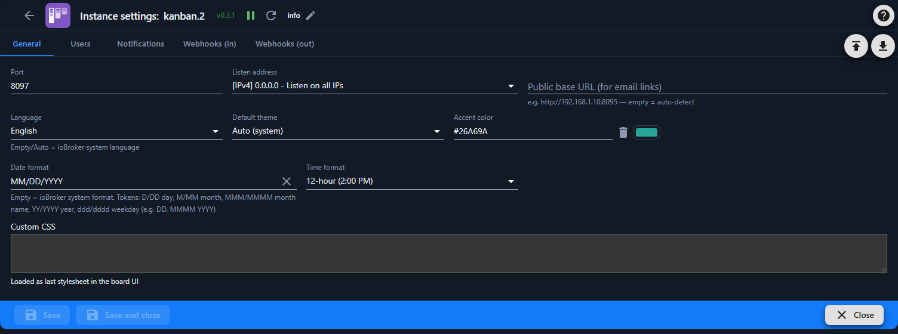

| Setting | Meaning |
|---|---|
| **Port** | Web server port (default `8095`). If it is taken, the adapter automatically picks a free one. |
| **IP address** | Bind address (default `0.0.0.0` = all interfaces). |
| **Base URL** | Publicly reachable URL used in e-mail links (e.g. behind a reverse proxy). Empty = auto-detect local IP. |
| **Default theme** | `auto` (system), `light` or `dark`. |
| **Accent color** | Color of the controls (default `#7E57C2`). |
| **Language** | UI language (`de`, `en`, `fr`, `nl`, `it`). Empty/automatic = ioBroker system language. Can be overridden per URL with `?lang=xx`. |
| **Date format** | Display format of the due date. **Empty = ioBroker system format.** Tokens see the table below (default `DD.MM.`). |
| **Time format** | `24 hours (14:00)` or `12 hours (2:00 PM)`. Applies to the optional time of day on cards. |
| **Custom CSS** | Served as `/api/custom.css`, for individual tweaks. |

#### Date format tokens

The common moment/Day.js notation applies (case-sensitive):

| Token | Meaning | Example (20 July 2026) |
|---|---|---|
| `D` / `DD` | day without / with leading zero | `20` / `20` |
| `M` / `MM` | month as a number without / with leading zero | `7` / `07` |
| `MMM` / `MMMM` | month name short / full | `Jul` / `July` |
| `YY` / `YYYY` | year two / four digits | `26` / `2026` |
| `ddd` / `dddd` | weekday short / full | `Mon` / `Monday` |

Month and weekday names are rendered in the board language. Examples: `DD.MM.` → `20.07.` · `DD MMMM YYYY` → `20 July 2026` · `dddd, DD MMM` → `Monday, 20 Jul` · `MM/DD/YYYY` → `07/20/2026`.

> Note: ioBroker itself uses `OO`/`O` for month names. Those are **not** supported here, a string copied from the system format that contains `OO` has to be rewritten to `MMMM`.

### Tab "Users"

This is where you define **which people exist**, the list applies to the entire instance. In the board they appear as chips in the header bar and can be assigned to cards.

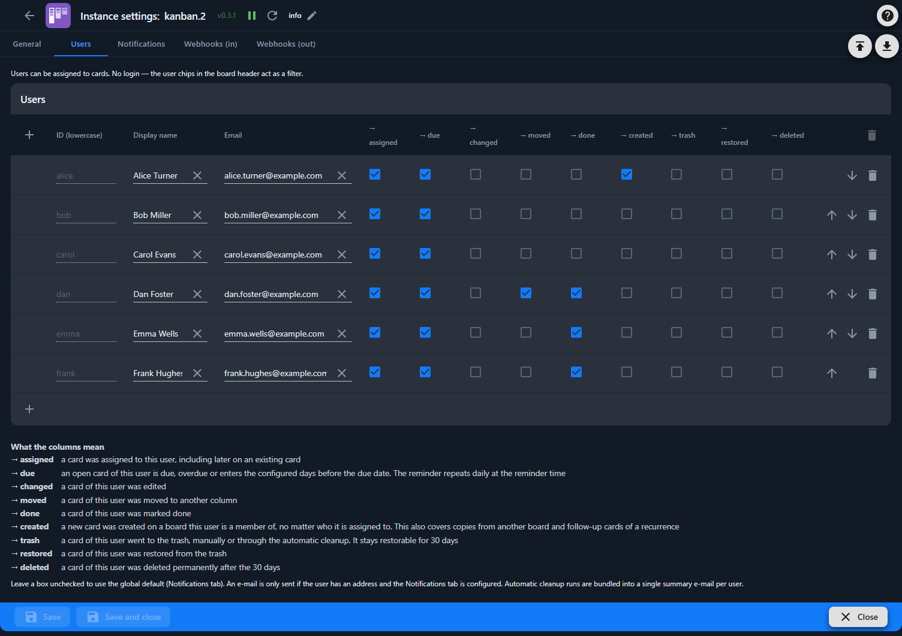

| Field | Meaning |
|---|---|
| **ID** (`name`) | Internal ID, lowercase, no special characters (e.g. `bjoern`). Used in URL parameters and assignments. |
| **Display name** (`displayName`) | Display name (e.g. `Björn`). |
| **E-mail** (`email`) | Optional. Target address for e-mail notifications. |
| **notify...** | Nine per-user checkboxes controlling notifications, see [Tab "Notifications"](#tab-notifications). |

Add a row with the **"+"** in the table header; the bin icon at the end of a row removes it again (without asking). Rows without an ID are dropped when saving. A fresh instance ships with two example users, `user1` and `user2`.

> **The ID is the key, and it is locked once created.** Boards and cards find their people through the *ID* column; the avatar pictures and the addresses of shared views hang on it as well. Changing it later would leave all of that pointing nowhere, and the adapter could not even clean up afterwards: a rename cannot be told apart from "deleted and newly created". The field is therefore locked as soon as the user has been saved once. The adapter writes a marker into the instance configuration on the next start and restarts once while doing so. That happens once per new user, never again after that.
>
> The **display name** stays freely editable. "Tom Reich" becomes "Tommy Reich" without a single card noticing.
>
> *Recommendation:* give the ID a moment's thought when you create it. Lower case, no umlauts, and readable enough to survive in a shared address (`?users=bjoern`).
>
> <a id="renaming-a-user"></a>
> **If cards do point nowhere**, the adapter reports it on start in the log and in the state `info.orphanedAssignees`, and the gear icon in the board header gets a small dot. That happens when an ID was renamed in an earlier version, when someone was deleted and created again, or when a card came in through the API with a foreign ID.
>
> The repair lives under **⚙ → Users → Orphaned assignees**. Each orphaned ID gets a row with its extent and the boards involved; the card count expands into the list of cards, so you can look before you move anything. Next to it a dropdown with the existing people and a button that asks first. The trash stays out of it: what is on its way to deletion does not need to belong to anyone.
>
> The same thing works through the interface:
>
> ```bash
> curl -X POST "http://<host>:8095/webhook/<TOKEN>/action" >   -H 'Content-Type: application/json' >   -d '{"cmd":"reassignUser","from":"bjoern_old","to":"bjoern"}'
> ```
>
> This carries over the assignees of every card, the member lists of the boards **and** the avatar picture. The picture only if the target person does not have one yet. If the new ID was already on a card, no duplicate entry appears. The target ID must exist in the instance settings, otherwise the call fails with `400`.

> **Not here:** user colour, avatar image and the assignment to individual boards are maintained directly in the web UI since 0.2.0. See [Users in the board](#users-in-the-board).

### Tab "Notifications"

Notifications are triggered on card events and delivered via **e-mail** (through the ioBroker `email` adapter) and/or **outbound webhooks**. In addition, every event is written to the state `kanban.0.lastEvent` (as a script trigger).

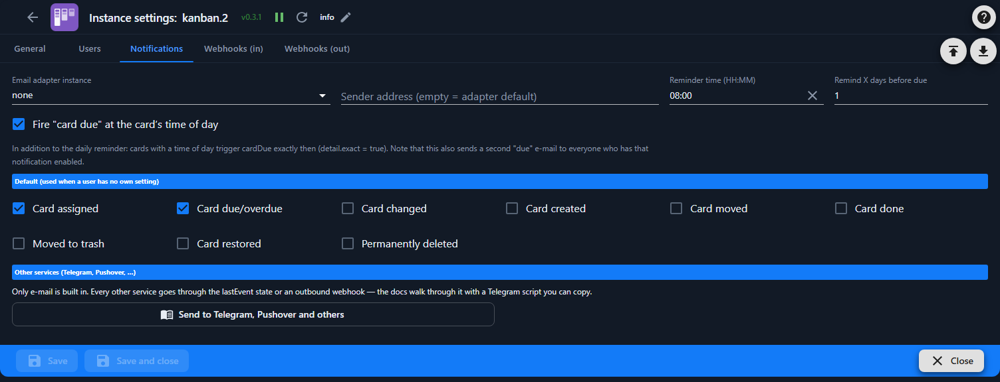

| Setting | Meaning |
|---|---|
| **Email adapter instance** | Which `email.x` instance is used for sending. |
| **Sender** | Optional sender address (empty = email adapter default). |
| **Reminder time** | `HH:MM`, when due cards are checked (default `08:00`). |
| **Remind X days before due** | Lead time for `cardDue` reminders (`0` to `30`, default `1`). |
| **Fire "card due" at the card's time of day** | Since 0.3.0, **off** by default. In addition to the daily reminder, cards with a **time of day** fire `cardDue` exactly at that time (`detail.exact = true`), so automations can trigger to the minute without polling the API. **Note:** the event goes through the normal notification path, so a second "due" e-mail is also sent to everyone who has that notification enabled. If you only want to drive scripts/webhooks, turn the "due" e-mail off per user. |
| **Default** | Global fallback switches per event, they apply when a user has nothing set of their own (see below). |

#### Who gets notified, and when?

In the **"Users"** tab every user has nine checkboxes. They decide which events trigger an e-mail for that person:

| Checkbox | When exactly it fires | Recipients |
|---|---|---|
| **assigned** (`notifyAssigned`) | As soon as someone is **added** as an assignee, on card creation for every initial entry, and when added later. Fires **once per person**. | **Only the person concerned** |
| **due** (`notifyDue`) | Daily at the reminder time (default `08:00`) for cards due today or within the lead days. A run missed due to an adapter restart is caught up. | All assignees of the card |
| **changed** (`notifyUpdated`) | On every edit of a card (title, date, labels, checklist ...). | All assignees of the card |
| **moved** (`notifyMoved`) | When moved to a **different** column. | All assignees of the card |
| **done** (`notifyDone`) | **In addition** to "moved", if the target column is flagged as *done*. | All assignees of the card |
| **created** (`notifyCreated`) | **Once** when a card is created; likewise when it is copied from another board and when a recurrence spawns the next card. | **All members of the board**, regardless of who it is assigned to |
| **trash** (`notifyDeleted`) | When a card moves to the **trash**, whether deleted by hand or by the automatic cleanup. Default: off. | All assignees of the card |
| **restored** (`notifyRestored`) | When a card is **restored** from the trash. Default: off. | All assignees of the card |
| **deleted** (`notifyPurged`) | When a card is removed **permanently**, either after 30 days in the trash or by hand. Default: off. | All assignees of the card |

The core difference between **assigned** and **created**: "assigned" is the **personal** message ("*you* are up now") and goes to that one person only. "created" is the **status message** to the whole team, every member of the board, even when the card belongs to someone else.

**Careful, events overlap.** Some actions trigger several events at once. Anyone with both checkboxes set will receive **several e-mails**, there is no bundling:

| Action | Events fired |
|---|---|
| Create a card **with** assignees | **created** + **assigned** |
| Edit a card and add someone | **changed** + **assigned** |
| Drag a card into the done column | **moved** + **done** |

For most setups **"assigned" alone** is therefore enough. "created" pays off if you also want to hear about cards that *others* create and where you are a co-assignee.

**Fallback:** if a user has nothing set for an event, the **global default** applies (tab "Email", section "Default"). This way existing users keep receiving notifications without having to configure everything individually.

**No self-spam:** whoever triggers a change is not notified about that very change.

**Prerequisite:** only users **with an e-mail address on file** receive mails; everyone else is skipped.

> **Trash events** (since 0.3.0): "moved to trash", "restored" and "permanently deleted" have their own checkboxes, all **off** by default. An **automatic cleanup run** does not send one mail per card but **one summary mail per user** listing every affected card. Deleting a single card by hand still sends a normal individual mail.

#### Calendar invite (.ics)

If **"Calendar invite"** is enabled on a card and a date is set, the adapter attaches a `termin.ics` to the notification e-mail:

- **Without time** → all-day event on the due date.
- **With time** → timed event with the **duration** set on the card (`calendarDuration`, default one hour).
- **With a recurrence** → a **series** instead of a single event: the invite carries an `RRULE`, so the calendar creates the whole series. Daily, every X days, weekly (with weekdays), monthly (day of month), monthly (nth/last weekday) and yearly are mapped. **Exception:** "workday of the month" depends on public holidays, which the calendar standard does not know, so those cards stay single events.
- **The invite is sent only once.** It is attached when the card is **created** or **newly assigned** to someone. Follow-up cards of a recurrence send **no** further invite (the series is already in the calendar), and reminder or move mails attach nothing either. An **updated** invite only goes out when **due date, time, duration or recurrence rule** change. That invite carries the same `UID` and a higher `SEQUENCE`, so the calendar replaces the existing entry instead of adding a second one. Other changes (the title, for instance) deliberately do not trigger a new invite.
- Title (`SUMMARY`), description, **location** (`LOCATION`) and link (`URL`) are carried over.
- **Time zone:** timed events are emitted unambiguously in UTC; the underlying time zone is determined from the system (or `system.config`), including daylight saving. All-day events are deliberately time-zone-free.

The attachment is included with **every** notification for the card, so if you enable the invite only later, it arrives with the next "Card changed" mail.

### Tab "Webhooks (in)"

Other systems (or ioBroker itself) can modify cards and boards via HTTP. Those requests are secured with **tokens**, which are managed here. The matching endpoints and commands are documented in [Part C](#webhooks-inbound).

| Field | Meaning |
|---|---|
| **name** | Label (shown as the source in logs). |
| **token** | Secret token, part of the URL. |
| **allowedBoards** | `*` = all boards, or a list of allowed board IDs (separated by space, comma, or semicolon). **Empty = no board**: such a token can no longer write anything. Enter `*` explicitly if you mean all boards. |
| **enabled** | Token active/inactive. |

The **"Generate new token"** button (above the table) automatically adds a new row with a secure random token (32 hex chars) and the name `agent`/`agent1`/.... Then adjust the name, optionally restrict `allowedBoards`, and **Save**. Alternatively fill the token field manually (e.g. `openssl rand -hex 16`). **Recommendation:** use a separate token for each integration (each agent, each script), that way each one can be revoked or replaced individually via the `enabled` checkbox.

Invalid token → HTTP `401`. Board not allowed → HTTP `403`.

**Quick test:** a single call tells you whether a freshly created token works. For the standard case there is no need to jump to [Part C](#webhooks-inbound):

```bash
curl -X POST "http://<host>:8095/webhook/<YOUR_TOKEN>/action" \
  -H 'Content-Type: application/json' -d '{"cmd":"listBoards"}'
```

If a **board list** comes back, the token is valid. All further commands and the complete list of responses and error codes are in [Part C](#webhooks-inbound).

Below the table sit two more switches: **"Accept commands via the action state"** (see [sendTo & action state](#sendto--action-state)) and **"Allowed browser origins (CORS)"**. The latter normally stays empty and is only needed when a website on another address calls the API from the browser. Details are under [Security & access control](#security--access-control).

### Tab "Webhooks (out)"

The adapter can send an **HTTP POST** to arbitrary URLs on every event, e.g. to Node-RED, IFTTT, a chat service or your own scripts.

| Field | Meaning |
|---|---|
| **name** | Label. |
| **url** | Target URL (receives `POST` with a JSON body). |
| **events** | `*` = all events, or a list of event types (separated by comma/semicolon/space). |
| **enabled** | Active/inactive. |

**Event types:** `cardCreated`, `cardUpdated`, `cardMoved`, `cardAssigned`, `cardDone`, `cardDeleted`, `cardRestored`, `cardPurged`, `cardDue`.

The structure of the JSON payload and the delivery details are in [Part C](#webhooks-outbound).

---

## Part B: The board (web UI)

The web UI at **`http://<host>:8095/`** is the actual workspace. Everything in this part is configured **directly in the browser** and takes effect immediately, no adapter restart. Thanks to live sync, changes show up on all open devices right away.

### Header bar

The **header bar** contains, left to right: the **board selector**, the **user chips** (doubling as a person filter, see [Users in the board](#users-in-the-board)), the **"+ Card"** button, the **theme toggle** (sun/moon), the **"Views"** dialog (monitor icon, see [Sharing views](#sharing-views--url-parameters)) and the **settings** (gear).

The gear opens the **board manager**, which covers the sections below. In embed mode (`embed=1`) the header bar is hidden entirely.

### Boards, columns & labels

The **gear (⚙)** opens the board manager. Since 0.3.0 it has just **two tabs**: **Board** and **Users** (colours and avatars, see [Users in the board](#users-in-the-board)). The former third tab "Boards" was folded into the Board tab. Changes are only applied on **Save**.

At the very top of the Board tab sits a row with four elements:

| Element | Effect |
|---|---|
| **Board picker** | Selects which board you are **editing**. The board displayed in the background does not change. If you have unsaved changes, the dialog asks first (save, discard, cancel). |
| **Arrow button** | Switches the **displayed** board to the one you are editing, while the dialog stays open. It is greyed out when the active board is already selected. |
| **Name field + "Create"** | Creates a new board. It immediately becomes the board you are editing and starts with all known users as members plus its own trash column. |
| **"Delete board"** (at the bottom) | Deletes the board being edited after a confirmation. The last remaining board cannot be deleted **in the web UI**. Via API and webhook (`deleteBoard`) that lock does **not** apply: the last board can be removed there as well, after which the instance shows "No board yet" again. |

Below that follow the board title, the member selection (see [Users in the board](#users-in-the-board)), columns, labels, the notification link target and the [Move done cards to the trash](#cleanup) section.

#### Columns

Columns can be created, reordered by drag & drop, renamed and deleted. **Deleting a column does not lose any cards**, they are moved to the first column of the board automatically. The [trash](#trash) is a system column and does not appear in this list.

> Every action that cannot be undone (deleting a card or board, emptying the trash, permanent deletion) asks for confirmation in a dialog **inside the UI** since 0.3.0, styled like the rest of the board and in the configured language.

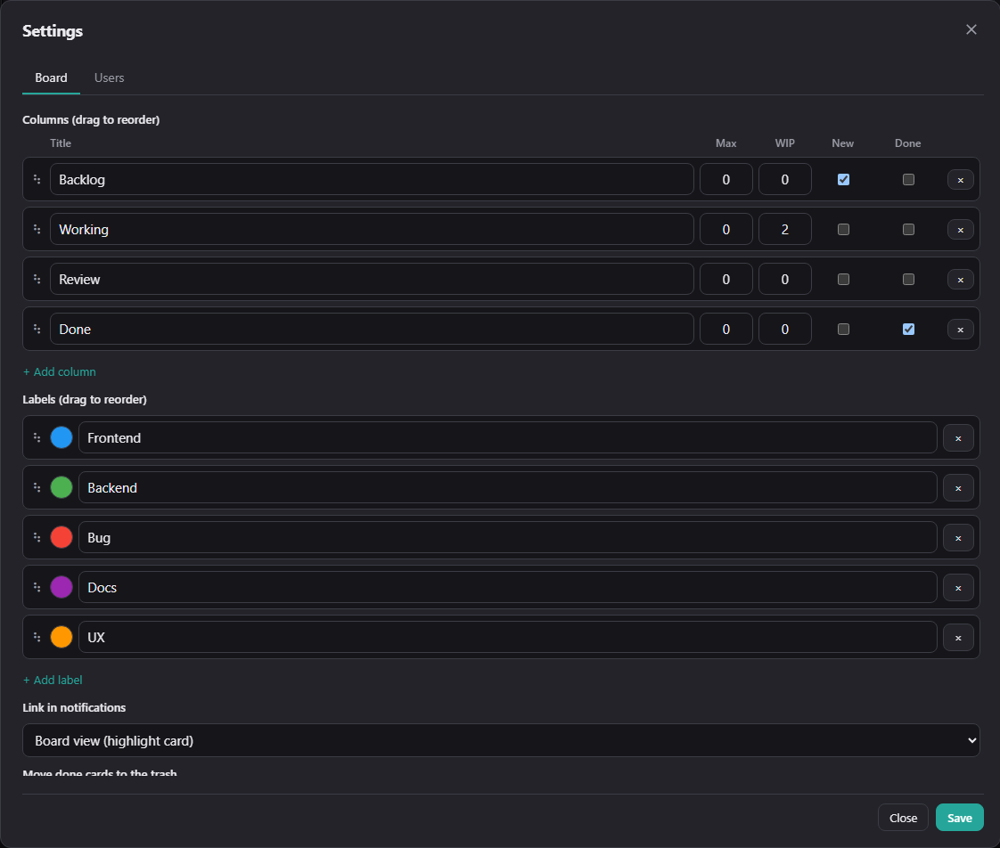

Above the column list sits a header row with the field names (**Title · Max · WIP · New · Done**). Every heading carries a tooltip with the full explanation.

- **Column ID:** besides its visible title every column carries an **immutable ID**. The three default columns are called `todo`, `doing` and `done`, newly created columns get a generated ID like `col_msd0mu8tkck68`. **Renaming keeps the ID**, so shared `columns=` links and `moveCard` calls keep working unchanged. You can look the IDs up via `GET /api/boards/<id>` (see [REST API](#rest-api)). IDs must be **unique**: if a `PATCH` sends the same ID twice, or the ID of the trash column, the affected column receives a freshly generated one.
- **Column width:** columns always share the **full width of the window**, so two columns each take up half. Only once less than 280 px would be left per column does the board become horizontally scrollable.
- **Display limit (Max):** a number > 0 shows only the first N cards in that column; below them a discreet `+X more` hint appears. `0` = show all. Useful so a long backlog does not blow up the board. The counter in the column header still counts **all** cards of the column.
- **WIP limit** (work in progress): a number > 0 caps the recommended card count. If exceeded, the column warns visually (counter & header are highlighted). `0` = no limit. The limit is a **warning**, not a hard block. It always refers to the **total** number of cards in the column, even while a person/label filter is showing fewer.
- **"New"** (`allowAdd`): controls in which columns the "+ Add card" link appears.
- **"Done" column** (`isDone`): cards moved here count as completed (`doneAt` is set, recurrences are triggered). Their title is shown with a **strikethrough**, and below it the completion time appears in brackets, for example `(Done: 26/07/2026 20:09)`, in the instance's date and time format.
- **Show/hide done (eye icon):** every done column has an eye toggle at the top right that shows or hides the completed cards (stored per device).
- **Limit of visible done cards:** the URL parameter `doneLimit=N` (see [Sharing views / URL parameters](#sharing-views--url-parameters)) shows only the N most recently completed cards, which is handy for compact, shared views.
- **Copy a completed card:** next to the title of a done card sits a small copy icon. It opens the editor with the same content as a **new** card. On save it lands in the first column flagged "New", checklist items start unticked, and the due date is prefilled with **today** if the original had one at all (a time of day is kept). Meant for recurring chores that have no fixed recurrence rule.

<a id="trash"></a>
#### Trash (since 0.3.0)

Every board has a **"Trash" system column**. Deleted cards no longer vanish straight away: they sit there for **30 days** and can be pulled back at any time. Only afterwards are they removed for good.

- **Visibility:** the trash is **hidden by default**. Show it via **"Show trash"** at the bottom of the board settings. That setting applies to **your device only**, so other people keep seeing their usual board.
- **What ends up there:** anything you remove with the **Delete** button in the card editor, cards you **drag** into the trash, and the cards from the [automatic cleanup](#cleanup).
- **Bringing a card back:** drag it out of the trash or tap the **restore** icon on the card. It returns to the first open column.
- **Deleting for good right away:** the second icon on the card removes it irreversibly. The broom button in the column header empties the **entire** trash. Both ask first. Via API and webhook, `purgeCard` likewise applies **only to cards in the trash**: on an active card it answers `400` with "Karte '...' liegt nicht im Papierkorb". Getting past the retention period therefore always leads through the trash first.
- **Reading the confirmations correctly:** the confirmation when deleting a card simply says "Really delete this card?", but since 0.3.0 that **always means the trash** and the card is still there. Truly irreversible are only the second icon on a card **inside** the trash and the broom button in the column header; their dialogs say so explicitly.
- **Remaining time:** every card shows how long it will still be kept, for example "30 days left".
- **Its own look:** the column is deliberately kept neutral grey, independent of theme and accent colour, so it stands apart from the working columns.
- **Special status:** the trash always sits on the far right, cannot be renamed, moved or deleted and does not show up in the column configuration. It has no WIP limit, no "+ Add card" link and no sort toggle; it is sorted by deletion time, so the card whose deadline expires first sits on top. It does not count towards the WIP limit or the counters of other columns.
- **Existing boards:** on the first start of 0.3.0 every existing board gets a trash column automatically. Existing cards are not touched.

<a id="cleanup"></a>
#### Move done cards to the trash (since 0.3.0)

To stop the done column from growing forever, each board can move old completed cards into the trash on its own. The setting sits at the bottom of the Board tab and is **off by default**.

| Mode | Effect |
|---|---|
| **Off** | Nothing is moved automatically (default). |
| **By age** | Cards completed more than *X* days ago move to the trash. Default: 90 days. |
| **By count** | Only the *X* most recently completed cards stay in each done column, the rest move to the trash. Default: 100 cards. |

The run happens **once a day** and **on adapter start**. It uses the completion timestamp (`doneAt`); cards without one are left alone. Because the cards only move to the trash, you still have another 30 days to pull something back.

#### Labels

Labels are coloured tags and are managed **per board** in the *Board* tab (create, rename, recolour, delete). On a card they appear as a coloured badge with automatically contrasting text; in the [Views dialog](#sharing-views--url-parameters) they can be used as a blacklist to hide cards.

#### Link in notifications (from 0.2.0)

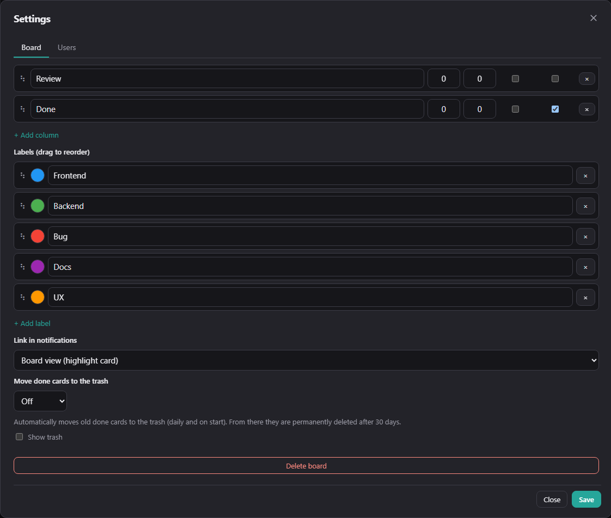

Per board you can choose where the "open card" link in notification e-mails points: **board view** (default, opens the board and briefly highlights the card), **card editor** (opens the edit dialog directly) or **custom URL** (a fixed address, e.g. your Lovelace dashboard the board is embedded in).

### Cards: all fields

**Card anatomy (since 0.3.0):** the **assignees** sit as a stack of avatars in the top right corner and the title text flows around them. Hovering or tapping the stack fans the faces out to the left without changing the line breaks. Long titles are cut off after **two lines** with an ellipsis, the full title stays available as a tooltip. The **card footer** holds the checklist progress on the left, the expand chevron in the middle and the icons for **description, link and recurrence** on the right, in that order. Clicking the description icon opens the description in a **read-only window** with rendered Markdown; links inside always open in a new tab. The chevron's hit area is deliberately wider and taller than the symbol itself so it is easy to hit by touch. Whether a checklist is expanded or collapsed is **remembered per device and board**, just like the column sort modes, and survives a reload.

Since 0.3.0 the editor opens **only via the pencil icon right next to the end of the title**; clicking anywhere on the card no longer opens it. That keeps the editor from popping up by accident while scrolling or tapping. Cards can still be grabbed and dragged anywhere. Inside the editor the fields are arranged like this: title, description, then the row with due date, time, priority and column, directly below it the calendar invite and the location (both belong to scheduling), then assignees and labels side by side, card colour and link side by side, followed by recurrence and checklist. On narrow screens the paired fields stack. The footer holds **Delete**, **Manage** (transfer/clone), **Cancel** and **Save**.

A card has the following content fields (settable via the API under the same names):

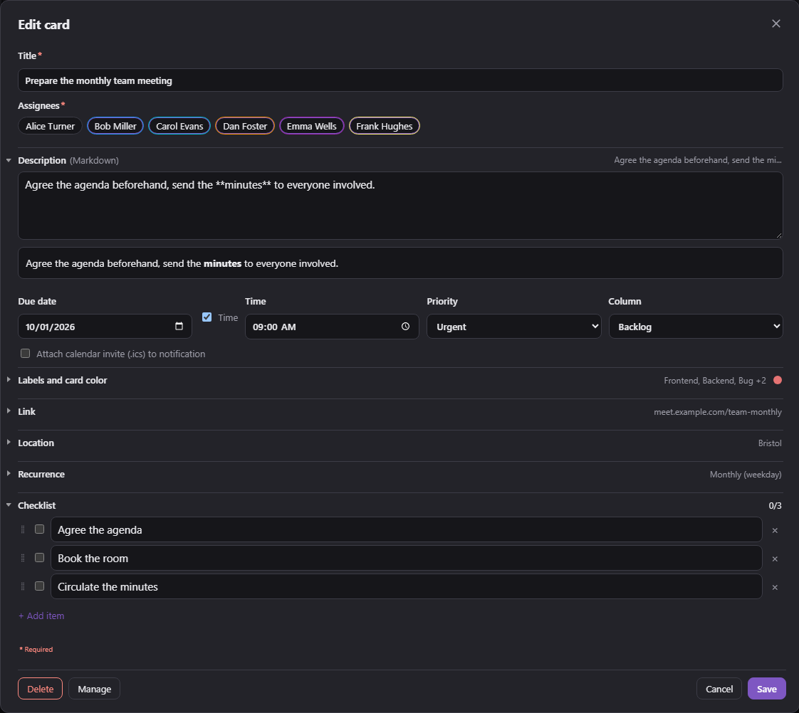

| Field | Type | Description |
|---|---|---|
| **title** | text | Task title (required). |
| **description** | Markdown | Description, rendered as Markdown (links, images, lists ...). As soon as the field contains something, the editor shows a **live preview** of the rendered Markdown **below the input**, so you see the result while typing. Embedded HTML is sanitized before display (XSS protection). |
| **due** | `YYYY-MM-DD` | Due date. The badge is coloured by state, see [Due date colours](#due-date-colours). |
| **dueTime** | `HH:MM` | Optional time of day. Enabled via a checkbox, shown on the card after the date. Only effective together with `due`. |
| **priority** | `0`/`1`/`2` | Normal / High / Urgent. On the card this shows as a badge below the title (before due date and location): **Normal** shows nothing, **High** an orange `!`, **Urgent** a red `!!`. Other values are rejected, via the API with an error (see [Responses & errors](#responses--errors)). |
| **assignees** | list of user IDs | Assignees. Determine who receives notifications. **Required, through the API as well:** at least one person must be given, and every ID must exist in the instance settings. Otherwise the interface answers with `400` and names the IDs it knows. Until now the API accepted anything, placeholders like `default` included; that produced cards the editor could never have created and which stay invisible behind a `users` filter. An ID that is **already on the card** remains allowed when editing, even if the user no longer exists. Otherwise the orphaned card would be the one you cannot touch. If a board's **member list no longer matches any existing user**, **all** users are assignable since 0.3.0. |
| **labels** | list of label IDs | Colored tags. Labels are managed per board (create, rename, recolor, delete). If a label arrives through the API that the board does not know, it is **created** rather than rejected (green, title = ID; both editable afterwards). Otherwise the card would carry a label the board does not list, which makes it invisible behind an `onlyLabel` filter. |
| **color** | hex color | Colored bar on the left edge of the card. Chosen via an embedded color picker (color field + hue slider + hex input) or presets. |
| **link** | URL | A link. The card shows a **type-dependent icon** (see [Link types](#link-types)). |
| **location** | text | Location. Shown as a location badge (pin icon) on the card and copied into the calendar invite as `LOCATION`. |
| **checklist** | list | Sub-items with checkboxes; once there are at least two, drag the small **handle** on the left in the editor to reorder them. Shown as progress `✓ 2/5` in the bottom left on the card. The **chevron (▾/▴)** at the middle of the card footer expands/collapses the items directly on the card, where they can also be **ticked off** (saved immediately). |
| **calendarInvite** | yes/no | If enabled **and** a due date is set, a **`.ics` calendar invite** is attached to every notification e-mail for this card. |
| **calendarDuration** | `HH:MM` | Duration of the calendar invite, default **`01:00`** (one hour). The field appears in the editor right next to the **calendar invite** checkbox once that is enabled. Only effective for events **with a time of day**; without one it stays an all-day event. |
| **recurrence** | object | Recurrence rule (see [Recurrence](#recurrence)). |

The adapter also manages automatically: `id`, `columnId`, `order`, `createdAt`, `createdBy`, `movedAt`, `doneAt`, `trashedAt`, plus the internal markers `lastReminderAt`, `lastExactAt` (so the same reminder or time-of-day event does not fire twice on the same day) and `icsUid`/`icsFingerprint`/`icsSeq` (calendar series: the same UID across the whole recurrence chain, and detection of changed appointment data).

Since 0.3.0 every card object of the **REST API** additionally carries the computed field **`dueAt`**, the due date including time as an ISO timestamp with local offset (e.g. `2026-08-01T13:30:00+02:00`; `00:00` without a time, `null` without a date). It is identical to the `dueAt` of the events, is **not stored** and is ignored on write, so automations do not have to combine `due` + `dueTime` + time zone themselves.

`movedAt` records **since when a card has been sitting in its current column** and is the basis for the "age in column" sort mode. It is only refreshed on a real column change; reordering within the same column leaves it untouched. `trashedAt` marks when a card went to the trash and drives the 30-day deadline.

#### Transfer or clone a card (since 0.3.0)

In the footer of the card editor, right next to **Delete**, sits the **Manage** button. It opens the dialog of the same name, which offers three buttons at the top: **Clone**, **Copy** and **Move**. The selects below adapt to the chosen button.

- **Clone** duplicates the card **within the same board**. Only the **target column** is shown, preselected with the column the card currently sits in. The clone carries over everything: checklist, labels, assignees, recurrence. Leave the preselected column as is and it lands directly **below the original**; pick a different column and it is appended at the **bottom** of that one instead. Handy for recurring tasks you keep around as a template.
- **Copy** and **Move** additionally reveal the **target board**; its first column flagged "New" is preselected. Move takes the card with it (it leaves the current board), copy creates a new card on the target and leaves the original untouched. If there is no other board, both buttons are disabled.
- **Labels** are matched by **name**. If the target board has a label with the same name it is kept; labels without a match are dropped. The target board is never silently extended with new labels.
- **Assignees** are only kept if they are **members** of the target board. The dialog shows beforehand what will be dropped.
- If **nobody** would be left, the dialog shows a picker of the target board's members and only allows the transfer once at least one person is selected. That way no card can end up without an assignee.
- Moving fires `cardMoved` (flagged as a board change), copying and cloning fire `cardCreated` with a new card id (a clone additionally carries `detail.clone = true`).

#### Link types

The board derives a matching icon (Material Design Icons) from the address you enter. Rules are evaluated top to bottom, the **first match wins**.

| Icon | Detected by | Example |
|:--:|---|---|
|  | `mailto:` | `mailto:hausmeister@example.com` |
|  | `tel:` | `tel:+491701234567` |
|  | `youtube.com` / `youtu.be` | `https://youtu.be/xxxxxxxxxxx` |
|  | address ends in `.pdf` | `https://example.com/anleitung.pdf` |
|  | `.jpg` `.jpeg` `.png` `.gif` `.webp` `.svg` | `https://example.com/grundriss.png` |
|  | route: `waze.com`, `/maps/dir/`, `daddr=` | `https://www.waze.com/ul?ll=52.52,13.405` |
|  | place: Google/Apple Maps, OpenStreetMap, `geo:` | `geo:52.52,13.405` |
|  | internal address: private ranges (`10.`, `172.16.` to `172.31.`, `192.168.`), `127.`, `169.254.`, `localhost` plus host names ending in `.local` `.lan` `.home` `.internal` `.fritz.box` | `http://192.168.1.10:8123/` |
|  | everything else | `https://example.com` |

Only the safe schemes `http(s)`, `mailto:`, `tel:` and `geo:` are clickable (see [Security & access control](#security--access-control)).

### Sorting & order

By default you set the order of cards within a column yourself: click a card, hold it and drag it up or down (this works with touch on a phone too). In the same way you drag a card into another column to change its status. The order you choose is kept and synced live to all open views.

This holds even when **not all cards are visible**, with a person or label filter active or a display limit in place. The card then lands exactly where you dropped it between the visible neighbours, and the hidden cards keep their order around it.

Since 0.3.0 **each column individually** can be sorted automatically instead. Clicking the sort icon in the column header opens a small menu with five modes:

| Mode | Behaviour |
|---|---|
| **Drag & drop** | Your own order. Cards are grabbed and dragged directly (default). |
| **Drag handles** | Your own order as well, but every card gets a handle on the left. Dragging only works via that handle, which makes reordering easier on a touchscreen. |
| **Due date** | Earliest date first, taking a set time of day into account. Cards without a date sit at the bottom. |
| **Priority** | Highest priority first; within the same priority the due date decides. |
| **Age in column** | The card that entered this column most recently sits on top. In a done column that is the task you ticked off last. |

For the three automatic modes a **direction toggle** appears next to the sort icon. One click reverses the order, and the arrow shows the current direction at a glance. So in "age in column" you can look at either what was finished last or the cards that have been sitting longest.

A few details keep reversing predictable: only the main criterion is flipped. Cards without a date or timestamp stay at the bottom, ties are still decided by the title, and within the same priority the due date still sorts ascending.

**Mode and direction are stored per device** (like the eye icon), so they only affect your own view. In the automatic modes, reordering within the column is disabled because it would have no effect; moving cards to another column still works. Switching back to "drag & drop" or "drag handles" brings back your saved manual order unchanged.

Independently of all this, the due badge is coloured, so anything urgent stands out regardless of its position.

<a id="due-date-colours"></a>
#### Due date colours

| Colour | State |
|---|---|
| **red** | past: the date has gone by, or the card's time of day has passed |
| **orange** | due today, time of day not reached yet |
| **yellow** | within the reminder lead time, so tomorrow by default |
| neutral | due later |
| **green** | done |

Two differently computed questions sit behind this. The **lead-time window** (yellow) is planning and counts in **calendar days**. It follows the instance setting [**Remind X days before due**](#tab-notifications), so the colour says the same thing as the reminder mail: set it to `3` and everything up to the day after tomorrow turns yellow. Not a rolling 24 hour window, so tomorrow stays tomorrow all day.

The boundary to **red** is a fact instead. When the card carries a **time of day**, that time counts: at 17:01 the 17:00 slot has passed, which is exactly when the `cardDue` event fires with `detail.exact`. Without a time, the colour changes at midnight.

The colours can be changed through [custom CSS](#faq--pitfalls): `--danger` for red, `--warn` for orange, and `--due-upcoming` with `--due-upcoming-text` for yellow.

### Recurrence

Recurring tasks work **on completion** (the Kanban way): as soon as a recurring card is moved to the "Done" column, a **fresh card** with the next matching due date is created automatically in the first non-done column (checklist items reset). Every content field of the template is carried over: title, description, assignees, labels, card colour, priority, link, **time of day**, **location** and the **calendar invite** flag. Cards with recurrence carry a recurrence badge (circular-arrows icon).

If a recurring card is created **without** a manual date, the adapter automatically sets the next matching date.

| Type (`recurrence.type`) | Meaning | Additional fields |
|---|---|---|
| `daily` | Every day | none |
| `weekly` | On specific weekdays | `dayOfWeek`: list `[1..7]` (1 = Monday ... 7 = Sunday) |
| `monthly` | Fixed day of month | `dayOfMonth`: `1..31` (the 31st is clamped to the last day in short months) |
| `monthly_weekday` | N-th/last weekday of the month, e.g. **2nd Tuesday** | `ordinal`: `1..4` or `-1` (last), `dayOfWeek`: `[iso]` |
| `workday` | First/last/n-th **working day** of the month | `workdayPos`: `first` / `last` / `nth` / `nth_last`, `n`: for `nth`/`nth_last` |
| `yearly` | Yearly | `month`: `1..12`, `dayOfMonth`: `1..31` |
| `every_n_days` | Every X days from a start date | `interval`: N, `startDate`: `YYYY-MM-DD` |
| `cron` | Cron expression used as a pattern | `cron`: `"0 8 * * 1-5"` |

A **working day** means: not a weekend **and** not a public holiday (see below). Example: "first working day in May" lands on the 4th if May 1st is a holiday/weekend.

#### Cron expression

For patterns the fixed types can't express there is the **cron expression** type. It takes the usual five fields:

```
minute  hour  day  month  weekday
   0      8    *     *      1-5    -> Monday to Friday at 08:00
```

Each field understands `*`, single numbers, lists (`1,15`), ranges (`1-5`), steps (`*/3`, `1-7/2`) and the English short names for month (`jan`...`dec`) and weekday (`mon`...`sun`). Sunday is both `0` and `7`. An expression may be at most 120 characters long, and even the longest sensible pattern stays well below that.

Three things differ from a real cron daemon:

- **The expression is a pattern, not a schedule.** The adapter runs nothing at those moments. It uses the pattern to find the next due date when a card is completed. As with every recurrence, the follow-up card appears when you tick the card off, not on its own.
- **Minute and hour set the time of the card.** `0 8 * * 1-5` produces cards with the time `08:00`; the *time* field in the editor is filled from the pattern and locked. If the pattern names several times (`15,45 8-10 * * *`), the earliest one wins.
- **`L`, `W`, `#` and `?` do not exist.** For "last working day of the month" or "second Tuesday" use the types *working day of the month* and *monthly (weekday)*, which also know the public-holiday logic that no cron can express.

If **day** and **weekday** are both restricted, they combine with **or**, as in the original: `0 8 1 * mon` matches every first of the month *and* every Monday.

Below the input the editor shows the rule in plain words and the next three dates. If the expression is faulty, the reason appears there instead of a preview and the card cannot be saved.

**Calendar invitation:** simple patterns are translated into a recurrence rule (daily, fixed weekdays, fixed days of the month, yearly). Nested patterns (day and weekday at once, or steps across several fields) have no equivalent in the calendar standard; those cards send a single event per occurrence.

### Public holidays

For the **working-day recurrences** the adapter computes public holidays itself (Easter formula + fixed dates + the German "Buß- und Bettag"), so even dates far in the future are calculated correctly.

- If the ioBroker **`feiertage`** adapter is installed, the Kanban adapter adopts its **state/region configuration** (which holidays apply). Only genuinely work-free public holidays count, decorative days (e.g. Valentine's Day) are ignored.
- Without the `feiertage` adapter a **fallback** with the nationwide public holidays is used.

> Changes to the `feiertage` adapter are picked up on the next start of `kanban.0`.

### Users in the board

Which people exist at all comes from the instance settings ([Tab "Users"](#tab-users)). Their appearance and board assignment, however, are maintained directly in the web UI, without restarting the adapter.

**Header chips as a filter:** The user chips in the header double as a **multi-select filter**, tapping toggles a person on or off. With a partial selection the board only shows cards of the selected people; with **all or none** active, all cards are shown. The selection is **stored per board in the browser** and restored on the next visit.

**User colour:** The colour of the avatar ring and chip is maintained **in the board UI** since 0.2.0 (⚙ → Users) and applies immediately, without restarting the instance.

**Avatar image (optional):** By default the avatar shows the initials (on the user color). In the board UI under **⚙ → "User avatars"** you can **upload a PNG/JPG** per user, which is then shown as a round avatar (with preview; the image is automatically cropped to a square, scaled to 128 px and stored in the ioBroker file storage, no config bloat). "Remove avatar" reverts to the initials.

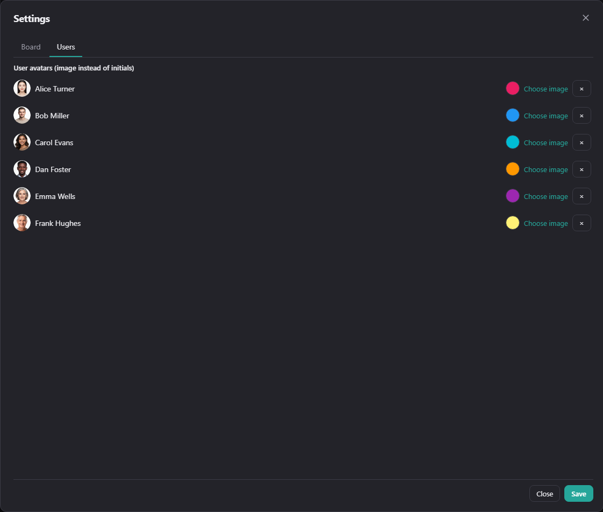

**Members per board:** in the Board tab of the settings (**⚙ → Board**), right below the board title, you define which users are assignable there (card dialog, header chips and the Views dialog only show members). Every board needs **at least one member**; new boards start with all users. Using the board picker at the top you can also edit the members of other boards without switching to them.

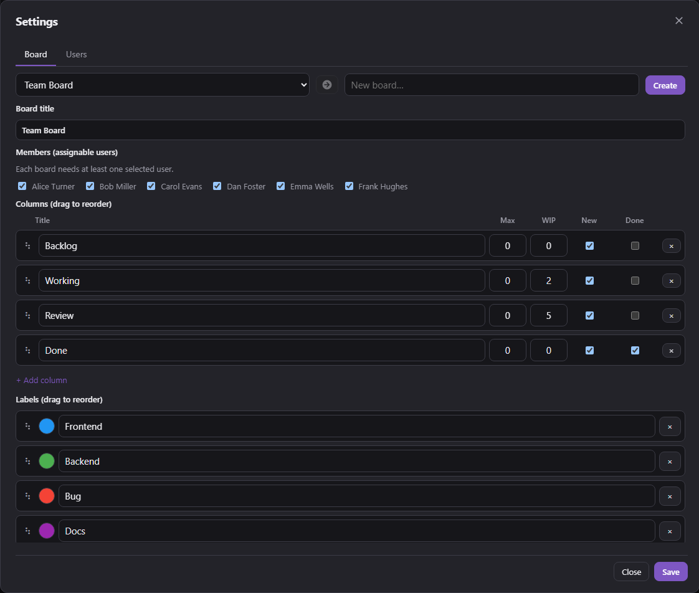

### Mobile view

On narrow screens the board stacks the columns vertically; each column collapses as an accordion (state is remembered per device). The card, board and views dialogs open full-screen with a fixed action bar at the bottom. To move a card, press and hold briefly, while dragging, a quick-move menu with the target columns appears.

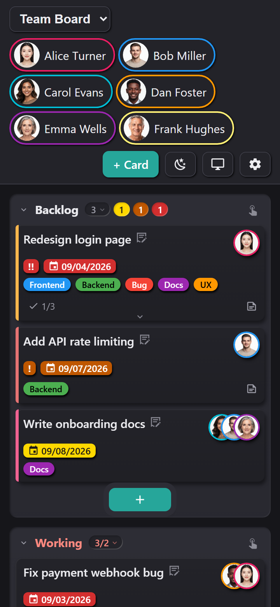 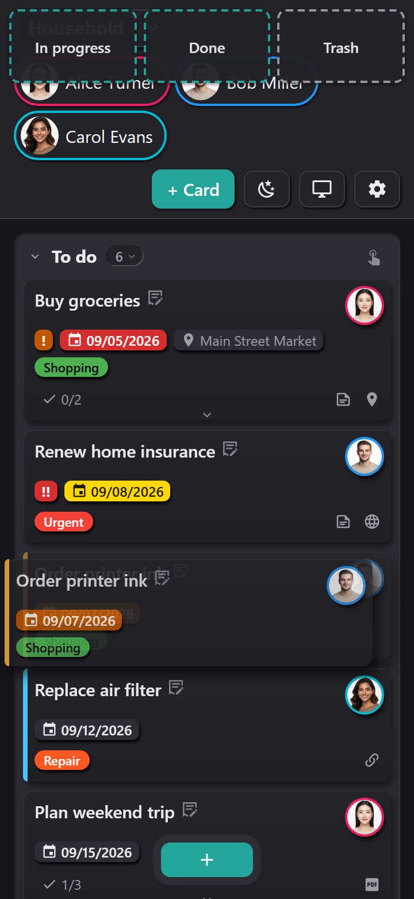

*Left: columns stacked as an accordion. Right: the quick-move menu that appears over the target columns while dragging a card.*

### Sharing views / URL parameters

The **monitor icon** in the header opens the **"Views"** dialog. There you assemble a filtered view and get a **ready-to-copy URL** below. Ideal for embedding in Lovelace (webpage card) or for sharing.

The dialog covers the **most common** filters: board, users (multiple), labels (multiple) including the switch between **"Hide these labels"** (blacklist) and **"Show only these labels"** (whitelist), visible columns, the done-card limit (`doneLimit`) and the controls to hide (`hideSettings`, `embed`). **Not** in the dialog, but available **as URL parameters only**, are `theme`, `accent`, `lang`, `card` and `focus`. Append those to the generated address by hand if you need them.

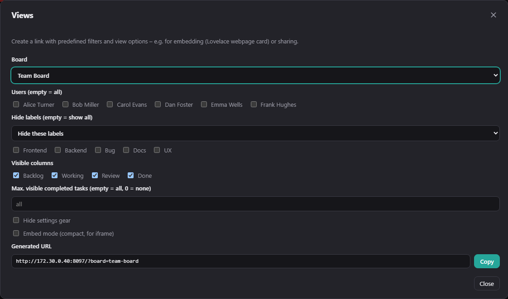

All parameters can also be appended to the URL directly:

| Parameter | Effect |
|---|---|
| `board=<id>` | Opens this board. Since 0.3.0 the address bar keeps track of the current board: switching via the board picker sets `?board=<id>` (no extra history entry, all other parameters are preserved), so the address can be copied and shared as is. |
| `users=<name,name>` | **Person filter**: shows only cards assigned to at least one of these users (sets the header chips accordingly). `user=<name>` is the short form for a single user. **Careful:** the parameter overwrites the chip selection stored per board in the browser **for good**: it stays active on the next visit *without* the parameter. Reset it via the chips in the header bar. |
| `label=<id,id>` | **Label blacklist** (multiple possible): hides cards that have one of these labels, new labels stay visible automatically. |
| `onlyLabel=<id,id>` | **Label whitelist** (since 0.3.0): shows **only** cards carrying at least one of these labels, so cards without a label drop out. Can be combined with `label=` (whitelist first, then blacklist). |
| `columns=<id,id>` | Shows only these columns. Others are hidden. |
| `doneLimit=N` | In done columns, show only the N most recently completed cards (`0` = none, omit = all). |
| `hideSettings=1` | Hides the settings gear. |
| `embed=1` | **Embed mode**: hides the whole header bar (for iframe/Lovelace). |
| `theme=auto\|light\|dark` | Forces a theme. |
| `accent=%23RRGGBB` | Accent color (hex, encode `#` as `%23`). |
| `card=<id>` | Opens a card directly (deep link, e.g. from e-mails). |
| `focus=<id>` | Does **not** open the editor, just briefly highlights the card on the board (pulsing outline). Generated by notifications whose link target is **board view**. |
| `lang=<code>` | Overrides the instance's UI language for this view (de, en, fr, nl, it, es, pl, pt, ru, uk, zh-cn). |

**Examples**

```
# Compact embed: only board "familie", no header
http://192.168.1.10:8095/?board=familie&embed=1&theme=auto

# Only "In progress" + last 3 done cards, filtered to two people
http://192.168.1.10:8095/?board=familie&columns=doing,done&doneLimit=3&users=bjoern,heike

# Everything except cards with label "private", settings hidden
http://192.168.1.10:8095/?board=familie&label=private&hideSettings=1
```

> **Lovelace/iframe:** the adapter sets **no** frame headers (`X-Frame-Options`/`frame-ancestors`). The CSP added in 0.1.1 is a `<meta>` tag and does **not** restrict embedding, so the UI can still be embedded directly in a Lovelace webpage card or an `<iframe>`.

---

## Part C: Integration & automation

Boards and cards can be driven entirely from the outside, from ioBroker scripts, Node-RED, shell scripts or LLM agents.

### REST API

For integrations on the same network there is a REST API (the same one the web UI uses). **Reading** (`GET`) is open, **writing** (`POST`/`PATCH`/`DELETE`) requires a token from 0.1.1 (see [Security & access control](#security--access-control)).

| Method & path | Purpose |
|---|---|
| `GET /api/config` | UI configuration (users, theme, accent color). |
| `GET /api/users` | User list. |
| `GET /api/custom.css` | The custom CSS configured in the settings. |
| `GET /avatars/<name>` | A user's avatar image (PNG). |
| `POST /api/users/<name>/avatar` | Set avatar (`{ image: "data:image/png;base64,..." }`, max 512 KB; token required). |
| `DELETE /api/users/<name>/avatar` | Remove avatar (token required). |
| `GET /api/boards` | All boards (short form). |
| `POST /api/boards` | Create a board (`{ id?, title }`). |
| `GET /api/boards/<id>` | Board with all cards. With `?rev=<n>` it returns `{unchanged:true}` if unchanged (polling). |
| `PATCH /api/boards/<id>` | Change a board (title, columns, labels, members, cleanup setting `cleanup: { mode, days, count }`). |
| `PATCH /api/users/<name>` | Set a user's color (`{ color: "#RRGGBB" }`). Used by the board's user management. |
| `DELETE /api/boards/<id>` | Delete a board. |
| `POST /api/boards/<id>/cards` | Create a card. |
| `PATCH /api/boards/<id>/cards/<cardId>` | Change a card. |
| `POST /api/boards/<id>/cards/<cardId>/move` | Move a card (`{ columnId, order }`). |
| `DELETE /api/boards/<id>/cards/<cardId>` | Move a card **to the trash** (since 0.3.0 this is no longer a permanent delete). |
| `POST /api/boards/<id>/cards/<cardId>/restore` | Bring a card back from the trash (`{ columnId? }`, otherwise the first open column). |
| `POST /api/boards/<id>/cards/<cardId>/purge` | Remove a card **permanently**. |
| `POST /api/boards/<id>/trash/empty` | Empty the board's trash completely. |
| `GET /api/users/orphaned/<name>` | The cards behind an orphaned ID: title, board, column, due date, done or not. `?limit=<n>` shortens the list, the full count stays in `total`. The trash is left out. |
| `POST /api/boards/<id>/cards/<cardId>/transfer` | Transfer a card to another board (`{ toBoard, toColumn?, mode: "move"\|"copy", assignees? }`). With `toBoard` = the same board and `mode: "copy"` the card is cloned in place. |

> **Write access** to `/api` requires a token from 0.1.1 (`X-Kanban-Token`; the web UI sends it automatically), **reading** stays open on the LAN. Details and limits: [Security & access control](#security--access-control). For external access use the token-based [webhooks](#webhooks-inbound).

#### Structure of a column object

This is how `GET /api/boards/<id>` returns each column, and exactly how `PATCH /api/boards/<id>` expects it back:

```json
{ "id": "todo", "title": "To do", "maxVisible": 0, "wipLimit": 0, "isDone": false, "allowAdd": true }
```

| Field | Meaning |
|---|---|
| `id` | Immutable [column ID](#columns) (`todo`, `doing`, `done` or a generated one like `col_msd0mu8tkck68`). It survives renaming. |
| `title` | The column title shown in the UI, freely editable. |
| `maxVisible` | Display limit ("Max"): a number > 0 shows only the first N cards, `0` = all. |
| `wipLimit` | WIP warning threshold, `0` = no limit. |
| `isDone` | `true` = "Done" column (sets `doneAt` and triggers recurrences). |
| `allowAdd` | `true` = the column shows the "+ Add card" link. |

The **trash** appears as an additional column with `isTrash: true`. It is managed by the adapter itself and must **not** be sent along when writing.

> **`PATCH` replaces the column list entirely.** There is no way to change a single column: read the current list via `GET /api/boards/<id>`, modify or extend it there and send the **complete** list back. Anything missing counts as deleted, and the cards of that column then move to the first column of the board.

### Webhooks: inbound

The **tokens** used here are managed in the instance settings ([Tab "Webhooks (in)"](#tab-webhooks-in)).

#### Generic endpoint (recommended)

```
POST /webhook/<token>/action
Content-Type: application/json
```

The body contains `cmd` plus the appropriate fields. The same **command vocabulary** applies as for `sendTo` and the `action` state:

| `cmd` | Required fields | Additional fields |
|---|---|---|
| `addBoard` | `title` | `id` (optional, otherwise derived from the title) |
| `deleteBoard` | `board` | none |
| `addCard` | `board`, `title` | all card fields (`due`, `assignees`, `labels`, `priority`, `location`, `recurrence`, ...), `columnId` |
| `updateCard` (alias `editCard`) | `board`, `cardId`\|`id` | card fields to change |
| `moveCard` | `board`, `cardId`\|`id`, `column`\|`columnId` | `order` |
| `doneCard` | `board`, `cardId`\|`id` |, (moves to the done column) |
| `deleteCard` | `board`, `cardId`\|`id` |, (moves to the trash since 0.3.0) |
| `restoreCard` | `board`, `cardId`\|`id` | `column`\|`columnId` (target column; otherwise the first open one) |
| `purgeCard` | `board`, `cardId`\|`id` |, (removes permanently) |
| `emptyTrash` | `board` |, (empties the trash) |
| `transferCard` | `board`, `cardId`\|`id`, `toBoard` | `toColumn`, `mode` (`move` or `copy`, default `move`), `assignees`. With `mode: "copy"`, `toBoard` may be the card's own board (clone) |
| `listOrphanedAssignees` | none | none |
| `reassignUser` | `from`, `to` | moves every assignment from `from` to `to`, see [Renaming a user](#renaming-a-user) |
| `listBoards` / `getBoards` | none | none |
| `getBoard` | `board` | none |

> **Field-name pitfalls (important!)**
> - The card ID is **`cardId` OR `id`**, **not** `card`.
> - The target column of `moveCard` is **`column` OR `columnId`**.
> - The board is given via **`board` OR `boardId`**.

**Examples**

```bash
TOKEN=your_token
BASE=http://192.168.1.10:8095

# Create a card
curl -X POST "$BASE/webhook/$TOKEN/action" -H 'Content-Type: application/json' -d '{
  "cmd": "addCard",
  "board": "familie",
  "columnId": "todo",
  "title": "Take out the bins",
  "due": "2026-07-20",
  "assignees": ["bjoern"],
  "labels": ["household"],
  "priority": 1
}'

# Move a card to another column
curl -X POST "$BASE/webhook/$TOKEN/action" -H 'Content-Type: application/json' -d '{
  "cmd": "moveCard", "board": "familie", "cardId": "c_abc123", "column": "doing"
}'

# Mark a card as done
curl -X POST "$BASE/webhook/$TOKEN/action" -H 'Content-Type: application/json' -d '{
  "cmd": "doneCard", "board": "familie", "id": "c_abc123"
}'

# Update a card (e.g. enable the calendar invite afterwards)
curl -X POST "$BASE/webhook/$TOKEN/action" -H 'Content-Type: application/json' -d '{
  "cmd": "updateCard", "board": "familie", "id": "c_abc123",
  "calendarInvite": true, "location": "Town hall"
}'

# Move a card to the trash (restorable for 30 days)
curl -X POST "$BASE/webhook/$TOKEN/action" -H 'Content-Type: application/json' -d '{
  "cmd": "deleteCard", "board": "familie", "id": "c_abc123"
}'

# Bring a card back from the trash
curl -X POST "$BASE/webhook/$TOKEN/action" -H 'Content-Type: application/json' -d '{
  "cmd": "restoreCard", "board": "familie", "id": "c_abc123"
}'

# Copy a card to another board
curl -X POST "$BASE/webhook/$TOKEN/action" -H 'Content-Type: application/json' -d '{
  "cmd": "transferCard", "board": "familie", "id": "c_abc123",
  "toBoard": "wohnung", "mode": "copy"
}'
```

#### Resource endpoints (alternative)

The same actions are also available as REST-like webhook routes (token in the URL):

```
POST   /webhook/<token>/boards/<id>/cards
PATCH  /webhook/<token>/boards/<id>/cards/<cardId>
POST   /webhook/<token>/boards/<id>/cards/<cardId>
POST   /webhook/<token>/boards/<id>/cards/<cardId>/move
```

#### Responses & errors

Every call, webhook as well as REST, answers with JSON. On success you get HTTP `200` with the affected object (card or board); commands without a result of their own, such as `emptyTrash`, report `{"ok":true}`. On failure the reason sits in the `error` field (the adapter emits these messages verbatim, in German):

| Situation | Code | Response |
|---|---|---|
| Success | `200` | the affected object or `{"ok":true}` |
| Token missing or invalid | `401` | `{"error":"invalid token"}` |
| Board blocked for this token | `403` | `{"error":"Token darf Board '...' nicht ändern"}` |
| Writing command without a board while the token is restricted to boards | `403` | `{"error":"token is limited to specific boards"}` |
| Board does not exist | `404` | `{"error":"Board '...' existiert nicht"}` |
| Card does not exist | `404` | `{"error":"Karte '...' existiert nicht"}` |
| Column does not exist | `404` | `{"error":"Spalte '...' existiert nicht in Board '...'"}` |
| Required field missing | `400` | `{"error":"title fehlt"}` |
| Invalid date | `400` | `{"error":"due muss im Format YYYY-MM-DD vorliegen, nicht '...'"}` |
| Invalid priority | `400` | `{"error":"priority kennt nur 0, 1 oder 2, nicht '...'"}` |

> **New: stricter validation.** Up to 0.3.0 the adapter quietly straightened out bad input: an unknown `columnId` landed in the first column, an invalid `due` was simply dropped, and `getBoard` on an unknown board answered with `200` and `null`. All three now return an **error**. Automations relying on the old, forgiving behaviour need to be adjusted. In exchange, nothing silently ends up in the wrong place any more.

### Webhooks: outbound

Target URLs and event filters are configured in the instance settings ([Tab "Webhooks (out)"](#tab-webhooks-out)).

**Delivery:** HTTP POST with `Content-Type: application/json`, 5-second timeout, **one** automatic retry after 2 seconds.

**Example payload** (body of the outbound POST):

```json
{
  "event": "cardMoved",
  "ts": "2026-07-12T14:05:46.415Z",
  "board": { "id": "familie", "title": "Family" },
  "card": {
    "id": "c_abc123",
    "title": "Take out the bins",
    "columnId": "doing",
    "due": "2026-07-20",
    "assignees": ["bjoern"],
    "labels": ["household"],
    "priority": 1
  },
  "detail": { "fromColumn": "todo", "toColumn": "doing", "by": "bjoern" }
}
```

Every event has the shape `{ event, ts, board:{id,title}, card:{...}, detail:{...}, link, dueAt }`. The `detail` field varies by event type (e.g. `assignee` for `cardAssigned`, `fromColumn`/`toColumn` for `cardMoved`, `auto`/`reason` for bulk actions, `clone`/`crossBoardCopy` when cloning or copying to another board, `crossBoard` when moving to one, `exact` for the card-precise `cardDue`). `dueAt` was added in 0.3.0 and carries the due date including time as an ISO timestamp with local offset.

### Notifications to any service (Telegram, Pushover, ...)

Besides the built-in e-mail notification you can connect **any** service without it being hard-wired into the adapter. On every event the adapter writes the state `kanban.0.lastEvent` and - if configured - sends an [outbound webhook](#webhooks-outbound). A short script (JavaScript adapter) or a Node-RED flow picks that up and forwards it to Telegram, Pushover, Signal, Pushbullet and so on.

**Structure of an event** (content of `lastEvent` / the webhook body):

```json
{
  "event": "cardAssigned",
  "ts": "2026-07-25T09:00:00.000Z",
  "board": { "id": "familie", "title": "Familie" },
  "card": { "id": "c_abc", "title": "Muelltonne rausstellen", "due": "2026-07-27", "assignees": ["user1"], "priority": 1, "labels": ["haushalt"] },
  "detail": { "assignee": "user1", "by": "user2" },
  "link": "http://<host>:8095/?board=familie&card=c_abc",
  "dueAt": "2026-07-27T18:00:00+02:00"
}
```

- `event` - event type: `cardCreated`, `cardAssigned`, `cardUpdated`, `cardMoved`, `cardDone`, `cardDeleted`, `cardRestored`, `cardPurged`, `cardDue`.
- `card.assignees` - the assignees (user **ids**, not display names); the notification is aimed at them.
- `link` - ready-to-use deep link to the card (from 0.2.1; uses the base URL from the instance settings).
- `dueAt` - from 0.3.0: the due date as an ISO timestamp with local offset, e.g. `2026-08-01T09:00:00+02:00`. Without a time set, `00:00` is sent; without a due date the value is `null`. Every card object of the REST API carries the same field.
- **`cardDue` comes in two flavours:** the **daily** reminder at the configured reminder time (day-based, including lead time and overdue cards, `detail.overdue` may be `true`). The second one needs the instance option "Fire 'card due' at the card's time of day" and is a **card-precise** event at the card's time with `detail.exact: true` and `detail.dueTime`. The latter fires once per card and day; if the moment falls into a downtime, it is caught up on the next start on the same day. Scripts that only care about exact times filter on `ev.detail && ev.detail.exact`.

**Trash events (from 0.3.0):** `cardDeleted` now means "moved to the trash" - the card can be restored for 30 days. `cardRestored` fires when it is brought back, `cardPurged` when it is removed permanently. During bulk actions, `detail` additionally carries `auto: true` and `reason`: `cleanup` (from done into the trash), `retention` (the 30-day deadline expired) or `emptyTrash` (trash emptied by hand). In all three cases e-mails are sent as **one summary per user** instead of one per card; the outbound webhooks still fire per card.
**Recurrences (from 0.3.0):** completing a recurring card immediately creates the next instance. That fires `cardCreated` plus one `cardAssigned` per assignee, both carrying `detail.recurrence: true`. Without a filter your script therefore announces the follow-up card as "assigned to you" right after you tick the old one off. One line hides those events:

```javascript
if (ev.detail && ev.detail.recurrence) return;   // follow-up card of a recurrence
```

- `detail.by` - **who triggered the change.** Important: the board runs **without a login** - the web UI does not know the actor and leaves `by` empty or `api`. It is only filled for changes made via API, webhook or script that pass a `by` (e.g. your own agents). A "do not notify the actor" filter therefore only works for such sources.

> **Prerequisite per service:** the recipient must be known to the service. For **Telegram** the person has to send the bot `/start` (plus the password, if configured) once; afterwards they appear with their numeric **chatId** in state `telegram.0.communicate.users`. Put that chatId into `USERS` as the value - the **key** is the Kanban user id (e.g. `user1`), not the display name.

**Example: Telegram** (create as a script in the JavaScript adapter). Adjust `USERS` (Kanban id -> Telegram **chatId**) and `BASE_URL` at the top. For a different service just swap the `sendTo` line (see below):

```javascript
// ============================================================
//  Kanban  ->  messenger notifications (Telegram example)
//  Runs in the ioBroker JavaScript adapter.
//  Reacts to kanban.0.lastEvent and sends the assigned users a
//  message. The same pattern works with Pushover, Signal,
//  Pushbullet, WhatsApp ... - just swap the sendTo line.
// ============================================================

// ---- Configuration -----------------------------------------
const KANBAN    = 'kanban.0';                 // Kanban instance
const MESSENGER = 'telegram.0';               // messenger instance (Telegram here)
const BASE_URL  = 'http://192.168.1.10:8095'; // board base URL (fallback if the event has no link)

// Mapping: Kanban user id  ->  messenger chat id
// Key   = the Kanban user id (lowercase "name" as in card.assignees, e.g. "user1"), NOT the display name.
// Value = the recipient id (Telegram: the numeric "ID" column of telegram.0.communicate.users).
const USERS = {
    user1: '123456789',
    // user2: '234567890',
};

// Which events should trigger a message?
// Available: cardCreated, cardAssigned, cardUpdated, cardMoved, cardDone,
//            cardDeleted (= moved to trash), cardRestored, cardPurged, cardDue
// Tip: 'cardAssigned' + 'cardDue' is enough for most setups. Adding 'cardCreated'
//      sends an extra message when a card is created.
const EVENTS = ['cardAssigned', 'cardDue'];

// Skip the person who triggered the change? Uses ev.detail.by (the actor).
// Note: the board has NO login, so the web UI does not identify the actor -
// "by" is only filled for changes made via API / webhooks / scripts that pass
// a "by" field (e.g. your own agents). For plain clicks in the board UI this
// option therefore has no effect.
const SKIP_SELF = true;

// If a person has no messenger mapping: send to everyone? (false = skip)
const BROADCAST_IF_UNMAPPED = false;
// ------------------------------------------------------------

const HEADER = {
    cardAssigned: 'Assigned to you',
    cardDue:      'Due',
    cardCreated:  'New card',
    cardMoved:    'Moved',
    cardDone:     'Done',
    cardUpdated:  'Updated',
};
const PRIO = ['', 'Priority: High', 'Priority: Urgent'];

function buildText(ev) {
    const c = ev.card || {};
    const b = ev.board || {};
    const lines = ['[Kanban] ' + (HEADER[ev.event] || ev.event), ''];
    lines.push(c.title || '(no title)');
    lines.push('Board: ' + (b.title || b.id || '?'));
    if (c.due)      lines.push('Due: ' + c.due + (c.dueTime ? ' ' + c.dueTime : ''));
    if (c.priority) lines.push(PRIO[c.priority]);
    // The adapter adds a ready-to-use deep link as ev.link; fall back to building one
    const link = ev.link || (c.id && b.id
        ? BASE_URL + '/?board=' + encodeURIComponent(b.id) + '&card=' + encodeURIComponent(c.id)
        : '');
    if (link) { lines.push(''); lines.push(link); }
    return lines.join('\n');
}

on({ id: KANBAN + '.lastEvent', change: 'any' }, (obj) => {
    let ev;
    try { ev = JSON.parse(obj.state.val); } catch (e) { return; }
    if (!ev || !EVENTS.includes(ev.event)) return;

    // Determine recipients
    let recipients;
    if (ev.event === 'cardAssigned' && ev.detail && ev.detail.assignee) {
        recipients = [ev.detail.assignee];                 // only the newly assigned person
    } else {
        recipients = (ev.card && ev.card.assignees) || []; // all assignees
    }

    // Optionally drop the person who triggered the change (no self-notification)
    const by = ev.detail && ev.detail.by;
    if (SKIP_SELF && by) recipients = recipients.filter(u => u !== by);
    if (!recipients.length) return;

    const text = buildText(ev);

    const already = new Set();
    for (const uid of recipients) {
        const chatId = USERS[uid];
        if (chatId) {
            if (already.has(chatId)) continue;
            already.add(chatId);
            sendTo(MESSENGER, { chatId: chatId, text: text }); // adjust to your messenger's sendTo parameters if needed
        } else if (BROADCAST_IF_UNMAPPED) {
            sendTo(MESSENGER, { text: text }); // adjust to your messenger's broadcast parameters if needed
        }
        // otherwise: no mapping -> skipped
    }
});
```

**Other services** - just swap the send line:

```javascript
// Pushover  (message is mandatory; title/sound/priority/device optional)
sendTo('pushover.0', { title: 'Kanban', message: text });

// Pushbullet
sendTo('pushbullet.0', { type: 'note', title: 'Kanban', message: text });

// WhatsApp (whatsapp-cmb) - phone optional = default number
sendTo('whatsapp-cmb.0', 'send', { text: text, phone: '+49170...' });
```

### sendTo & action state

The same command vocabulary (`addCard`, `moveCard`, ...) is reachable in several ways:

**`sendTo` (from ioBroker scripts):**

```javascript
sendTo('kanban.0', 'addCard', {
    board: 'familie',
    title: 'Created from a script',
    due: '2026-07-20',
    assignees: ['bjoern']
}, (res) => log(JSON.stringify(res)));
```

**`action` state:** write a JSON command to the state `kanban.0.action` (without `ack`):

```javascript
setState('kanban.0.action', JSON.stringify({
    cmd: 'moveCard', board: 'familie', cardId: 'c_abc123', column: 'done'
}));
```

The adapter executes the command and clears the state again.

> **Access:** neither route uses a token: anyone allowed to run scripts or write states in ioBroker can do everything here, including `deleteBoard` and `emptyTrash`. That is intentional, as both are local ioBroker interfaces. From 0.3.0 the `action` state can be switched off under "Webhooks (in)" if no script writes to it, and irreversible commands are logged with their source. For access from outside, use the webhook route with its own token and board restriction.

### Live sync & deep links

- **WebSocket `/ws`:** on every change the server sends a `dirty` message to all open views, which reload the affected board. All devices see changes almost instantly.
- **Polling fallback:** if the WebSocket is unavailable, the UI periodically checks for changes using `?rev=`.
- **Deep link:** `.../?board=<id>&card=<id>` opens the given card directly, this is how notification e-mails link ("Open card in board").
- **Simultaneous editing:** the card editor works **without locking**. If two people save the same card shortly after one another, the **last** save wins; the first person's change is lost without any notice. For cards several people maintain, it pays to agree briefly on who currently has it open.
- **After an adapter restart:** an open page **reconnects on its own**, which also covers every save of the instance settings, since that restarts the adapter. On top of that the view syncs whenever you switch back to the tab, and once a minute. Should a view still look stale, a reload fixes it.

### ioBroker states & objects

Besides the UI, the adapter creates states you can use in scripts, VIS/Lovelace or Node-RED:

| State | Type | Meaning |
|---|---|---|
| `kanban.0.info.connection` | bool | Web server running. |
| `kanban.0.lastEvent` | json | Last triggered event (`{event, ts, board, card, detail, link, dueAt}`), ideal as a script trigger. |
| `kanban.0.action` | json (writable) | Command input, see [sendTo & action state](#sendto--action-state). |
| `kanban.0.info.orphanedAssignees` | json | Assignees that no longer exist as users, each with the number of cards and boards. Empty while everything matches. See [Renaming a user](#renaming-a-user). |
| `kanban.0.info.apiSecret` | string | From 0.3.0 the internal write token lives in the adapter's file storage, no longer in this state. On instances **upgraded from an older version** the state remains and stays **empty**; on **newly created** 0.3.0 instances it is **not created at all**. For scripts, use the tokens from "Webhooks (in)". |
| `kanban.0.boards.<id>.data` | json | Full board (cards, columns, labels). |
| `kanban.0.boards.<id>.rev` | number | Revision (increments on every change, for polling). |
| `kanban.0.boards.<id>.cardCount` | number | Number of cards in the board. |
| `kanban.0.boards.<id>.overdueCount` | number | Overdue cards in the board. |
| `kanban.0.users.<name>.assignedCount` | number | Open cards assigned to this person. |
| `kanban.0.users.<name>.overdueCount` | number | Of those, overdue. |
| `kanban.0.users.<name>.overdueList` | json | List of overdue cards (title + board/column). |

The `boards.*` and `users.*` mirror states are handy for dashboards ("Björn: 3 open, 1 overdue") or automations without querying the REST API.

---

## Part D: Reference

### Security & access control

> **New in 0.1.1**, added after a security review.

**Write protection for the REST API (token).** Read access (`GET`) to `/api` stays open on the LAN (the web UI and simple dashboards need no token). **Write** access (`POST`/`PATCH`/`DELETE`) requires a token in the `X-Kanban-Token` header or as a `_token` field in the body. Valid tokens are:

- the automatically generated **SPA secret**, which the server hands to its own UI as `<meta name="kanban-token">`, the web UI sends it transparently, nothing to configure;
- any active **inboundToken** (tab "Webhooks (in)"), so scripts/agents can also write via `/api`.

Without a valid token → HTTP `401`. The native setting `apiWriteProtection: false` disables the protection (then `/api` behaves as in 0.1.0).

> **Also new in 0.3.0:**
> - A token's **board restriction** ("allowed boards") applies on **both** routes: REST (`/api/boards/<id>/...`) and webhook commands (`addCard`, `moveCard`, `deleteBoard`, `transferCard`, ...). What counts is the board the call **actually touches**: for REST the board in the path, plus the target board of a transfer, and for commands the field that this particular command evaluates. Another board yields `403`. A **writing** command that names no board at all, such as `addBoard` or editing users and avatars, is closed to restricted tokens as well, no matter what else the body contains. Purely **reading** commands (`listBoards`, `getBoard`) stay open, as reading needs no token anyway.
> - Tokens are **no longer accepted as a URL parameter** (`?token=...`), because URLs end up in logs, browser history and referrers. Use the header or the body field.
> - The **SPA secret now lives in the adapter's file storage** instead of the readable state `kanban.0.info.apiSecret`; the state remains but stays empty. An existing value is migrated on first start and then cleared.
> - **Irreversible commands** (`deleteBoard`, `emptyTrash`, `purgeCard`) are logged together with their source.

**Third-party websites cannot reach the API (CORS).** From 0.3.0 the adapter sends CORS permissions only on `/api` and `/webhook`, and only for origins you list under *Webhooks (in)* → **Allowed browser origins**. The default is empty, meaning same origin only.

Up to 0.3.0 `Access-Control-Allow-Origin: *` sat on **every** route, including the page that hands out the write token in its `<meta>` tag. Any website you had open in your browser could therefore scan the network for your adapter in the background, read that page, extract the token and then change or delete cards and boards. That door is now shut. Only access **from a browser** was ever affected. Scripts, Node-RED and `curl` know no origin check and keep working unchanged, with or without an entry.

You only need an entry if a website on a **different** address calls the API **from the browser**, for example your own dashboard at `https://dashboard.local:8123`. Separate several origins with commas. A `*` works too, but grants every website read access to all boards, so prefer listing the actual addresses.

> **Honest limit of this protection:** because the UI works **without a login**, any device on the same network that loads the page can read the SPA secret. The token thus reliably blocks **third-party websites/CSRF** and naive scanners, but is **not** a substitute for network isolation. For hard isolation, bind the port to the LAN/`127.0.0.1` only and put an authenticating reverse proxy in front.

**Sanitized description preview.** The Markdown description is cleaned with an HTML sanitizer (DOMPurify) before display, embedded `<script>`, `onerror` etc. is removed (protection against stored XSS).

**Safe link schemes only.** A card's link badge is clickable only for `http(s)`, `mailto:`, `tel:` and `geo:`; other schemes (e.g. `javascript:`) are not executed as a link.

**Content Security Policy.** The UI sets a CSP (as `<meta>`) that blocks third-party/inline scripts. It **deliberately omits** `frame-ancestors` so the iframe/Lovelace embedding stays free.

### Language / internationalization

The interface is **multilingual**. The default language follows the **system language configured in ioBroker**; the language can optionally be fixed in the instance settings.

Translations live as **one file per language** under `www/i18n/` (e.g. `de.json`, `en.json`). Currently **eleven languages** are included: **German, English, French, Dutch, Italian, Spanish, Polish, Portuguese, Russian, Ukrainian and Chinese (simplified)**, all selectable in the instance "Language" dropdown, alongside "Auto". Further languages can be added simply by dropping in another JSON file with the same keys. If no file exists for the requested language, English is used as fallback.

### FAQ & pitfalls

- **No e-mails arrive.** Delivery depends entirely on the configured `email` adapter. Check the credentials there (modern mailboxes often require OAuth2 instead of a password). The Kanban adapter only hands over the message.
- **The `.ics` is not attached.** The attachment is only created if **"Calendar invite"** is enabled on the card **and** a **due date** is set.
- **Time without a date disappears.** A time is always tied to a due date, without a date it is discarded.
- **Color selection.** The adapter deliberately uses an **embedded** color picker (not the native system dialog), so the full color space including hex input is available on every device, mobile included.
- **Custom design (theming).** Via **instance settings → General → "Custom CSS"** you can restyle the UI. It is based on CSS variables you can override, e.g. for a black-and-orange look (inspired by Lovelace):

  ```css
  :root, html[data-theme="dark"] {
    --bg: #000000;                  /* page background */
    --surface: #161616;             /* cards & dialogs */
    --surface2: rgba(10,10,10,.55); /* column background */
    --text: #f5f5f5;
    --border: rgba(255,152,0,.3);   /* borders (everywhere) */
    --accent: #ff9800 !important;   /* accent color */
  }
  .column { border: 1px solid var(--border); }
  ```

  Key variables: `--bg`, `--surface`, `--surface2`, `--text`, `--muted`, `--border`, `--accent`, `--danger`, `--warn`, `--radius`. The `!important` on `--accent` is required because the accent color is also set via the config field.
- **"Close" in the settings dialog discards changes.** The board manager only applies changes on **Save**; "Close" discards them without asking.
- **The date in the edit dialog looks different from the card.** The input is the browser's native date field and follows the browser language; the display on the cards follows the instance's configured **date format**. Both mean the same date.
- **A webhook command fails with "card 'undefined' does not exist".** Almost always the wrong ID field: it is `cardId` or `id`, **not** `card`.
- **"Spalte '...' existiert nicht in Board '...'" when creating a card.** Since 0.3.0 an unknown `columnId` returns a `404` instead of silently dropping the card into the first column. The valid [column IDs](#columns) are listed by `GET /api/boards/<id>`. Careful: a column's title is **not** its ID.
- **"due muss im Format YYYY-MM-DD vorliegen".** The due date is only accepted as `YYYY-MM-DD` (e.g. `2026-07-20`), not as `20/07/2026` or a timestamp. An invalid date used to be discarded without comment; today the call fails with `400`.
- **"priority kennt nur 0, 1 oder 2".** Priority knows exactly three values: `0` = normal, `1` = high, `2` = urgent. Text such as `"high"` or larger numbers are rejected with `400`.
- **New columns missing in a shared URL.** The `columns=` filter is static. If a column is added later, the view must be shared again. In the "Views" dialog itself, columns are detected live.
